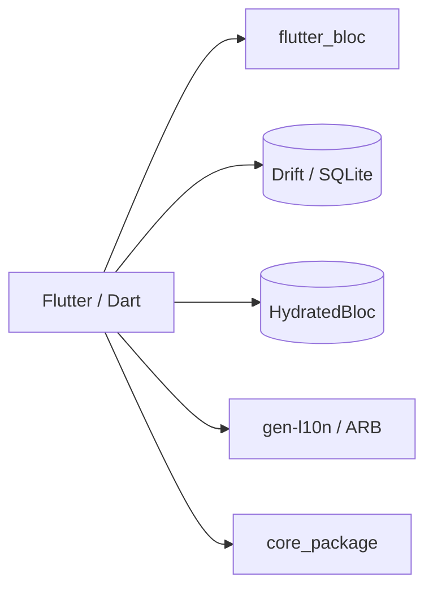
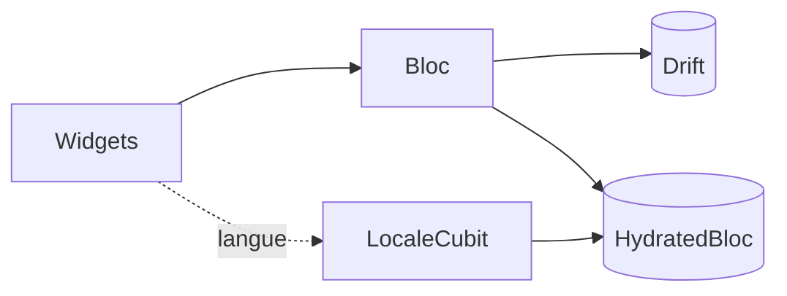
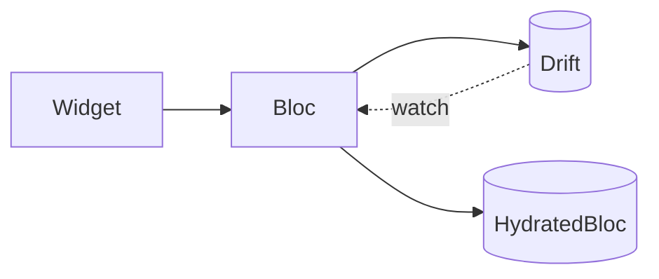

# Architecture

- [Language/Framework](#languageframework)
- [Mobile](#mobile)
  - [Naming Conventions](#naming-conventions)
- [Services communication](#services-communication)

## Language/Framework

- App `Flutter` (Dart) monolithique, 100% locale, sans backend ni Firebase.
- Monorepo `Melos` (pub workspaces) : `apps/digiharmony_app` + `packages/core_package` (modèles humeur, conseils, règles métier).
- 3 flavors : `development` / `staging` / `production`, points d'entrée `lib/main_<flavor>.dart` — aucun ne pointe vers une API.
- Scaffolding `very_good` (`flutter_bloc`, `bloc`, `equatable`, `very_good_analysis`).

```json
@apps/digiharmony_app/pubspec.yaml
```



## Mobile

- Plateformes : Android (prioritaire) puis iOS.
- État applicatif : `flutter_bloc` / `bloc`.
- État léger persistant : `HydratedBloc` (langue via `LocaleBloc`, flags onboarding/tuto) — jamais le journal.
- Persistance : `Drift` (SQLite type-safe) pour journal d'humeur, conseils, agrégats ; réactif via `watch()` ; codegen `build_runner` ; `sqlite3_flutter_libs`.
- 2 fichiers locaux distincts (Drift + HydratedBloc), tous deux sur l'appareil → zéro-collecte.
- i18n : `gen-l10n` / ARB, 8 langues, bascule immédiate sans redémarrage via `LocaleBloc` au-dessus de `MaterialApp`. Sans choix explicite : suit la langue du téléphone si supportée, sinon repli **anglais** via `localeListResolutionCallback` (DEC-009).
- Vibration : `HapticFeedback` natif (0 dépendance, 0 permission).
- Audio Detox : `just_audio` + `just_audio_background`.
- Temps d'écran : `app_usage` (Android best-effort via `ACTION_USAGE_ACCESS_SETTINGS` ; iOS = repli).
- Permission unique : `PACKAGE_USAGE_STATS`.
- Android release : `minify` / `shrinkResources` à `false` (sinon R8 strippe les libs natives Drift).



### Naming Conventions

- **Files**: snake_case
- **Components?**: PascalCase (Widgets)
- **Functions**: camelCase
- **Variables**: camelCase
- **Constants**: lowerCamelCase (Dart `const`)
- **Types/Interfaces**: PascalCase
- **Couche de données (Drift) en FRANÇAIS** : noms de tables, colonnes, DAO, entités et méthodes de requête en français. SQL/colonnes en `snake_case` (ex. `entrees_humeur`, `code_emotion`, `cree_le`) ; classes Dart en PascalCase français (ex. table `EntreesHumeur`, ligne `EntreeHumeur`, `Conseil`). Méthodes de requête en français (ex. `observerDerniereHumeurDuJour()`, `conseilDuJour()`). S'applique à tout « collection / table / etc. ».
- **Features / pages en FRANÇAIS** : racine domaine en français + **suffixes Flutter standard conservés** (`AccueilPage`, `AccueilView`, `AccueilBloc`, `AccueilState`/`AccueilEvent` — suffixes anglais `Event`/`State` **autorisés**, dérogation actée 2026-06-05). Structure imposée (règle `0-flutter-pages-structure`) : `lib/pages/<page>/bloc/<page>_bloc/` (bloc+event+state) + `views/` (`<page>_page.dart` avec `page()`/`route()`, `<page>_view.dart`). Traductions de domaine : **Splash → Demarrage**, **Onboarding → Bienvenue**, **Home → Accueil**.
- **Scaffolding technique conservé en anglais** : `AppTheme`, `AppColors`, `MoodColors`, `AppSpacing`, `AppRadii`, `AppDatabase`, `AppRouter`, `LocaleBloc`, `bootstrap`, `main_*`. Les codes d'émotion (clés `happy/calm/dynamic/sad/angry/nervous/tired`, DEC-003) restent stables (valeurs de code, pas des identifiants d'UI).

## Services communication

- Aucun service externe, aucun réseau : app 100% locale, RGPD par absence de traitement.
- Flux interne : `Widget` → `Bloc` → `Drift` (journal/agrégats, réactif `watch()`) ou `HydratedBloc` (langue/flags). **Cubit interdit** (bloc-only, voir règle `1-bloc-only-no-cubit`).
- Le journal et les agrégats sont toujours dérivés de `Drift`, jamais dupliqués dans `HydratedBloc`.



## Navigation

- **Bottom bar via `MainShell`** (`app/shell/main_shell.dart`, DEC-008) : 5 onglets
  (Accueil·Journal·Conseils·Bulles·Paramètres) dans un `IndexedStack` **paresseux** (un
  onglet n'instancie son Bloc/lecture Drift qu'à la 1re visite). `DemarrageView` fait
  `pushReplacement(MainShell)`.
- **Navigation impérative, sans GoRouter** (DEC-FND-07 maintenu) : `AppRouter` (`Navigator.push`)
  pour les écrans de tâche, `ShellScope` (InheritedWidget, `maybeOf` nullable) pour basculer
  d'onglet depuis les raccourcis internes (repli `Navigator.push` hors shell).
- **Plus de retour entre sections** : les onglets masquent leur chevron (`Navigator.canPop()`
  false). Les écrans de tâche sont **poussés plein écran** (bottom bar masquée) avec un
  **bouton Fermer (X)** (`BarreOutils.fermer` / `Icons.close`).
