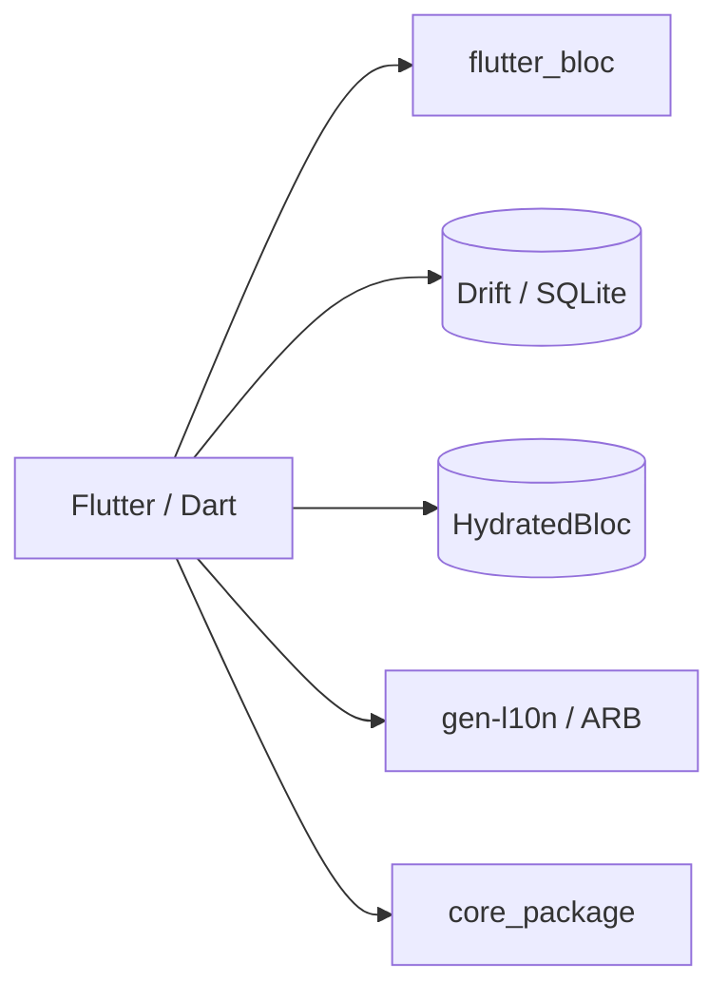
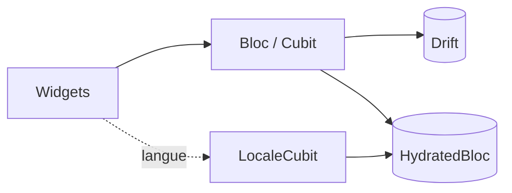
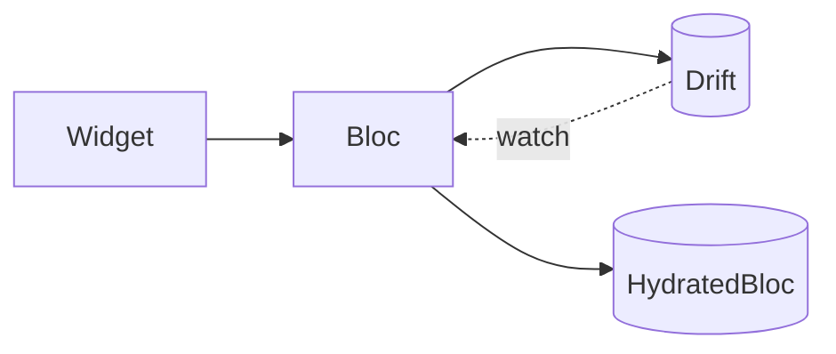

# Architecture

- [Language/Framework](#languageframework)
- [Mobile](#mobile)
  - [Naming Conventions](#naming-conventions)
- [Services communication](#services-communication)

## Language/Framework

- App `Flutter` (Dart) monolithique, 100% locale, sans backend ni Firebase.
- Monorepo `Melos` (pub workspaces) : `apps/digiharmony_app` + `packages/core_package` (modèles humeur, conseils, règles métier).
- 3 flavors : `development` / `staging` / `production`, points d'entrée `lib/main_<flavor>.dart` — aucun ne pointe vers une API.
- Scaffolding `very_good` (`flutter_bloc`, `bloc`, `equatable`, `very_good_analysis`).

```json
@apps/digiharmony_app/pubspec.yaml
```



## Mobile

- Plateformes : Android (prioritaire) puis iOS.
- État applicatif : `flutter_bloc` / `bloc`.
- État léger persistant : `HydratedBloc` (langue via `LocaleCubit`, flags onboarding/tuto) — jamais le journal.
- Persistance : `Drift` (SQLite type-safe) pour journal d'humeur, conseils, agrégats ; réactif via `watch()` ; codegen `build_runner` ; `sqlite3_flutter_libs`.
- 2 fichiers locaux distincts (Drift + HydratedBloc), tous deux sur l'appareil → zéro-collecte.
- i18n : `gen-l10n` / ARB, 8 langues, bascule immédiate sans redémarrage via `LocaleCubit` au-dessus de `MaterialApp`.
- Vibration : `HapticFeedback` natif (0 dépendance, 0 permission).
- Audio Detox : `just_audio` + `just_audio_background`.
- Temps d'écran : `app_usage` (Android best-effort via `ACTION_USAGE_ACCESS_SETTINGS` ; iOS = repli).
- Permission unique : `PACKAGE_USAGE_STATS`.
- Android release : `minify` / `shrinkResources` à `false` (sinon R8 strippe les libs natives Drift).



### Naming Conventions

- **Files**: snake_case
- **Components?**: PascalCase (Widgets)
- **Functions**: camelCase
- **Variables**: camelCase
- **Constants**: lowerCamelCase (Dart `const`)
- **Types/Interfaces**: PascalCase

## Services communication

- Aucun service externe, aucun réseau : app 100% locale, RGPD par absence de traitement.
- Flux interne : `Widget` → `Bloc`/`Cubit` → `Drift` (journal/agrégats, réactif `watch()`) ou `HydratedBloc` (langue/flags).
- Le journal et les agrégats sont toujours dérivés de `Drift`, jamais dupliqués dans `HydratedBloc`.


