# Codebase Structure

```mermaid
flowchart TD
    Root["digiharmony/ (monorepo Melos 7 · pub workspace)"]
    Root --> Pubspec["pubspec.yaml (workspace + melos)"]
    Root --> Apps["apps/"]
    Root --> Pkgs["packages/"]
    Root --> Docs["aidd_docs/"]

    Apps --> App["digiharmony_app/ (very_good_cli)"]
    App --> Lib["lib/"]
    App --> Andr["android/"]
    App --> Plat["ios · macos · linux · windows · web"]
    App --> Assets["assets/ (images · fonts · audio · video)"]
    App --> Test["test/ (app · counter · helpers)"]
    App --> L10nYaml["l10n.yaml · analysis_options.yaml · deploy.sh"]

    Lib --> Entries["main.dart · main_{development,staging,production}.dart"]
    Lib --> Boot["bootstrap.dart"]
    Lib --> AppDir["app/ (app.dart · view · routing/app_router.dart · shell/main_shell.dart)"]
    Lib --> Pages["pages/ (features, racine FR)"]
    Lib --> Data["data/local/app_database.dart (Drift)"]
    Lib --> Theme["theme/theme.dart · locale/ · common/"]
    Lib --> Config["config/legal_urls.dart"]
    App --> Ios["ios/ (Runner + DigiHarmonyActivityReportExtension · entitlements family-controls)"]
    Lib --> L10n["l10n/"]

    Pages --> Demarrage["demarrage/ (splash)"]
    Pages --> Bienvenue["bienvenue/"]
    Pages --> Accueil["accueil/"]
    Pages --> Saisie["saisie_humeur/ (sélection + Valider, DEC-004)"]
    Pages --> Journal["journal/ (Jour/Semaine/Mois, lecture Drift)"]
    Pages --> Soutien["soutien/ (Super conseil, déclenché 7 négatives)"]
    Pages --> TempsEcran["temps_ecran/ (Android natif app_usage + Drift v3 ; iOS Screen Time DEC-006)"]
    Pages --> TutoNotifs["tuto_notifs/ (tuto statique OS-aware, 0 natif/0 perm)"]
    Pages --> Parametres["parametres/ (langue live LocaleBloc + confidentialité + liens projet)"]
    Pages --> Conseils["conseils/ (deck swipable rappel/conseil/emotion, composerDeck pur, Do's/Don'ts + tags par carte)"]

    Data --> Tables["EntreesHumeur · Conseils (étendue v4: type_carte/code_emotion/accent/ordre) · UsagesEcranJournaliers (v3)"]
    Data --> Reads["observerDerniereHumeurDuJour · ...DeLaSemaine · ...DuMois · compterSaisiesNegativesConsecutives · conseilDuJour · cartesGeneriquesOrdonnees"]
    L10n --> Arb["arb/ (8 langues: en,fr,el,it,ro,tr,es,mk)"]
    L10n --> Gen["gen/ (app_localizations*.dart généré)"]

    Andr --> Gradle["build.gradle.kts · settings.gradle.kts · gradle.properties"]
    Andr --> AndrApp["app/ (src: main,debug,profile,development,staging)"]
    Andr --> Secrets["digiharmony_keystore.jks · key.properties (hors VCS)"]

    Pkgs --> Core["core_package/ (lib/src · test · .github)"]

    Docs --> Mem["memory/ (project-overview · codebase-map · internal · external)"]
    Docs --> Dec["internal/decisions/ (ADR · 0001..0008)"]
    Docs --> Rules["rules/ (melos7-pub-workspace · android-gradle-minify-off · permissions-zero-collecte)"]
```

## Notes

- **Navigation (`app/shell/main_shell.dart`, DEC-008)** : `MainShell` = bottom bar 5 onglets
  (Accueil·Journal·Conseils·Bulles·Paramètres) dans un `IndexedStack` **paresseux** (onglet
  chargé à la 1re visite). `DemarrageView` fait `pushReplacement(MainShell)`. Raccourcis internes
  → bascule d'onglet via `ShellScope` (repli `Navigator.push` hors shell). Sections-onglets sans
  retour (`canPop()` false) ; écrans de tâche poussés plein écran avec **bouton Fermer (X)**
  (`BarreOutils.fermer` / `Icons.close`). Toujours sans GoRouter (Navigator impératif).
- **Drift (`data/local/app_database.dart`)** : compteurs/agrégats **dérivés** en lecture seule
  (`observerEntreesDeLaSemaine/DuMois` réactifs `watch()` ; `compterSaisiesNegativesConsecutives()`
  ponctuel) — jamais dupliqués dans HydratedBloc (DEC-001/002). Connexion ouverte avec
  `PRAGMA busy_timeout = 5000` (absorbe les verrous transitoires « database is locked » au démarrage).
- **Soutien** : déclenché à l'ouverture (post-splash) si compteur ≥ 7 ; anti-relance via `SoutienBloc`
  (HydratedBloc). Prévisualisation dev via un déclencheur `kDebugMode` (tree-shaké en release ; aucune
  entrée de navigation en prod).
- **Temps d'écran** : Android lit l'usage natif (`app_usage` + MethodChannel `digiharmony/usage_access`)
  et historise dans `UsagesEcranJournaliers` (Drift, schéma v3). iOS = Apple Screen Time (FamilyControls
  + DeviceActivityReport, données **non lisibles** par l'app → pas d'historique Drift iOS) derrière le flag
  `kScreenTimeIosActif` ; plomberie câblée dans `AppDelegate` + extension `DigiHarmonyActivityReportExtension`
  (DEC-006). Entrée du tuto notifs depuis l'écran temps d'écran.
- **Paramètres** : 0 nouveau Bloc — choix de langue **en direct** via `LocaleBloc` existant ; version
  **dynamique** via `package_info_plus` ; liens projet via `url_launcher` **sans gate `canLaunchUrl`**
  (sur Android 11+ il renvoie false « component name null » alors que `launchUrl` réussit ; on appelle
  `launchUrl` directement en try/catch).
- **Conseils** (`pages/conseils/`) : deck de cartes swipables (rappel / conseil / emotion), composition
  **déterministe par jour** via helper PUR `composerDeck` (carte émotion en tête selon l'humeur **du jour**
  + N génériques en rotation `% n`). Corpus = table `Conseils` **étendue v4** (clés ARB seulement, contenu
  placeholder à valider partenaires). **Lecture seule, aucune écriture.** Chaque carte a des **Do's/Don'ts**
  et un **tag thématique + icône** propres. `conseilDuJour` et `composerDeck` partagent
  `cartesGeneriquesOrdonnees()` (filtre `≠ emotion`, ordre `ordre`/`id`) → la tuile Accueil = carte 0 du
  deck (DEC-CO-11). Pas de CTA « J'applique ». Migration v3→v4 idempotente. Voir `tasks/conseils.md`.
- **Identité d'app (production-only)** : icône **adaptative** Android + splash via `flutter_launcher_icons`
  / `flutter_native_splash` (configs flavor → `android/app/src/production/`), iOS appiconset + storyboard
  `LaunchScreenProduction` câblé par config (DEC-007). dev/staging inchangés. Nom « Digiharmony ».
- Le dossier `counter/` du template very_good_cli a été retiré.

