# Codebase Structure

```mermaid
flowchart TD
    Root["digiharmony/ (monorepo Melos 7 · pub workspace)"]
    Root --> Pubspec["pubspec.yaml (workspace + melos)"]
    Root --> Apps["apps/"]
    Root --> Pkgs["packages/"]
    Root --> Docs["aidd_docs/"]

    Apps --> App["digiharmony_app/ (very_good_cli)"]
    App --> Lib["lib/"]
    App --> Andr["android/"]
    App --> Plat["ios · macos · linux · windows · web"]
    App --> Assets["assets/ (images · fonts · audio · video)"]
    App --> Test["test/ (app · counter · helpers)"]
    App --> L10nYaml["l10n.yaml · analysis_options.yaml · deploy.sh"]

    Lib --> Entries["main.dart · main_{development,staging,production}.dart"]
    Lib --> Boot["bootstrap.dart"]
    Lib --> AppDir["app/ (app.dart · view · routing/app_router.dart)"]
    Lib --> Pages["pages/ (features, racine FR)"]
    Lib --> Data["data/local/app_database.dart (Drift)"]
    Lib --> Theme["theme/theme.dart · locale/ · common/"]
    Lib --> Config["config/legal_urls.dart"]
    Lib --> L10n["l10n/"]

    Pages --> Demarrage["demarrage/ (splash)"]
    Pages --> Bienvenue["bienvenue/"]
    Pages --> Accueil["accueil/"]
    Pages --> Saisie["saisie_humeur/ (sélection + Valider, DEC-004)"]
    Pages --> Journal["journal/ (Jour/Semaine/Mois, lecture Drift)"]
    Pages --> Soutien["soutien/ (Super conseil, déclenché 7 négatives)"]

    Data --> Tables["EntreesHumeur · Conseils"]
    Data --> Reads["observerDerniereHumeurDuJour · ...DeLaSemaine · ...DuMois · compterSaisiesNegativesConsecutives"]
    L10n --> Arb["arb/ (8 langues: en,fr,el,it,ro,tr,es,mk)"]
    L10n --> Gen["gen/ (app_localizations*.dart généré)"]

    Andr --> Gradle["build.gradle.kts · settings.gradle.kts · gradle.properties"]
    Andr --> AndrApp["app/ (src: main,debug,profile,development,staging)"]
    Andr --> Secrets["digiharmony_keystore.jks · key.properties (hors VCS)"]

    Pkgs --> Core["core_package/ (lib/src · test · .github)"]

    Docs --> Mem["memory/ (project-overview · codebase-map · internal · external)"]
    Docs --> Dec["internal/decisions/ (ADR · 0001..0005)"]
    Docs --> Rules["rules/ (melos7-pub-workspace · android-gradle-minify-off · permissions-zero-collecte)"]
```

## Notes

- **Drift (`data/local/app_database.dart`)** : compteurs/agrégats **dérivés** en lecture seule
  (`observerEntreesDeLaSemaine/DuMois` réactifs `watch()` ; `compterSaisiesNegativesConsecutives()`
  ponctuel) — jamais dupliqués dans HydratedBloc (DEC-001/002). Connexion ouverte avec
  `PRAGMA busy_timeout = 5000` (absorbe les verrous transitoires « database is locked » au démarrage).
- **Soutien** : déclenché à l'ouverture (post-splash) si compteur ≥ 7 ; anti-relance via `SoutienBloc`
  (HydratedBloc). Prévisualisation dev via un déclencheur `kDebugMode` (tree-shaké en release ; aucune
  entrée de navigation en prod).
- Le dossier `counter/` du template very_good_cli a été retiré.

