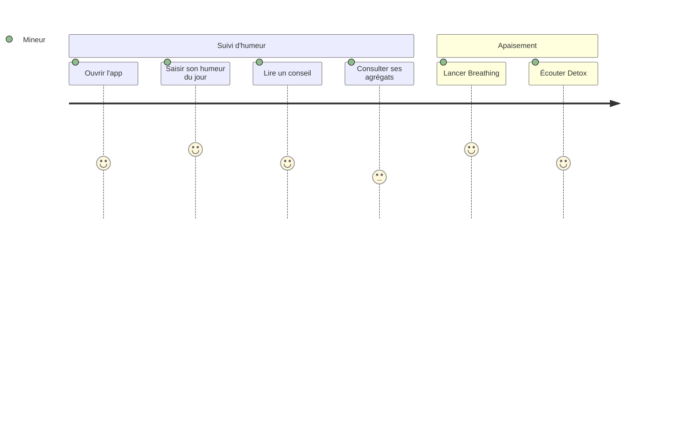

# PROJECT_BRIEF.md

Application mobile de bien-être et santé mentale pour public mineur, dans le cadre d'un projet Erasmus+. Entièrement hors-ligne, sans collecte ni identification.

## Executive Summary

- **Project Name**: DIGIHARMONY
- **Vision**: Aider les mineurs à comprendre et apaiser leurs émotions, sans jamais collecter leurs données.
- **Mission**: Offrir un compagnon de bien-être 100 % local et anonyme — RGPD par absence de traitement.

### Full Description

- App Flutter, public mineur, projet Erasmus+.
- Hors-ligne intégral : aucun backend, aucun Firebase.
- Zéro collecte, zéro identification, zéro tracking/analytics.
- Données strictement sur l'appareil.
- Licence GNU GPLv3 — dépôt GitHub public `AlexandreMaillot/digiharmony`.
- Multilingue : `en`, `fr`, `el`, `it`, `ro`, `tr`, `es`, `mk` (repli `en`).

## Context

- Pas de compte, pas de connexion réseau, pas de notifications/push (V1).
- Confiance n°1 : aucune permission superflue.
- Seule permission : `PACKAGE_USAGE_STATS` (Android, best-effort) pour « Mon temps d'écran » ; iOS = repli.

### Core Domain

Bien-être émotionnel et santé mentale des jeunes : auto-observation de l'humeur, conseils, exercices d'apaisement, et prise de recul sur le temps d'écran.

### Ubiquitous Language

| Term | Definition | Synonymes |
| --- | --- | --- |
| Journal d'humeur | Entrée datée d'humeur saisie par l'utilisateur | Mood journal |
| Émotion négative | Humeur classée comme négative | |
| Super-conseil | Conseil renforcé déclenché après 7 émotions négatives consécutives | |
| Conseil | Message de bien-être proposé à l'utilisateur | Advice |
| Agrégat | Synthèse d'humeur sur une semaine / un mois | Stats |
| Breathing | Exercice de respiration guidée (avec vibration) | Respiration |
| Detox | Module audio d'apaisement | |
| Mon temps d'écran | Vue du temps d'usage de l'appareil | Screen time |

## Features & Use-cases

- Journal d'humeur daté : saisir et consulter ses humeurs.
- Conseils contextualisés selon l'humeur.
- Agrégats semaine / mois de l'humeur.
- Super-conseil après 7 émotions négatives consécutives.
- Breathing : exercice de respiration guidée.
- Detox : écoute audio d'apaisement.
- Mon temps d'écran : prise de recul sur l'usage de l'appareil.
- Changement de langue immédiat (8 langues).

## User Journey maps

### Mineur

- Adolescent cherchant à comprendre et apaiser ses émotions.
- Objectifs : suivre son humeur, se calmer, prendre du recul — en toute confidentialité.

#### Suivi quotidien de l'humeur

- Ouvre l'app, saisit l'humeur du jour, lit le conseil associé.
- Consulte ses agrégats semaine/mois pour repérer des tendances.
- Après 7 émotions négatives consécutives, reçoit un super-conseil.

#### Apaisement

- Lance un exercice Breathing pour se recentrer.
- Écoute un contenu Detox pour décompresser.
- Consulte « Mon temps d'écran » pour ajuster son usage.
