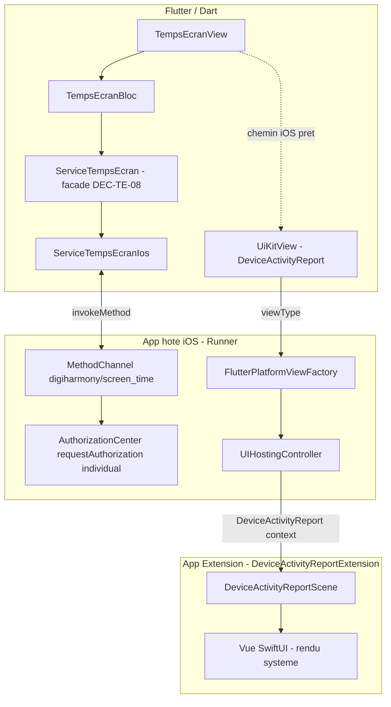

# Plan exécutable — Support iOS « Mon temps d'écran » via Apple Screen Time

> ⚠️ **Plan honnête sur la faisabilité.** Ce chantier dépend d'un **accès spécial Apple**
> (`com.apple.developer.family-controls`) qui est accordé **au cas par cas** et **hors de
> portée du code**. Tant qu'il n'est pas obtenu, le chemin iOS **ne peut pas tourner** sur
> device. Le plan permet de préparer **toute la plomberie** (façade, MethodChannel,
> PlatformView, target d'extension, entitlements, UX, i18n, tests Dart) pour qu'au moment où
> l'entitlement arrive, il ne reste que la validation sur device réel. **On ne survend rien.**
>
> Le page plan source `aidd_docs/tasks/temps-ecran.md` **fait loi** pour Android (inchangé) et
> pour les garde-fous (§0 : zéro collecte, permission unique, ton bienveillant, i18n, a11y,
> design-system). La façade **`ServiceTempsEcran` (DEC-TE-08)** isole déjà la plateforme : c'est
> le point d'extension propre pour brancher iOS sans toucher Android.

---

## 0. Réalité technique iOS (FAIT LOI — ne rien proposer qui la contredise)

Ces faits sont **non négociables** et conditionnent toute l'architecture ci-dessous :

1. **FamilyControls — autorisation.** L'accès se débloque via
   `AuthorizationCenter.shared.requestAuthorization(for: .individual)` (async). Cela exige
   l'entitlement **`com.apple.developer.family-controls`** — un **accès spécial Apple**,
   demandé sur le portail développeur et **validé au cas par cas**. **Prérequis humain, hors
   code.** Sans lui, `requestAuthorization` échoue à l'exécution.
2. **DeviceActivity / DeviceActivityReport — données illisibles par l'hôte.** Les données
   d'usage ne sont **JAMAIS** accessibles à l'app hôte (ni en Swift hôte, ni a fortiori côté
   Dart). Elles ne s'affichent **QUE** dans une **App Extension `DeviceActivityReportExtension`**
   (une vue **SwiftUI rendue par le système**, dans un process séparé sandboxé). L'app hôte
   **ne peut pas extraire** les chiffres (total, top apps, historique).
3. **Conséquence directe sur l'UX iOS.** L'écran iOS **n'affiche pas** la liste top-apps /
   l'historique custom d'Android. Il **embarque le `DeviceActivityReport`** (intégré dans
   Flutter via une **PlatformView / `UiKitView`** hébergeant un `UIHostingController`).
4. **Pas d'historique Drift iOS.** Les chiffres n'arrivant **jamais** côté Dart, il n'y a
   **rien à persister** dans Drift côté iOS. La table d'agrégat journalier (DEC-TE-04 révisé,
   Android) **ne s'applique pas** à iOS. → **Révision DEC iOS** (voir §11).
5. **`app_usage` est inutile sur iOS** (retourne `[]`). Le chemin Android (`app_usage` +
   MethodChannel `digiharmony/usage_access`) reste **strictement inchangé**.

> **Corollaire zéro-collecte (renforcé).** Sur iOS, c'est l'**OS** qui rend les chiffres dans
> l'extension sandboxée : l'app ne **voit** rien, ne **stocke** rien, ne **transmet** rien.
> C'est architecturalement encore plus « zéro collecte » qu'Android. Aucun SDK réseau, aucune
> permission au-delà de l'entitlement FamilyControls (qui n'est PAS une permission réseau).

---

## 1. Architecture iOS (cible)

### 1.1 Vue d'ensemble des composants



- **L'app hôte ne lit aucun chiffre.** `UIHostingController` héberge un `DeviceActivityReport`
  dont le **contenu** est rendu par l'**extension** (process séparé). L'hôte ne fait que
  **placer** la vue.

### 1.2 Flux d'autorisation FamilyControls (machine à états)

États exposés par la façade côté iOS (à mapper sur le `TempsEcranState` existant) :

| État autorisation | Origine | Rendu UX iOS |
|---|---|---|
| `nonDemande` | `AuthorizationCenter.shared.authorizationStatus == .notDetermined` | écran d'autorisation + CTA « Autoriser » |
| `refuse` | `.denied` (ou échec `requestAuthorization`) | écran « accès refusé » bienveillant + lien Réglages |
| `accorde` | `.approved` | embarque le `DeviceActivityReport` (PlatformView) |
| `indisponible` | entitlement absent / API non dispo (ex. simulateur, iOS < cible) | état dégradé bienveillant (comme aujourd'hui) |

> **Important.** `authorizationStatus` est lisible **sans** déclencher de pop-up système (lecture
> de statut silencieuse, comme `aLAcces()` Android). Seul le **CTA explicite** déclenche
> `requestAuthorization` (cohérent avec le principe d'octroi validé Android : jamais de demande
> « à froid », un écran d'explication d'abord — DEC-TE-02).

### 1.3 Mapping sur le `TempsEcranState` existant (réutilisation, pas de refonte)

Le Bloc et l'enum `TempsEcranStatus` (Android) restent la **source de vérité de l'UX**. On
**réutilise** les statuts existants plutôt que d'en créer une nouvelle famille :

| Côté iOS | `TempsEcranStatus` réutilisé | Justification |
|---|---|---|
| `nonDemande` / `refuse` | `permissionRequise` | même intention UX (écran d'octroi + CTA) |
| `accorde` | `pret` (variante iOS : rendu PlatformView au lieu de `_VueResume`) | données affichées (par le système) |
| `indisponible` | `indisponible` | identique à aujourd'hui |
| erreur native | `erreur` | identique |

→ Le **différenciateur de rendu** iOS vs Android se fait au niveau de la **View** (et non du
Bloc) : en `pret`, si `Platform.isIOS` → afficher la PlatformView `DeviceActivityReport` ; sinon
`_VueResume` Android. Le Bloc reste agnostique. **À acter : DEC-TE-12 (§11).**

### 1.4 Cibles Xcode & fichiers natifs

- **Target hôte `Runner`** : ajoute la capability FamilyControls (fichier
  `Runner/Runner.entitlements` à créer, clé `com.apple.developer.family-controls` = `true`),
  le code MethodChannel (Swift) et la `FlutterPlatformViewFactory`.
- **Nouveau target `DeviceActivityReportExtension`** (App Extension) : contient
  `DeviceActivityReportScene` + la vue SwiftUI de rapport. **Possède SON PROPRE**
  `.entitlements` (même clé FamilyControls) et `Info.plist`
  (`NSExtensionPointIdentifier = com.apple.deviceactivity.report`).
- **3 flavors** (`development`/`staging`/`production`) : l'entitlement et le target d'extension
  doivent être **cohérents sur les 3 schémas** (`Runner.xcodeproj/xcshareddata/xcschemes/`).
  ⚠️ Le bundle id de l'extension doit être un **suffixe** du bundle id de l'hôte, **par flavor**
  (ex. `<host>.devicereport`). À vérifier flavor par flavor (point d'attention humain).

### 1.5 Info.plist hôte

- Pas de clé de permission réseau (aucune). FamilyControls **n'est pas** une clé `Info.plist`
  d'usage (`NS...UsageDescription`) — c'est un **entitlement**. Donc **rien** à ajouter dans
  l'`Info.plist` hôte côté « usage description » (pas de string de consentement façon caméra).
  À **vérifier** au moment de l'implémentation (la doc Apple peut imposer une clé annexe selon
  la version d'OS — à confirmer sur device, pas d'invention ici).

---

## 2. Pont Flutter ↔ natif

### 2.1 MethodChannel `digiharmony/screen_time` (autorisation + statut)

| Méthode Dart | Côté Swift | Retour |
|---|---|---|
| `statutAutorisation()` | lit `AuthorizationCenter.shared.authorizationStatus` | `'nonDemande' \| 'refuse' \| 'accorde' \| 'indisponible'` |
| `demanderAutorisation()` | `await AuthorizationCenter.shared.requestAuthorization(for: .individual)` | statut résultant (idem enum) |

- **Aucun** canal pour « lire les chiffres » : c'est **impossible** (cf. §0.2). Ne pas en créer.
- Gestion d'erreur : tout échec (entitlement absent, API indispo) → `'indisponible'` ou
  `'erreur'` remonté proprement, **jamais** de crash (parité avec le contrat Android).

### 2.2 PlatformView `DeviceActivityReport` (rendu du rapport)

- **Dart** : `UiKitView(viewType: 'digiharmony/device_activity_report', ...)` placé par la View
  uniquement en chemin iOS + état `pret`.
- **Swift hôte** : `FlutterPlatformViewFactory` → `FlutterPlatformView` dont la `view` est la
  `view` d'un `UIHostingController(rootView: DeviceActivityReport(context, filter:))`.
  - **MVP filtre** : `DeviceActivityFilter` « aujourd'hui » (segment journalier). Le détail du
    filtre (catégories vs apps) est **limité par l'API** (voir §6).
  - La **vue elle-même** (mise en forme des chiffres) vit dans **l'extension**, pas dans l'hôte.

### 2.3 API façade `ServiceTempsEcran` côté iOS

La façade existante (DEC-TE-08) est **étendue** de façon **rétro-compatible** (Android ne change
pas). Proposition (à affiner par l'Implémenter, pas figée ici) :

```text
abstract interface class ServiceTempsEcran {
  bool get plateformeSupportee;          // iOS: true (au lieu de false), Android: true
  Future<bool> aLAcces();                // Android: PACKAGE_USAGE_STATS ; iOS: derive de statutAutorisation()
  Future<void> ouvrirReglagesAcces();    // Android: ACTION_USAGE_ACCESS_SETTINGS ; iOS: demanderAutorisation() OU Réglages
  Future<List<UsageAppVue>> usageDuJour(); // Android: app_usage ; iOS: TOUJOURS [] (chiffres illisibles)
  // --- ajout iOS, no-op/inerte sur Android ---
  bool get rapportEmbarque;              // iOS: true (l'UX doit afficher la PlatformView) ; Android: false
}
```

- **Justification du `rapportEmbarque`** : c'est le **seul** signal propre pour que la View sache
  « en `pret`, dois-je rendre `_VueResume` (Android) ou la PlatformView (iOS) ? » sans que le
  Bloc connaisse la plateforme. Alternative (test `Platform.isIOS` dans la View) acceptable mais
  moins testable. **À trancher par l'Implémenter ; DEC-TE-12 documente l'intention.**
- `usageDuJour()` iOS retourne `[]` **par conception** (pas un bug) : aucun chiffre ne traverse
  la frontière native→Dart.

---

## 3. Bascule UX iOS

- **Android : strictement inchangé.** Aucun fichier Android, aucune string Android, aucun test
  Android modifié. Garde-fou de non-régression : `git diff` ne doit toucher **aucun** `.kt`,
  `AndroidManifest.xml`, ni `_VueResume`/agrégation Android.
- **iOS** : `TempsEcranView` (chemin iOS) rend, selon l'état :
  - `permissionRequise` (mappé depuis `nonDemande`/`refuse`) → écran d'autorisation **iOS dédié**
    (`_VueAutorisationIos`) : explication bienveillante **pourquoi** + rassurance confidentialité
    (les chiffres restent dans le système, l'app ne les voit pas) + CTA « Autoriser ».
  - `pret` + `rapportEmbarque` → **PlatformView** `DeviceActivityReport` (le système rend les
    chiffres). Footer « données locales » conservé (texte adapté iOS : « ces données restent dans
    ton iPhone, l'app ne les voit pas »).
  - `indisponible` → état dégradé bienveillant existant (entitlement absent / simulateur).
  - `erreur` → `_VueErreur` existant + Réessayer.
- **Ton bienveillant** (DEC-003) : pas de score/objectif/comparaison/streak ; cohérent avec le
  rendu système (qu'on **ne contrôle pas** finement — autre raison d'un wrapper sobre autour).
- **a11y** : la PlatformView système porte sa propre a11y (limitée, non contrôlable). Le
  **wrapper** (écran d'autorisation, footer, CTA) respecte tap ≥ 48dp, contraste AA,
  `MediaQuery.disableAnimations` pour le halo.

---

## 4. i18n (clés iOS dédiées)

Ajouter dans **les 8** `lib/l10n/arb/app_<lang>.arb` (`fr`+`en` réels, repli `en` pour
`el/it/ro/tr/es/mk`), puis `flutter gen-l10n`. **Ne pas** réutiliser les clés Android d'octroi
(`PACKAGE_USAGE_STATS`) : le parcours iOS est différent (autorisation FamilyControls, pas
« réglages d'accès à l'usage »). Clés proposées (valeurs FR/EN à affiner, ton bienveillant) :

| Clé (proposée) | FR (intention) | EN (intention) |
|---|---|---|
| `tempsEcranIosAutorisationTitre` | « Pour voir ton temps d'écran » | "To see your screen time" |
| `tempsEcranIosAutorisationExplication` | « DigiHarmony utilise le Temps d'écran d'Apple. Ces données restent dans ton iPhone : l'app ne les voit pas, rien n'est envoyé. » | "DigiHarmony uses Apple Screen Time. This data stays in your iPhone: the app can't see it, nothing is sent." |
| `tempsEcranIosAutorisationCta` | « Autoriser » | "Allow" |
| `tempsEcranIosRefuse` | « Accès non autorisé. Tu peux l'activer dans les Réglages. » | "Access not allowed. You can enable it in Settings." |
| `tempsEcranIosDonneesSysteme` | « Ces données restent dans ton iPhone, l'app ne les voit pas. » | "This data stays in your iPhone; the app can't see it." |

> Réutiliser les clés génériques existantes quand c'est légitime (`tempsEcranChargement`,
> `tempsEcranErreur`, `tempsEcranReessayer`, `tempsEcranIndisponiblePlateforme`). Ne **pas**
> dupliquer. **À harmoniser** avec l'Implémenter (les valeurs exactes ne sont pas figées ici).

---

## 5. Prérequis humains Apple (BLOQUANTS) — non automatisables

> 🚫 **CES POINTS BLOQUENT LE BUILD/RUN RÉEL TANT QU'ILS NE SONT PAS FAITS PAR L'UTILISATEUR.**
> Aucun ne peut être réalisé par l'agent (ni par CLI fiable). Ils relèvent du **portail Apple
> Developer**, de **Xcode**, et d'un **device physique**. Ordonnés.

1. **[Apple, externe] Demander l'entitlement `com.apple.developer.family-controls`** sur le
   portail Apple Developer (formulaire d'accès spécial). **Validation Apple au cas par cas,
   délai et issue INCERTAINS.** → **Bloquant n°1, racine de tout.**
2. **[Apple, externe] Provisioning profile** régénéré incluant l'entitlement FamilyControls,
   **pour les 3 flavors** (development/staging/production) ET **pour le target d'extension**
   (un profil par bundle id, hôte + extension).
3. **[Xcode] Activer la capability** FamilyControls sur le target `Runner` (Signing &
   Capabilities) — génère/édite `Runner.entitlements`.
4. **[Xcode] Créer le target App Extension `DeviceActivityReportExtension`** (template Xcode
   « Device Activity Report Extension »). ⚠️ **À faire dans Xcode** : l'édition du
   `project.pbxproj` en CLI pour créer un nouveau target est **fragile** et **non garantie**.
   Si la manip pbxproj automatisée échoue, **c'est un point bloquant humain assumé** (créer le
   target manuellement dans Xcode, puis l'agent branche le code Swift dedans).
5. **[Xcode] Capability FamilyControls sur l'extension** + cohérence des bundle ids (suffixe de
   l'hôte) par flavor.
6. **[Device réel] Tester** : **Screen Time / DeviceActivity est INDISPONIBLE en simulateur.**
   La validation de bout en bout (`requestAuthorization` accordé, rapport affiché) **exige un
   iPhone physique** connecté à un compte avec Screen Time actif.
7. **[Apple, indirect] Conformité App Store** : l'usage de FamilyControls peut entraîner une
   **revue Apple plus stricte** (justification d'usage). À anticiper côté soumission (hors code).

> **Tant que (1) n'est pas accordé**, l'agent peut écrire **toute la plomberie** et la faire
> **compiler/lints/tester côté Dart**, mais **ne peut pas** valider le comportement iOS réel.
> Le plan est donc **`status: blocked_on_apple`** pour la partie « ça marche sur device ».

---

## 6. Risques / faisabilité — honnête

| Risque | Gravité | Détail |
|---|---|---|
| **Approbation Apple de l'entitlement** | 🔴 Élevé / incertain | FamilyControls est un **accès spécial** accordé au cas par cas. Une app « bien-être ado » sans contexte de contrôle parental explicite **peut être refusée**. **Aucune garantie.** C'est le risque dominant. |
| **Création du target d'extension** | 🟠 Moyen | Manip Xcode non triviale, pbxproj en CLI peu fiable → probable étape **manuelle** (point bloquant 4). |
| **Granularité des données** | 🟠 Moyen | `DeviceActivityReport` affiche surtout des **catégories** et/ou des apps **avec autorisation** ; pas un « top apps » arbitraire comme Android. L'UX iOS **ne sera pas identique** à Android, par conception (cf. §0.3). |
| **Contrôle UX limité** | 🟡 Faible-moyen | La vue de rapport est **rendue par le système** dans l'extension : peu de marge de style fin (cohérence design-system **partielle** sur cette vue). On encadre avec un wrapper sobre. |
| **Cohérence 3 flavors** | 🟡 Faible | Entitlement + bundle ids extension à répliquer proprement sur dev/staging/prod. |
| **Maintenance OS** | 🟡 Faible | API DeviceActivity évolue selon versions iOS ; cible OS à fixer (point d'attention, pas un blocage immédiat). |

### MVP proposé (V1 iOS)

- **Afficher un `DeviceActivityReport` filtré « aujourd'hui »** (segment journalier), après
  autorisation FamilyControls, embarqué via PlatformView. Écran d'autorisation bienveillant en
  amont. C'est tout : **un rapport système du jour**, pas plus.

### Hors V1 (explicitement)

- Pas de tendance multi-jours custom iOS (impossible côté Dart ; et le rapport système gère
  déjà ses propres segments).
- Pas de top-apps custom, pas d'icônes/labels custom (rendu système).
- Pas de `FamilyActivityPicker` (sélection d'apps à surveiller) — hors périmètre « consulter ».
- Pas de monitoring `DeviceActivityCenter` / seuils / shields (c'est du contrôle parental, hors
  scope « bien-être / consultation douce » et hors ton DIGIHARMONY).

---

## 7. Garde-fous (FONT LOI)

- ✅ **Zéro collecte** : sur iOS, les chiffres **ne traversent jamais** la frontière vers Dart
  (rendus par le système dans l'extension sandboxée). Rien n'est stocké, rien n'est transmis.
  **Pas de Drift iOS** pour le temps d'écran (les chiffres n'arrivent jamais).
- ✅ **Aucune autre permission / aucun SDK** réseau/analytics/tracking/Crashlytics. FamilyControls
  est un **entitlement** (pas une permission réseau). Rien d'autre n'est ajouté.
- ✅ **Android intact** : non-régression vérifiable (aucun fichier Android/`.kt`/manifest touché).
- ✅ **i18n 8 langues**, repli `en`, aucune chaîne en dur (clés iOS dédiées).
- ✅ **Design-system** : couleurs via `AppColors`/thème (jamais hex en dur), `MoodColors`
  interdit (pas un écran d'humeur). Wrapper sobre autour du rapport système.
- ✅ **Ton bienveillant** : pas de score/objectif/FOMO/comparaison/streak.
- ✅ **a11y** : tap ≥ 48dp, contraste AA, `disableAnimations` sur le halo. (La vue système porte
  sa propre a11y, non contrôlable — documenté comme limite.)
- ✅ **Bloc-only** (Cubit interdit), `State` `Equatable` + enum `status`, transformers explicites.

---

## 8. Milestones

> Chaque milestone est dimensionné pour **une passe Implémenter**. Les milestones M1→M4
> produisent la **plomberie** ; la **validation device réel** est **bloquée** par §5 (Apple).
> M0 est un préalable de cadrage humain (pas du code).

### M0 — Préalable Apple (BLOQUANT, humain) — pas de code

- **Tâches** : déclencher §5 points 1→2 (demande entitlement + provisioning). Acter la cible OS
  minimale iOS pour DeviceActivity. Confirmer les bundle ids d'extension par flavor.
- **Acceptation** : entitlement **demandé** (idéalement **accordé**) ; provisioning prêt.
- **Validation** : confirmation utilisateur (capture portail Apple). **Aucune commande agent.**
- **Dépendances** : aucune. **Bloque M2/M3/M4 pour la validation device** (mais pas l'écriture
  du code, qui peut avancer en parallèle « à blanc »).
- **Statut** : **BLOQUÉ tant que non fait par l'utilisateur.**

### M1 — Entitlements + flux d'autorisation FamilyControls (Dart + Swift hôte)

- **Tâches** :
  - Créer `Runner/Runner.entitlements` (clé `com.apple.developer.family-controls`) + le câbler
    aux 3 configs/flavors du `Runner.xcodeproj` (Xcode si CLI pbxproj échoue — point §5.3/4).
  - MethodChannel `digiharmony/screen_time` côté Swift (hôte) : `statutAutorisation()` +
    `demanderAutorisation()` (mappés sur `AuthorizationCenter`). Échec → `indisponible`/`erreur`,
    jamais de crash.
  - Étendre la façade `ServiceTempsEcran` côté Dart : `ServiceTempsEcranIos`
    (`plateformeSupportee == true`, `aLAcces()` dérivé du statut, `usageDuJour()` → `[]`,
    `rapportEmbarque == true`). Android **inchangé**. Sélection d'impl par plateforme au
    montage de la route (`Platform.isIOS`).
- **Acceptation** :
  - Sur iOS, la façade rapporte un statut FamilyControls et `plateformeSupportee == true`.
  - Lecture de statut **silencieuse** (pas de pop-up tant que pas de CTA).
  - Façade entièrement **mockable** (mocktail) ; le Bloc bascule `permissionRequise`↔`pret`.
- **Validation (agent, sans Apple)** :
  - `melos exec -- dart format --set-exit-if-changed .`
  - `melos exec -- dart analyze --fatal-infos` (0 warning/info)
  - `melos exec --dir-exists=test -- flutter test` (tests façade mockée)
- **Validation (humain, device)** : `requestAuthorization` réellement appelé → **BLOQUÉ par M0**.
- **Commit** : `feat(temps-ecran-ios): entitlement FamilyControls + flux d'autorisation (facade iOS)`
- **Dépendances** : M0 (pour le run device ; pas pour le code/tests).

### M2 — Target DeviceActivityReportExtension + vue de rapport SwiftUI

- **Tâches** :
  - Créer le target **App Extension** `DeviceActivityReportExtension` (Xcode — point §5.4,
    **probable manuel**). Son `.entitlements` (FamilyControls) + `Info.plist`
    (`NSExtensionPointIdentifier = com.apple.deviceactivity.report`).
  - Implémenter `DeviceActivityReportScene` + la vue SwiftUI de rapport (rendu système des
    chiffres « aujourd'hui »). Style sobre, cohérent au mieux avec le ton (marge limitée).
  - Cohérence bundle ids extension/hôte sur les 3 flavors.
- **Acceptation** :
  - Le projet contient un target d'extension valide, avec entitlements + Info.plist corrects.
  - La scène compile et déclare le bon point d'extension.
- **Validation (agent)** : compilation du target si l'environnement le permet ; sinon **revue
  structurelle** (fichiers présents, clés correctes). **Le rendu réel est BLOQUÉ par M0 + device.**
- **Validation (humain, device)** : le rapport affiche des chiffres → **BLOQUÉ**.
- **Commit** : `feat(temps-ecran-ios): target DeviceActivityReportExtension + scene de rapport`
- **Dépendances** : M0 (entitlement extension), M1 (entitlement hôte).

### M3 — PlatformView + bascule UX iOS

- **Tâches** :
  - `FlutterPlatformViewFactory` Swift (hôte) : `UIHostingController(DeviceActivityReport(...))`
    filtre « aujourd'hui », enregistrée sous `digiharmony/device_activity_report`.
  - Côté Dart : `UiKitView` placé par `TempsEcranView` **uniquement** en chemin iOS + `pret` +
    `rapportEmbarque`. Écran `_VueAutorisationIos` (CTA « Autoriser » → `demanderAutorisation`).
  - Bascule au retour premier plan (`AppLifecycleState.resumed` → re-check statut), réutilisant
    le mécanisme existant (DEC-TE-07). Android **inchangé**.
- **Acceptation** :
  - iOS `permissionRequise` → écran d'autorisation + CTA ; `pret` → PlatformView affichée.
  - Android : `_VueResume` inchangé, aucun `UiKitView` chargé sur Android.
- **Validation (agent)** : format + analyze + tests (bascule d'état mockée ; présence
  conditionnelle de la PlatformView testée via `Platform`/façade mockée).
- **Validation (humain, device)** : rapport réellement embarqué → **BLOQUÉ par M0+M2+device.**
- **Commit** : `feat(temps-ecran-ios): PlatformView DeviceActivityReport + bascule UX iOS`
- **Dépendances** : M1, M2.

### M4 — i18n / a11y / tests

- **Tâches** :
  - Clés iOS dédiées (§4) dans les 8 ARB (`fr`+`en` réels, repli `en`), `flutter gen-l10n`.
  - a11y du wrapper (tap ≥ 48dp, contraste AA, `disableAnimations`), footer « données système ».
  - Tests Dart : façade iOS mockée (statuts), bascule `permissionRequise`↔`pret`, rendu
    conditionnel PlatformView vs `_VueResume`, **non-régression Android** (les tests Android
    existants restent verts et inchangés).
- **Acceptation** :
  - `flutter gen-l10n` OK 8 langues ; aucune chaîne en dur.
  - Tests verts ; couverture des chemins iOS au niveau Dart (sans dépendre d'Apple).
- **Validation (agent)** : `flutter gen-l10n`, format, analyze, `flutter test`.
- **Validation (humain, device)** : a11y réelle de la vue système → **partiellement BLOQUÉ**
  (a11y du rapport système non contrôlable, à constater sur device).
- **Commit** : `feat(temps-ecran-ios): i18n iOS + a11y wrapper + tests bascule`
- **Dépendances** : M1, M3.

> **Note ordre / livraison.** M1→M4 (code Dart + Swift) peuvent être **écrits et lintés/testés
> côté Dart sans Apple**. Mais **aucune** des 4 ne peut être déclarée « **fonctionne sur
> iPhone** » avant que **M0 (entitlement Apple)** soit accordé et qu'un **device réel** valide.
> C'est la raison du `status: blocked_on_apple`.

---

## 9. Fichiers à créer / modifier (indicatif)

**Créer** :
- `apps/digiharmony_app/ios/Runner/Runner.entitlements` (FamilyControls).
- `apps/digiharmony_app/ios/DeviceActivityReportExtension/` (target : Info.plist, .entitlements,
  `*.swift` scène + vue de rapport).
- Swift hôte : MethodChannel `digiharmony/screen_time` + `FlutterPlatformViewFactory`
  (dans `Runner/`, ex. `ScreenTimeChannel.swift`, `DeviceActivityReportViewFactory.swift`).
- Dart : `lib/pages/temps_ecran/services/service_temps_ecran_ios.dart` (impl iOS de la façade).
- Dart : `lib/pages/temps_ecran/widgets/vue_autorisation_ios.dart`,
  `vue_rapport_ios.dart` (wrapper `UiKitView`).
- Clés ARB iOS (§4) dans les 8 `lib/l10n/arb/app_<lang>.arb`.

**Modifier** :
- `apps/digiharmony_app/ios/Runner.xcodeproj/project.pbxproj` (entitlements + target extension —
  **probable édition Xcode manuelle**, point §5.4).
- `lib/pages/temps_ecran/services/service_temps_ecran.dart` (extension d'interface
  rétro-compatible : `rapportEmbarque` ; Android inchangé).
- `lib/pages/temps_ecran/views/temps_ecran_view.dart` (bascule de rendu iOS en `pret`).
- `lib/app/routing/app_router.dart` (sélection d'impl façade par plateforme au `push`).

**Ne PAS toucher** : tout fichier Android (`.kt`, `AndroidManifest.xml`), `_VueResume` Android,
l'agrégation Android, la table Drift d'agrégat journalier (DEC-TE-04, Android only).
**Aucune nouvelle dépendance pub** (FamilyControls/DeviceActivity = frameworks natifs Apple,
pas un package pub).

---

## 10. Validation globale (commandes — niveau « plomberie », sans Apple)

Depuis `apps/digiharmony_app/` :

```text
flutter gen-l10n
melos exec -- dart format --set-exit-if-changed .
melos exec -- dart analyze --fatal-infos        # 0 warning/info
melos exec --dir-exists=test -- flutter test    # bascule iOS mockée + non-régression Android
# build iOS = BLOQUÉ par entitlement (M0). Tenté seulement après accord Apple :
# flutter build ios --release --no-codesign
```

> `flutter build ios` **échouera tant que l'entitlement FamilyControls n'est pas provisionné**.
> Ne pas le compter comme critère agent ; c'est un critère **humain post-M0**.

---

## 11. Décisions iOS (DEC-TE iOS — à acter)

| ID | Décision |
|---|---|
| **DEC-TE-03 (RÉVISÉE)** | iOS n'est **plus** systématiquement `indisponible`. Avec l'entitlement FamilyControls accordé, iOS affiche un **`DeviceActivityReport`** (rendu système) via PlatformView. **Sans** entitlement (ou simulateur), iOS **retombe** sur `indisponible` (état dégradé bienveillant). Le support iOS est un **chantier séparé** (ce plan). |
| **DEC-TE-12** | Le **différenciateur de rendu** iOS vs Android en état `pret` se fait dans la **View** (signal `rapportEmbarque` de la façade), **pas** dans le Bloc. Le Bloc reste agnostique de la plateforme et réutilise `TempsEcranStatus` existant. |
| **DEC-TE-13** | **Aucun chiffre d'usage iOS ne traverse vers Dart** (contrainte API Apple, §0.2). Donc **pas de Drift iOS** pour le temps d'écran, **pas d'historique custom iOS**. `usageDuJour()` iOS retourne `[]` **par conception**. |
| **DEC-TE-14** | iOS utilise un **MethodChannel dédié** `digiharmony/screen_time` (autorisation/statut) + une **PlatformView** `digiharmony/device_activity_report` (rendu). Distinct du channel Android `digiharmony/usage_access`. Aucune dépendance pub ajoutée. |
| **DEC-TE-15** | **Parité du principe d'octroi** avec Android (DEC-TE-02) : écran d'explication bienveillant **avant** toute demande native ; seul le CTA déclenche `requestAuthorization`. Lecture de statut silencieuse. |
| **DEC-TE-16** | **MVP iOS** = `DeviceActivityReport` « aujourd'hui » embarqué. Hors V1 : `FamilyActivityPicker`, monitoring/seuils/shields, tendance multi-jours custom, top-apps custom. |

---

## 12. Auto-challenge (points signalés)

- ⚠️ **Le risque dominant est NON technique** : l'**approbation Apple** de l'entitlement. Si Apple
  refuse, **tout le chantier iOS tombe** (retour à `indisponible`). Le plan le dit franchement.
- ⚠️ **pbxproj en CLI** pour créer un target d'extension est **peu fiable** → étape Xcode
  **probablement manuelle** (point bloquant 4 assumé, pas masqué).
- ⚠️ **Simulateur inutile** : la validation **exige un device réel**. Aucune CI ne peut cocher
  « ça marche » sans iPhone physique + compte Screen Time.
- ⚠️ **UX non identique à Android** : la vue système n'est **pas** un « top apps » custom. Ne pas
  promettre la parité visuelle — c'est une **contrainte d'API**, pas un choix.
- ⚠️ **Contrôle design limité** sur la vue de rapport (rendue par l'extension) → cohérence
  design-system **partielle** sur cet écran, encadrée par un wrapper sobre.
- 🟡 **`Info.plist` host** : à confirmer s'il faut une clé annexe selon la version d'OS (ne rien
  inventer ; vérifier sur device au moment de M2/M3).
- 🔁 **Réutilisations** : façade `ServiceTempsEcran` (DEC-TE-08), `TempsEcranStatus`/Bloc
  existants, mécanisme `AppLifecycleState.resumed` (DEC-TE-07), halo/toolbar/footer. Pas de
  duplication ; Android intact.
