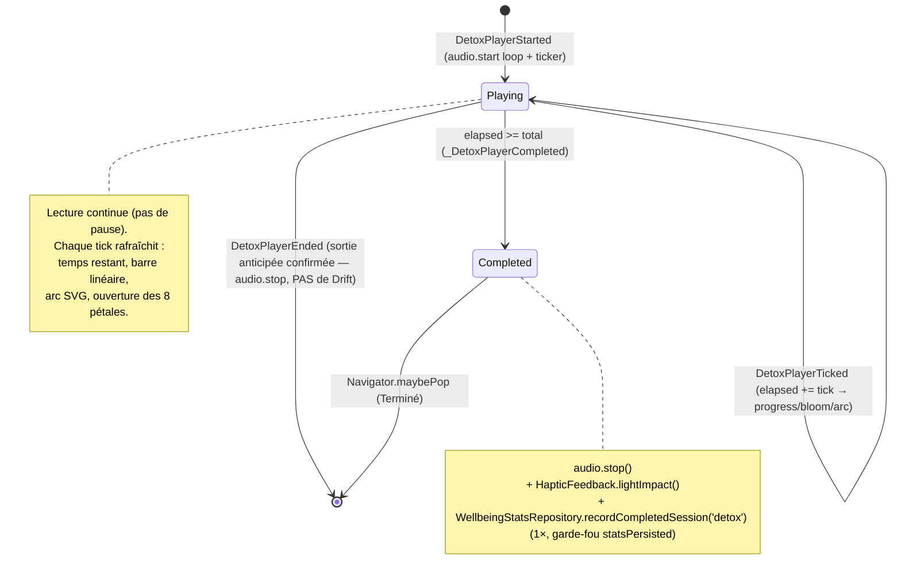

# Plan de page — Lecteur Détox « Ta pause » (DetoxPlayerPage)

> Plan auto-suffisant pour éditeur IA. Conforme aux règles `aidd_docs/memory/` de DIGIHARMONY :
> Flutter, monorepo Melos 7, client-only, **zéro collecte, zéro réseau, zéro SDK analytics**,
> vibration via `HapticFeedback` uniquement, i18n ARB gen-l10n 8 langues (repli `en`), Drift pour
> l'agrégat local, **`just_audio_background` autorisé UNIQUEMENT sur cet écran** (lecture continue
> écran verrouillé / arrière-plan), assets audio **locaux** bouclés.
>
> Cet écran est l'**écran de LECTURE** vers lequel navigue l'écran de configuration « Détox »
> (`/bubble/detox` → bouton « Lancer » → `/bubble/detox/player`). Il appartient à la catégorie
> **Détox** du hub « Choisis ta bulle ». Il réutilise les composants partagés `DigiToolbar`,
> `AppBackground`, `AppTheme`, `WellbeingStatsRepository` (Drift) posés par `respiration.md` et
> consommés par `les-sens.md`.

---

## 1. Contexte de la page

| Élément | Valeur |
| --- | --- |
| Nom | Lecteur Détox « Ta pause » — séance de **pause / déconnexion** audio (ambiance) sur une **durée choisie**, fleur à 8 pétales qui s'épanouit avec la progression |
| Widget page | `DetoxPlayerPage` (entrée + providers) + `DetoxPlayerView` (UI), fichier `lib/detox/view/detox_player_page.dart` |
| Route logique | `detox/player`, conceptuellement `/bubble/detox/player`, **enfant** de l'écran de config `/bubble/detox` — écran autonome plein écran |
| Parent | Écran de config Détox (`DetoxSetupPage`, `/bubble/detox`) → tap « Lancer » avec ambiance + durée choisies |
| Accès / rôles / auth | **Aucun** — app sans compte, sans identification. Accès libre. Seule permission projet : `PACKAGE_USAGE_STATS` (non requise ici) |
| **Contrat d'entrée** (paramètres de navigation) | `DetoxPlayerArgs { String ambianceId; int durationMinutes }` — voir §6. Toujours fournis par l'écran de config (jamais d'arrivée sans args) |
| Données affichées | Ambiance (badge), temps restant, temps total/écoulé, taux d'épanouissement (0→1), avancement de l'arc — **toutes dérivées de l'état du `DetoxPlayerBloc`** (en mémoire) |
| Persistance | **Écriture Drift uniquement à la FIN NATURELLE** (timer→0 → +1 agrégat `WellbeingStats`, `exerciseId='detox'`). Aucune écriture en sortie anticipée. Aucune lecture pendant la séance |
| État applicatif | `DetoxPlayerBloc` (timer / progression / états). Audio piloté par `DetoxPlayerController` (wrapper `just_audio_background`) |
| États écran | (a) **lecture** (playing, nominal), (b) **complétion / célébration** (timer à 0), (c) **dialog de sortie anticipée**. **Pas d'empty, pas d'error** (ambiance+durée toujours fournis ; asset manquant → fallback gracieux silencieux, cf. §8 / §14) |

**Pourquoi un Bloc ici :** la règle impose `bloc`/`flutter_bloc` *dès qu'il y a de l'état applicatif
mutable*. Ici l'état évolue dans le temps (timer de décompte → temps restant, barre linéaire, arc SVG,
taux d'épanouissement de la fleur) → `DetoxPlayerBloc` obligatoire. L'agrégat de fin de séance est
relationnel et requêtable → Drift (DEC-001), jamais HydratedBloc. **Aucun flag persistant** propre à cet
écran (pas de voix off ici), donc **pas de HydratedBloc**.

---

## 2. User Stories liées

**Aucune US backlog référencée fournie.** Le plan s'appuie sur les **décisions validées par
l'utilisateur** (reportées en §17) qui font office de critères d'acceptation. À rattacher si une US
existe (mettre à jour le champ `us:` de l'en-tête + du registry).

Critères d'acceptation dérivés des décisions (source des tests Kent) :
- **AC-1** : L'écran reçoit `ambianceId` + `durationMinutes` en paramètres de navigation et démarre la lecture **automatiquement** à l'ouverture.
- **AC-2** : L'**audio local** de l'ambiance (`assets/audio/detox/<ambianceId>.mp3`) est lu **en boucle** sur la durée choisie, **zéro réseau**, via `just_audio_background` (lecture continue écran verrouillé / app en arrière-plan, contrôles lockscreen/notification).
- **AC-3** : Le **timer** décompte `durationMinutes` et pilote simultanément : le **temps restant** affiché, la **barre linéaire**, l'**arc circulaire SVG**, et le **taux d'épanouissement de la fleur** (`bloomProgress` 0→1).
- **AC-4** : Le **badge ambiance** (toolbar trailing) reflète l'ambiance choisie (icône waves + label réutilisé de detox-setup).
- **AC-5** : **Fin naturelle** (timer→0) → état **complétion / célébration**, **arrêt de l'audio**, **+1 agrégat Drift `WellbeingStats('detox')`** **une seule fois** (garde-fou `statsPersisted`), `HapticFeedback` léger.
- **AC-6** : **« Terminer la pause »** (sortie anticipée, avant la fin) → `HapticFeedback.selectionClick()`, **dialog de confirmation** « Terminer la pause ? » ; si confirmé → arrêt audio + retour au hub, **SANS** incrément Drift.
- **AC-7** : Le **bouton retour** (chevron) et le **back système** suivent la même logique que « Terminer » (PopScope + dialog si séance non terminée ; pop direct si terminée).
- **AC-8** : Le **conseil « mode avion »** est un **message statique informatif** — **aucune** activation programmatique du mode avion.
- **AC-9** : Tout texte visible provient de l'**ARB** (gen-l10n), préfixe `detoxPlayer*`, FR+EN remplis, 6 langues = repli EN. Les **labels d'ambiance** sont **réutilisés** de detox-setup (pas redéfinis).
- **AC-10** : Si `reduceMotion` actif → boucles **décoratives** désactivées (shimmer conique, breathe des pétales, particules) **MAIS** l'arc + l'épanouissement (information de progression) **restent**, mis à jour par **paliers** (statique).
- **AC-11** : **Zéro collecte / zéro réseau** : audio en asset local, aucune analytics/tracking, aucune permission au-delà de `PACKAGE_USAGE_STATS`, vibration via `HapticFeedback` seulement.
- **AC-12** : **`just_audio_background` n'est câblé QUE pour cet écran** (Respiration & Les sens utilisent `just_audio` simple) ; l'audio s'**arrête proprement** au pop (pas de son fantôme, notification retirée).

---

## 3. Design (capturé) → mapping widgets

Écran mobile fond nuit `#16213C`, grand **halo radial central** (cyan→vert), **5 particules flottantes**
colorées (cyan/vert/jaune, animation `ptcl`). Police **DM Sans** (asset local). Réutilise la charte
bulle.

### Toolbar (haut)
| Élément design | Widget | Comportement |
| --- | --- | --- |
| Bouton retour (chevron-left, atténué `rgba(167,182,206,.5)`) | `DigiToolbar.onBack` | §6 — dialog de sortie si séance en cours (PopScope) |
| Titre centré « Ta pause » (bold) | `DigiToolbar.title` = `l10n.detoxPlayerTitle` | DM Sans bold |
| Badge ambiance à droite (pilule : icône waves verte + label, ex. « Mer », fond `#2FAE5F18`) | `DigiToolbar.trailing` = `_AmbianceBadge(ambianceId)` | reflète l'ambiance choisie (label réutilisé de detox-setup, cf. §13) |

> `DigiToolbar` expose déjà `trailing` (ajouté par `respiration.md`). **Aucune extension requise** :
> on passe `_AmbianceBadge` en `trailing`.

### Zone centrale — cœur animé (fleur 280 px) — PIÈCE MAÎTRESSE
| Élément design | Widget | Donnée / pilotage |
| --- | --- | --- |
| Halo bloom radial (cyan→vert) | couche `_DetoxBloom` (peinte) | décoratif, atténuable `reduceMotion` |
| Anneau **shimmer conique rotatif** (`detox-shimmer 20s`) | couche `_ShimmerRing` (`flutter_animate` rotate) | **décoratif** → coupé si `reduceMotion` |
| **Arc de progression circulaire** SVG (r=90, gradient cyan→vert→jaune, dasharray 565, `detox-arc`) | **`DetoxBloomPainter`** (CustomPainter) | **piloté par `state.progress`** (0→1) — INFORMATION, jamais coupé |
| **Fleur à 8 pétales** (`petal p0..p7`, ouverture `detox-bloom 12s` + `petal-breathe` en boucle) | **`DetoxBloomPainter`** (pétales) | **degré d'ouverture piloté par `state.bloomProgress`** (0→1) ; `petal-breathe` = boucle décorative coupée si `reduceMotion` |
| **Cœur central pulsant** (`detox-core-pulse`) | couche peinte + `flutter_animate` scale | pulse décoratif léger ; coupé si `reduceMotion` |

> ⚠️ **Exigence forte** : l'**arc** et l'**épanouissement de la fleur** sont **PILOTÉS PAR LA PROGRESSION
> RÉELLE** du timer audio (`state.progress`/`state.bloomProgress`), **pas juste décoratifs**. Les boucles
> `shimmer`, `petal-breathe`, `core-pulse`, particules sont **décoratives** (coupées sous `reduceMotion`).

### Message (sous la fleur)
| Élément design | Widget | Donnée |
| --- | --- | --- |
| Titre « Plus tu lâches, plus ça s'épanouit » (18px bold) | `Text` | `l10n.detoxPlayerBloomTitle` |
| Sous-titre « Tu es en pleine pause. Bien joué. » (`#A7B6CE`) | `Text` | `l10n.detoxPlayerBloomSubtitle` |

### Bloc temps
| Élément design | Widget | Donnée |
| --- | --- | --- |
| « 3 min 48 s restantes » (temps **restant**) | `Text` | `l10n.detoxPlayerTimeRemaining(formatDuration(state.remaining))` |
| Barre de progression **linéaire** (120px, remplie ~75%, gradient cyan→vert) | `_LinearProgress(value: state.progress)` | `state.progress` (0→1) |
| « 11 min 12 s » (durée totale / écoulée) | `Text` | `l10n.detoxPlayerTotalTime(formatDuration(state.total))` (et/ou écoulé selon design) |

### Conseil (bas) + CTA
| Élément design | Widget | Comportement |
| --- | --- | --- |
| Carte « Ne touche pas ton téléphone — mode avion conseillé » (icône plane, `detox-card-in`) | `_AirplaneTipCard` | `l10n.detoxPlayerAirplaneTip`, icône `Icons.flight` — **statique informatif** (AC-8) |
| Bouton bas large « Terminer la pause » (outline/atténué, transparent + bordure légère) | `_EndButton` | §6 — `HapticFeedback.selectionClick()` + dialog de confirmation |

### Tokens design (réutiliser `AppTheme`, étendre si besoin)
| Token | Valeur | Source |
| --- | --- | --- |
| `background` (fond nuit) | `#16213C` | **réutilise** `AppTheme.bubbleBackground` (renommé depuis `breathingBackground`, cf. `les-sens.md` §11) |
| cyan | `#3FB8E6` | `AppTheme.primary` (existant) |
| vert | `#2FAE5F` / `#A8D24E` | `#A8D24E` = token `success`/vert déjà ajouté (respiration) ; `#2FAE5F` = teinte badge ambiance → **réutilise `AppTheme.detoxSea #2FAE5F`** (déjà ajouté par `detox.md` / detox-setup) |
| jaune | `#F0C84A` | **réutilise** `AppTheme.sensesAccent #F0C84A` (déjà ajouté par `les-sens.md`) — pétales/arc fin de gradient |
| `foreground` | `#F2F6FB` | `AppTheme.foreground` (existant) |
| `muted` | `#A7B6CE` | **réutilise** `AppTheme.muted #A7B6CE` (déjà ajouté par `detox.md` / detox-setup) |
| radius | `12` / `full` | tokens radius existants |
| Police | `DM Sans` | asset local (déjà posé par le hub) |

> Le fond `#16213C` est **identique** à Respiration/Les sens → réutiliser `AppTheme.bubbleBackground`,
> **aucun nouveau token de fond**. Gradient fleur/arc = cyan `#3FB8E6` → vert `#A8D24E` → jaune `#F0C84A`.

### Icônes (Material, zéro dépendance ajoutée)
| Design | Material |
| --- | --- |
| `waves` (badge ambiance Mer) | `Icons.waves` (ou `Icons.water` selon ambiance — mapping detox-setup) |
| `plane` (conseil mode avion) | `Icons.flight` |
| `chevron-left` | `Icons.chevron_left` (porté par `DigiToolbar`) |

---

## 4. Arbre de widgets

```
DetoxPlayerPage (StatelessWidget)            // lib/detox/view/detox_player_page.dart
│  // reçoit DetoxPlayerArgs { ambianceId, durationMinutes } via la route (§6)
└─ BlocProvider(create: DetoxPlayerBloc(
│     session: DetoxSession(
│        ambianceId: args.ambianceId,
│        total: Duration(minutes: args.durationMinutes),
│     ),
│     statsRepository: context.read<WellbeingStatsRepository>(),  // Drift, écriture fin
│     audio: DetoxPlayerController(),                             // just_audio_background, asset local
│   )..add(const DetoxPlayerStarted()))                          // démarrage auto (AC-1/AC-2)
   └─ DetoxPlayerView (StatelessWidget)
      └─ PopScope(                                               // §6 — interception back système
           canPop: false,
           onPopInvokedWithResult: (didPop, _) async {
             if (didPop) return;
             await _onExitRequested(context);
           },
           child: Scaffold(extendBodyBehindAppBar: true, backgroundColor: AppTheme.bubbleBackground,
             appBar: DigiToolbar(
               title: l10n.detoxPlayerTitle,
               showMenu: false,
               onBack: () => _onExitRequested(context),          // §6 dialog de sortie
               trailing: _AmbianceBadge(ambianceId: args.ambianceId),
             ),
             body: AppBackground(
               background: AppTheme.bubbleBackground,            // #16213C
               child: SafeArea(
                 child: BlocConsumer<DetoxPlayerBloc, DetoxPlayerState>(
                   listenWhen: (p, c) => p.status != c.status,
                   listener: _onStateSideEffects,                // haptique + audio (§7)
                   builder: (context, state) => switch (state.status) {
                     DetoxPlayerStatus.playing   => _PlayingLayout(state),
                     DetoxPlayerStatus.completed => _CelebrationLayout(state),
                   },
                 ),
               ),
             ),
           ),
         )

_PlayingLayout(state)                                            // nominal (AC-3)
└─ Stack
   ├─ _ParticlesLayer()                       // 5 particules ptcl — décoratif (coupé si reduceMotion)
   └─ Column
      ├─ Spacer
      ├─ SizedBox(280×280,
      │    child: _DetoxBloom(
      │       progress: state.progress,        // arc circulaire (INFORMATION)
      │       bloomProgress: state.bloomProgress, // ouverture des 8 pétales (INFORMATION)
      │       reduceMotion: reduceMotion,
      │    )                                   // = CustomPaint(DetoxBloomPainter) + couches décoratives
      │      // couches : halo bloom · _ShimmerRing (conique rotatif, déco) · core pulse (déco)
      │  )
      ├─ Text(l10n.detoxPlayerBloomTitle)      // « Plus tu lâches, plus ça s'épanouit »
      ├─ Text(l10n.detoxPlayerBloomSubtitle)   // « Tu es en pleine pause. Bien joué. »
      ├─ Spacer
      ├─ Text(l10n.detoxPlayerTimeRemaining(formatDuration(state.remaining)))  // « 3 min 48 s restantes »
      ├─ _LinearProgress(value: state.progress)                                // barre 120px gradient
      ├─ Text(l10n.detoxPlayerTotalTime(formatDuration(state.total)))          // « 11 min 12 s »
      ├─ _AirplaneTipCard()                    // conseil mode avion (statique)
      └─ _EndButton(onTap: () => _onExitRequested(context))                    // « Terminer la pause »

_CelebrationLayout(state)                       // complétion (AC-5)
└─ Column (centré)
   ├─ _DetoxBloom(progress: 1.0, bloomProgress: 1.0, reduceMotion: reduceMotion)  // fleur pleinement éclose
   ├─ _CelebrationBurst()                       // glow vert #A8D24E (flutter_animate, one-shot, coupé si reduceMotion)
   ├─ Text(l10n.detoxPlayerCelebrationTitle)    // titre de fin de pause
   ├─ Text(l10n.detoxPlayerCelebrationBody)     // message apaisant
   └─ TextButton(l10n.detoxPlayerCelebrationDone, onPressed: () => Navigator.maybePop(context))
```

> **Pas de bouton pause explicite** (le design n'en montre pas) → **lecture continue**, sortie via
> « Terminer la pause ». Décision « garder simple » : **aucun état `paused`** (cf. §5). Le seul moyen
> d'interrompre est « Terminer » (sortie anticipée) ou la fin naturelle.

---

## 5. Machine d'états (timer / progression) — `DetoxPlayerBloc`

### Donnée pure (figée — `core_package`)
```dart
// packages/core_package/lib/src/detox/detox_session.dart
@immutable
class DetoxSession {
  const DetoxSession({required this.ambianceId, required this.total});

  final String ambianceId;   // 'water' | 'sea' | 'white_noise' | 'forest' (DetoxAmbianceId, detox-setup)
  final Duration total;      // durationMinutes choisie à la config (5 / 10 / 15)

  /// Chemin de l'asset audio local de l'ambiance (zéro réseau).
  String get audioAsset => 'assets/audio/detox/$ambianceId.mp3';
}
```
> `DetoxSession` est **donnée pure** (aucun import Flutter), placée dans `core_package` (comme
> `BreathingSession`, `GroundingExercise`). Les **ids d'ambiance** sont l'enum **`DetoxAmbianceId`**
> **défini par detox-setup** (`water`, `sea`, `white_noise`, `forest`) — **réutiliser** cet enum, ne pas
> le redéfinir. Idéalement `ambianceId` est typé `DetoxAmbianceId` (et non `String`) pour profiter de
> l'exhaustivité du `switch`. Durées = `DetoxDuration` (5/10/15) de detox-setup.

### États (`DetoxPlayerState`, equatable)
```dart
enum DetoxPlayerStatus { playing, completed }

class DetoxPlayerState extends Equatable {
  const DetoxPlayerState({
    required this.status,
    required this.total,        // durée totale (Duration)
    required this.elapsed,      // temps écoulé (Duration)
    this.statsPersisted = false, // garde-fou : agrégat écrit 1 seule fois (AC-5)
  });

  final DetoxPlayerStatus status;
  final Duration total;
  final Duration elapsed;
  final bool statsPersisted;

  Duration get remaining => total - elapsed;          // « 3 min 48 s restantes »
  double get progress =>                               // 0→1 (barre linéaire + arc SVG)
      total.inMilliseconds == 0 ? 0 : (elapsed.inMilliseconds / total.inMilliseconds).clamp(0.0, 1.0);
  double get bloomProgress => progress;                // « plus tu lâches, plus ça s'épanouit » (0→1)
  // copyWith + props...
}
```
> **`progress` et `bloomProgress` dérivent du même temps écoulé** → l'arc et la fleur sont garantis
> synchronisés au timer (exigence AC-3). On peut, pour l'esthétique, faire courber `bloomProgress`
> (ex. `Curves.easeOut`) **dans le painter** sans changer la donnée.

### Événements (`DetoxPlayerEvent`)
| Événement | Déclencheur | Effet |
| --- | --- | --- |
| `DetoxPlayerStarted` | auto à l'ouverture (AC-1) | `audio.start(session.audioAsset, loop: true)` puis arme le ticker (1 tick / seconde, ou 200 ms pour une fleur fluide) |
| `DetoxPlayerTicked` | ticker interne | `elapsed += tick` ; si `elapsed >= total` → `_DetoxPlayerCompleted` ; sinon émet le nouvel `elapsed` (rafraîchit temps restant / barre / arc / fleur) |
| `DetoxPlayerEnded` | « Terminer la pause » confirmé / back confirmé (AC-6) | annule ticker + `audio.stop()` (PAS d'écriture Drift) — puis la View pop |
| `_DetoxPlayerCompleted` (interne, via Ticked) | `elapsed` atteint `total` (AC-5) | `status=completed`, `audio.stop()`, écrit Drift 1× (`statsPersisted`), `HapticFeedback.lightImpact()` |

> **Pas d'événement Pause/Resume** (décision « garder simple », design sans bouton pause).

### Diagramme d'états (à attacher au plan — `aidd:03:components_behavior`)


### Implémentation du ticker
- Utiliser un `Stream.periodic` / `Timer.periodic` à **petit pas** (recommandé : **200 ms**) pour une
  fleur qui s'épanouit visuellement de façon **fluide**, ou **1 s** si l'on préfère minimiser les
  rebuilds (l'affichage `min/s` n'a besoin que de la seconde — la fleur peut interpoler côté painter).
  **Choix retenu** : tick **1 s** pour les textes + interpolation visuelle de la fleur/arc côté
  `flutter_animate`/`AnimatedBuilder` entre deux ticks (perf + fluidité). À trancher à l'implémentation.
- À chaque tick : `elapsed += tick`, `clamp` à `total`. Quand `elapsed >= total` → `_DetoxPlayerCompleted`.
- **`close()` du bloc** : annuler le ticker + `audio.dispose()` (pas de fuite, **pas de son qui continue
  après pop**, notification background retirée — AC-12).

### Garde-fou anti double-comptage (AC-5)
- `statsPersisted` dans l'état : à la transition `→ completed`, **si `!statsPersisted`** →
  `recordCompletedSession('detox')` puis émettre `statsPersisted=true`. Empêche tout double +1 (rebuild,
  ré-émission). **Aucune écriture** sur `DetoxPlayerEnded` (sortie anticipée).

---

## 6. Contrat de navigation entrant + sortie + dialog

### Contrat d'entrée (paramètres de l'écran de config Détox → lecteur)
```dart
// lib/detox/detox_player_args.dart
@immutable
class DetoxPlayerArgs {
  const DetoxPlayerArgs({required this.ambianceId, required this.durationMinutes});
  final String ambianceId;     // ambiance choisie à /bubble/detox (ex. 'sea')
  final int durationMinutes;   // durée choisie à /bubble/detox (ex. 11)
}
```
| Aspect | Détail |
| --- | --- |
| Route logique | `detox/player` (`/bubble/detox/player`), **enfant de** `/bubble/detox` (config). Atteint depuis `DetoxSetupPage` (bouton « Lancer ») via `MaterialPageRoute(builder: (_) => DetoxPlayerPage(args: DetoxPlayerArgs(ambianceId: ..., durationMinutes: ...)))` |
| Passage des args | **Constructeur typé** `DetoxPlayerPage({required DetoxPlayerArgs args})` (préféré aux `RouteSettings.arguments` non typés). Cohérent avec le style des autres écrans (pages instanciées directement) |
| Garantie | `ambianceId` + `durationMinutes` **toujours fournis** par detox-setup → **pas d'état empty/error** (cf. §14). Si detox-setup évolue vers une route nommée, exposer un `static route(args)` helper |
| Retour normal | `Navigator.maybePop(context)` → revient à l'écran de config Détox (puis hub) |
| Sortie en séance (AC-6/AC-7) | « Terminer la pause » **ET** chevron retour **ET** back système → si `status == playing` (séance **non terminée**) → `HapticFeedback.selectionClick()` + **dialog de confirmation**. Si `completed` → pop direct |

### Interception du back système (PopScope)
```dart
PopScope(
  canPop: false,                          // on gère nous-mêmes (séance en cours)
  onPopInvokedWithResult: (didPop, _) async {
    if (didPop) return;
    await _onExitRequested(context);
  },
  child: Scaffold(...),
)
```

### `_onExitRequested` (chevron / back / bouton « Terminer »)
```dart
Future<void> _onExitRequested(BuildContext context) async {
  final bloc = context.read<DetoxPlayerBloc>();
  // Séance terminée → pas de confirmation, pop direct (audio déjà stoppé).
  if (bloc.state.status == DetoxPlayerStatus.completed) {
    Navigator.of(context).maybePop();
    return;
  }
  await HapticFeedback.selectionClick();                 // AC-6 (retour tactile sur « Terminer »)
  final leave = await showDialog<bool>(                  // dialog « Terminer la pause ? »
    context: context,
    builder: (_) => AlertDialog(
      title: Text(l10n.detoxPlayerEndConfirmTitle),      // « Terminer la pause ? »
      content: Text(l10n.detoxPlayerEndConfirmBody),     // « Ta pause n'est pas finie… »
      actions: [
        TextButton(child: Text(l10n.detoxPlayerEndConfirmCancel), onPressed: () => Navigator.pop(context, false)),
        TextButton(child: Text(l10n.detoxPlayerEndConfirmConfirm), onPressed: () => Navigator.pop(context, true)),
      ],
    ),
  );
  if (leave == true && context.mounted) {
    bloc.add(const DetoxPlayerEnded());                  // stop audio + ticker, PAS d'écriture Drift
    Navigator.of(context).maybePop();                    // retour hub (sortie anticipée = 0 agrégat, AC-6)
  }
}
```
> ⚠️ Sortie anticipée **n'incrémente PAS** l'agrégat Drift (seule la **fin naturelle** compte, AC-5).
> Le bouton retour **et** le back système passent par le **même** `_onExitRequested` → cohérence garantie.

---

## 7. Effets de bord (haptique + audio) — `BlocListener`

Centralisés dans `_onStateSideEffects` (listener du `BlocConsumer`), sur changement de `status`.
Le **démarrage** et le **décompte** de l'audio sont gérés dans le **bloc** (sur `Started`/`Ticked`).

| Transition / action | HapticFeedback | Audio (`just_audio_background`) |
| --- | --- | --- |
| `DetoxPlayerStarted` (auto, dans le bloc) | — (calme recherché, **pas de vibration pendant la lecture**) | `audio.start(asset, loop: true)` |
| Tick pendant la lecture | — | (aucun — lecture continue en boucle) |
| `→ completed` (fin naturelle, AC-5) | `HapticFeedback.lightImpact()` (léger) | `audio.stop()` |
| « Terminer » confirmé (`DetoxPlayerEnded`, AC-6) | `HapticFeedback.selectionClick()` (déclenché dans `_onExitRequested`, avant le dialog) | `audio.stop()` |
| Pop / `close()` du bloc | — | `audio.dispose()` (notification background retirée, pas de son fantôme) |

> **Aucune vibration pendant la lecture** (on cherche le calme). Haptique uniquement : **léger** à la
> complétion, **selectionClick** sur « Terminer ». Tout passe par `HapticFeedback` (règle
> permissions-zero-collecte : pas de permission `VIBRATE`, pas de package vibration).

---

## 8. Intégration audio `just_audio_background` (SEUL écran autorisé)

### Pourquoi `just_audio_background` ici (et pas ailleurs)
Détox est une **pause de déconnexion** : l'utilisateur peut **verrouiller son écran** / mettre l'app en
**arrière-plan** pendant que l'ambiance continue (cohérent avec « mode avion conseillé », réduction du
temps d'écran). → lecture continue + contrôles lockscreen/notification = `just_audio_background`.
**Respiration & Les sens restent sur `just_audio` simple** (exercices au premier plan). `just_audio_background`
**n'est câblé QUE pour cet écran** (AC-12).

### Wiring background (à faire au moment de cette feature — déjà noté dans project-overview « Reste à faire »)
- `JustAudioBackground.init(...)` dans `main`/`bootstrap.dart` (id de canal de notification, titre).
- **Android** : `<service>` + `<receiver>` `just_audio_background` dans `AndroidManifest.xml`,
  `FOREGROUND_SERVICE` mediaPlayback selon la doc du package.
- **iOS** : `UIBackgroundModes` → `audio` dans `Info.plist`.
> ⚠️ **Pas de permission réseau / pas de SDK réseau** : le service ne fait que jouer un **asset local**.
> Aucune URL, aucun streaming. Cohérent avec « zéro collecte / zéro réseau ».

### Assets (packagés, zéro réseau)
```yaml
# apps/digiharmony_app/pubspec.yaml  → flutter > assets
assets:
  - assets/audio/detox/
```
Fichiers (un par ambiance — 4 ids `DetoxAmbianceId` de detox-setup) :
- `assets/audio/detox/water.mp3`
- `assets/audio/detox/sea.mp3` (« Mer »)
- `assets/audio/detox/white_noise.mp3`
- `assets/audio/detox/forest.mp3`

> Boucle : les fichiers peuvent être **courts** (boucle parfaite) et **rejoués en boucle** sur toute la
> durée choisie (`LoopMode.one`), évitant de packager des fichiers de plusieurs minutes.

### `DetoxPlayerController` (wrapper testable de `just_audio_background`)
```dart
// lib/detox/audio/detox_player_controller.dart
class DetoxPlayerController {
  final AudioPlayer _player = AudioPlayer();   // just_audio (+ source background)

  /// Démarre l'ambiance en boucle. asset = session.audioAsset.
  Future<void> start(String asset, {required String mediaTitle}) async {
    await _player.setLoopMode(LoopMode.one);   // boucle continue
    await _player.setAudioSource(
      AudioSource.asset(
        asset,
        // tag MediaItem requis par just_audio_background (lockscreen/notification)
        tag: MediaItem(id: asset, title: mediaTitle /* l10n.detoxPlayerMediaTitle */, artist: 'DIGIHARMONY'),
      ),
    );
    await _player.play();
  }

  Future<void> stop()    => _player.stop();
  Future<void> dispose() => _player.dispose();
}
```
- **Testabilité** : `DetoxPlayerBloc` reçoit `DetoxPlayerController` injecté → mock via `mocktail` pour
  vérifier `start(loop)` au démarrage, `stop()` à la complétion ET à la sortie anticipée, `dispose()`
  au `close()`, **sans** lecteur réel ni service background.
- **Fallback gracieux (asset manquant)** : `start()` enveloppé en `try/catch` → si l'asset est
  introuvable, **ne pas crasher, ne pas afficher d'erreur** : la séance **continue en silence** (le
  timer/la fleur/l'arc avancent normalement). Logguer en debug seulement. (cf. §14 — pas d'écran error).

---

## 9. Agrégat Drift — `WellbeingStats` (réutilisé, `exerciseId='detox'`)

### Réutilisation de la fondation existante
> La table `WellbeingStats(exerciseId, completedCount, lastCompletedAt)` + `WellbeingStatsRepository`
> sont **posées par `respiration.md`** et **réutilisées par `les-sens.md`** (`exerciseId='senses'`).
> Ce plan **consomme** la **même** `AppDatabase` / le **même** repository avec **`exerciseId='detox'`**.
> **NE PAS** dupliquer la table ni créer une 2e base. Si Respiration/Les sens n'ont pas encore posé la
> DB au moment de l'implémentation, voir §10 de `respiration.md` (fondation Drift).

### Interface (rappel — déjà définie)
```dart
abstract class WellbeingStatsRepository {
  Future<void> recordCompletedSession(String exerciseId);  // upsert +1, lastCompletedAt = now
  Stream<int> watchCompletedCount(String exerciseId);      // réactif (futur écran stats)
}
```
- **Appel unique** dans le bloc à la transition `→ completed` (fin naturelle), **gardé par
  `statsPersisted`** : `recordCompletedSession('detox')`. **0 appel** sur sortie anticipée (AC-6).
- **Aucune lecture** pendant la séance.
- Écriture en `try/catch` **non bloquant** (un échec DB ne casse pas la célébration).
- **Test Kent** : fake/mocktail repo → vérifier `recordCompletedSession('detox')` appelé **exactement
  1×** sur séance complète (timer→0), **0×** si « Terminer » avant la fin.

---

## 10. CustomPainter — `DetoxBloomPainter` (fleur 8 pétales + arc de progression)

Cœur visuel **piloté par la progression** (pas d'asset image, pas de package tiers — Material/CustomPaint
uniquement).

```dart
// lib/detox/widgets/detox_bloom_painter.dart
class DetoxBloomPainter extends CustomPainter {
  DetoxBloomPainter({required this.progress, required this.bloomProgress});
  final double progress;       // 0→1 : avancement de l'arc circulaire (INFORMATION, AC-3)
  final double bloomProgress;  // 0→1 : degré d'ouverture des 8 pétales (INFORMATION, AC-3)

  @override
  void paint(Canvas canvas, Size size) {
    final center = size.center(Offset.zero);
    final r = 90.0;                                   // rayon de l'arc (design SVG r=90)

    // 1) ARC DE PROGRESSION : gradient cyan→vert→jaune, dasharray 565 ≈ 2πr.
    //    sweepAngle = 2π * progress, départ -π/2 (haut). SweepGradient(cyan #3FB8E6, vert #A8D24E, jaune #F0C84A).
    //    Paint: stroke, strokeCap.round, largeur ~6.
    //    -> matérialise l'avancement de la séance.

    // 2) 8 PÉTALES : pour i in 0..7, angle = i * (2π/8). Chaque pétale s'ouvre selon bloomProgress :
    //    échelle/longueur du pétale = lerp(replié, épanoui, eased(bloomProgress)).
    //    Couleur = gradient radial cyan→vert→jaune selon le rayon. (option : léger décalage de phase p0..p7).

    // 3) CŒUR CENTRAL : petit disque (pulse géré en widget, pas ici).
  }

  @override
  bool shouldRepaint(covariant DetoxBloomPainter old) =>
      old.progress != progress || old.bloomProgress != bloomProgress;
}
```
- **`_DetoxBloom`** (widget) compose : `CustomPaint(painter: DetoxBloomPainter(...))` + couches
  **décoratives** (`_ShimmerRing` conique rotatif, halo bloom, core pulse) **conditionnées à
  `reduceMotion`** (§12).
- **Anneau shimmer conique rotatif** : `SweepGradient` + `flutter_animate .rotate(...).repeat()` →
  **coupé** si `reduceMotion`.
- **`petal-breathe`** (respiration lente des pétales) = boucle décorative légère (`.scale(...).repeat()`)
  → **coupée** si `reduceMotion` ; l'ouverture pilotée par `bloomProgress` **reste**.

---

## 11. Particules + couches décoratives

| Couche | Widget | Comportement |
| --- | --- | --- |
| 5 particules flottantes (cyan/vert/jaune, anim `ptcl`) | `_ParticlesLayer` (positions fixes + `flutter_animate` translate/fade `.repeat()`) | **décoratif** → **coupé** si `reduceMotion` (couche masquée) |
| Halo radial central (cyan→vert) | dans `_DetoxBloom` (peint) | statique acceptable ; pulse léger coupé si `reduceMotion` |
| Anneau shimmer conique | `_ShimmerRing` | rotation `.repeat()` coupée si `reduceMotion` |
| Cœur pulsant | `flutter_animate` scale `.repeat()` | coupé si `reduceMotion` (taille fixe) |

---

## 12. Animations (`flutter_animate`) + accessibilité

`flutter_animate: ^4.5.2` déjà en dépendance.

| Animation | Cible | Effet | Catégorie |
| --- | --- | --- | --- |
| **Ouverture fleur** (`detox-bloom`) | pétales (`DetoxBloomPainter`) | ouverture pilotée par `bloomProgress` (timer) | **INFORMATION** (jamais coupée) |
| **Arc de progression** (`detox-arc`) | arc (`DetoxBloomPainter`) | sweep pilotée par `progress` (timer) | **INFORMATION** (jamais coupée) |
| **Barre linéaire** | `_LinearProgress` | remplissage = `progress` | **INFORMATION** |
| **Shimmer conique** (`detox-shimmer 20s`) | `_ShimmerRing` | rotate `.repeat()` | **décoratif** |
| **Core pulse** (`detox-core-pulse`) | cœur | scale `.repeat()` | **décoratif** |
| **Halo bloom** (`detox-halo-bloom`) | halo radial | pulse `.repeat()` | **décoratif** |
| **petal-breathe** | pétales | scale lent `.repeat()` | **décoratif** |
| **Particules** (`ptcl`) | `_ParticlesLayer` | translate/fade `.repeat()` | **décoratif** |
| **Entrées** (`detox-msg`, `detox-time`, `detox-card-in`) | message/temps/carte | `fadeIn`+`slide` (one-shot) | transition d'entrée (atténuable) |
| **Célébration** | `_CelebrationBurst` | `fadeIn`+`scale` vert `#A8D24E` (one-shot) | décoratif (statique si reduceMotion) |

### Respect `reduceMotion` (AC-10) — OBLIGATOIRE
```dart
final reduceMotion = MediaQuery.of(context).disableAnimations;
```
- Si `reduceMotion == true` :
  - **Décoratifs coupés** : shimmer conique, core pulse, halo pulse, **petal-breathe**, **particules**,
    burst de célébration → versions **statiques**.
  - **INFORMATION conservée** : l'**arc** et l'**épanouissement de la fleur** restent **pilotés par la
    progression**, mais mis à jour **par paliers** (pas d'interpolation fluide entre ticks) → repaint à
    chaque tick `state.progress` sans tween. La **barre linéaire** et les **textes** restent exacts.
  - La **mécanique reste 100 % fonctionnelle** : timer, audio, complétion, Drift, sortie — rien n'en dépend.
- Encapsuler les `effects` conditionnels dans chaque widget animé.
- **Test Kent** : avec `MediaQueryData(disableAnimations: true)`, vérifier qu'aucune animation en boucle
  n'est active (pas de `pump` infini), que `progress`/`bloomProgress` avancent quand même via le ticker
  (FakeAsync/pump), et que la séance se termine (completed) normalement.

---

## 13. Internationalisation (ARB / gen-l10n)

Système : **gen-l10n / ARB**, dir `lib/l10n/arb`, template `app_en.arb`, 8 langues
`en/fr/el/it/ro/tr/es/mk`, repli `en`. Helper `context.l10n`.

### Clés à CRÉER (préfixe `detoxPlayer*`)
| Clé ARB | EN | FR | Params |
| --- | --- | --- | --- |
| `detoxPlayerTitle` | "Your break" | "Ta pause" | — |
| `detoxPlayerAmbianceBadge` | "{ambiance}" | "{ambiance}" | `{ambiance}` (String — **valeur = label réutilisé** de detox-setup) |
| `detoxPlayerBloomTitle` | "The more you let go, the more it blooms" | "Plus tu lâches, plus ça s'épanouit" | — |
| `detoxPlayerBloomSubtitle` | "You're on a break. Well done." | "Tu es en pleine pause. Bien joué." | — |
| `detoxPlayerTimeRemaining` | "{time} remaining" | "{time} restantes" | `{time}` (String formaté, ex. « 3 min 48 s ») |
| `detoxPlayerTotalTime` | "{time}" | "{time}" | `{time}` (String, ex. « 11 min 12 s ») |
| `detoxPlayerAirplaneTip` | "Don't touch your phone — airplane mode recommended" | "Ne touche pas ton téléphone — mode avion conseillé" | — |
| `detoxPlayerEnd` | "End the break" | "Terminer la pause" | — |
| `detoxPlayerEndConfirmTitle` | "End the break?" | "Terminer la pause ?" | — |
| `detoxPlayerEndConfirmBody` | "Your break isn't over yet. It won't be counted." | "Ta pause n'est pas finie. Elle ne sera pas comptée." | — |
| `detoxPlayerEndConfirmConfirm` | "End" | "Terminer" | — |
| `detoxPlayerEndConfirmCancel` | "Keep going" | "Continuer" | — |
| `detoxPlayerCelebrationTitle` | "Break complete" | "Pause terminée" | — |
| `detoxPlayerCelebrationBody` | "You took a real break. Nicely done." | "Tu as pris une vraie pause. Bravo." | — |
| `detoxPlayerCelebrationDone` | "Done" | "Terminé" | — |
| `detoxPlayerToolbarBack` | "Back" | "Retour" | — (a11y) |
| `detoxPlayerMediaTitle` | "Detox break" | "Pause détox" | — (titre lockscreen/notification, MediaItem) |

### Clés RÉUTILISÉES (NE PAS redéfinir — définies par detox-setup / `detox.md`)
- Labels d'ambiance (4) : `detoxAmbianceWaterLabel`, `detoxAmbianceSeaLabel` (« Mer »),
  `detoxAmbianceWhiteNoiseLabel`, `detoxAmbianceForestLabel` → `_AmbianceBadge` résout
  `ambianceId → label` via la **même** source que detox-setup (`DetoxAmbiance` en core_package). Le badge
  passe ce label dans `detoxPlayerAmbianceBadge`.

### Fichiers cibles
- `app_en.arb` (template) : valeurs EN **+ blocs `@detoxPlayerXxx`** avec `description` + `placeholders`
  (`ambiance`/`time` = `String`).
- `app_fr.arb` : valeurs FR.
- `app_el.arb`, `app_it.arb`, `app_ro.arb`, `app_tr.arb`, `app_es.arb`, `app_mk.arb` : **copie EN**
  (repli), **relecture native ultérieure** (el/ro/tr/mk = locuteur natif).
- Régénérer : `flutter gen-l10n` puis `flutter analyze --fatal-infos`.

### Résolution ambiance → label + icône (réutilise detox-setup)
```dart
// lib/detox/detox_ambiance_l10n.dart  (RÉUTILISER l'extension de detox-setup si déjà présente)
extension DetoxAmbianceL10n on DetoxAmbianceId {   // enum de core_package (detox-setup)
  String ambianceLabel(AppLocalizations l) => switch (this) {
    DetoxAmbianceId.water      => l.detoxAmbianceWaterLabel,
    DetoxAmbianceId.sea        => l.detoxAmbianceSeaLabel,
    DetoxAmbianceId.whiteNoise => l.detoxAmbianceWhiteNoiseLabel,
    DetoxAmbianceId.forest     => l.detoxAmbianceForestLabel,
  };
  IconData get ambianceIcon => switch (this) {
    DetoxAmbianceId.water      => Icons.water,
    DetoxAmbianceId.sea        => Icons.waves,
    DetoxAmbianceId.whiteNoise => Icons.graphic_eq,
    DetoxAmbianceId.forest     => Icons.forest,
  };
}
```
> ⚠️ detox-setup a déjà la source de vérité ambiance (`DetoxAmbiance`/`DetoxAmbianceId` + labels en
> core_package) → **réutiliser** ; si l'extension label/icône existe déjà côté detox-setup, l'importer
> au lieu de la dupliquer. Le badge design « Mer » utilise `Icons.waves` + teinte `detoxSea #2FAE5F`.

### Formatage de durée (helper partagé)
```dart
// lib/detox/detox_duration_format.dart
String formatDuration(Duration d) {
  final m = d.inMinutes;
  final s = d.inSeconds % 60;
  return '$m min $s s';   // « 3 min 48 s » — adapter si l10n/pluriels requis
}
```
> Le rendu « X min Y s » est passé en `String` aux clés `detoxPlayerTimeRemaining`/`TotalTime`. Si une
> localisation fine des unités est exigée plus tard, déplacer le formatage vers des clés ICU dédiées.

---

## 14. États de la page

| État | Présent ? | Détail |
| --- | --- | --- |
| **Lecture** (playing) | ✅ | fleur+arc pilotés par progression, temps restant, barre, conseil, CTA « Terminer », audio en boucle |
| **Complétion** (completed) | ✅ | fleur pleinement éclose, message de fin, `HapticFeedback.lightImpact()`, agrégat Drift +1 (1×), bouton « Terminé » |
| **Dialog de sortie anticipée** | ✅ | « Terminer la pause ? » (chevron / back / CTA) — confirmer = stop audio + retour, **0 agrégat** |
| Empty | ❌ | `ambianceId` + `durationMinutes` **toujours fournis** par detox-setup |
| Error | ❌ | **asset audio manquant → fallback gracieux silencieux** (séance continue sans son, pas d'écran d'erreur, cf. §8) ; écriture Drift en `try/catch` non bloquant |
| Loading | ❌ | aucune attente réseau ; `audio.start` asynchrone n'introduit pas d'écran loading (la fleur démarre à 0) |
| **Pause** | ❌ | **volontairement absent** (design sans bouton pause ; lecture continue, sortie via « Terminer ») |

Feedback utilisateur : haptique (léger à la fin, selectionClick sur « Terminer »), audio d'ambiance,
dialog de sortie, célébration, fleur+arc qui matérialisent l'avancement.

---

## 15. Composants réutilisables (vs registry)

Registry actuel : `DigiToolbar` (trailing), `AppBackground` (background), `AppTheme`, `BubbleCard`,
`VoiceoverCubit`, `WellbeingStats`+`WellbeingStatsRepository` (Drift).

| Composant | Statut | Action |
| --- | --- | --- |
| `DigiToolbar` (avec `trailing`) | **partagé existant** | **Réutiliser** : `trailing = _AmbianceBadge`. Aucune extension |
| `AppBackground` (avec `background`) | **partagé existant** | **Réutiliser** : `background = AppTheme.bubbleBackground` (#16213C) |
| `AppTheme` | **partagé existant** | **Réutiliser** `bubbleBackground`, `success/vert #A8D24E`, `sensesAccent #F0C84A`, `detoxSea #2FAE5F` (badge/halo, déjà ajouté par detox-setup), `muted #A7B6CE` (déjà ajouté par detox-setup). Aucun nouveau token attendu |
| `WellbeingStats` + `WellbeingStatsRepository` (Drift) | **partagé existant** | **Réutiliser** avec `exerciseId='detox'`, **ne PAS dupliquer** (même AppDatabase) |
| `VoiceoverCubit` / `VoiceoverButton` | **non concerné** | Détox n'a **pas** de voix off (ambiance continue) → ne pas brancher |
| `DetoxSession` | **nouveau (core_package)** | donnée pure ambiance+durée, sans Flutter UI |
| `DetoxPlayerArgs` | **nouveau (app)** | contrat de navigation entrant §6 |
| `DetoxPlayerBloc` + state + events | **nouveau (app)** | machine d'états §5 |
| `DetoxPlayerController` | **nouveau (app)** | wrapper `just_audio_background` §8 — **fonde l'usage background du projet** |
| `DetoxBloomPainter` | **nouveau (app)** | CustomPainter fleur 8 pétales + arc §10 |
| `_AmbianceBadge`, `_DetoxBloom`, `_ShimmerRing`, `_ParticlesLayer`, `_LinearProgress`, `_AirplaneTipCard`, `_EndButton`, `_CelebrationLayout`, `_CelebrationBurst` | **nouveaux (app, privés à detox)** | spécifiques écran |

> **Pas de collision de route** : `detox/player` est enfant de `detox` (config), distinct des routes
> `breathing`/`senses`. **Pas de duplication** de Bloc/store/DB. `just_audio_background` **exclusif** à
> cet écran.

> 🔁 **Candidat extraction cross-page** : la **carte conseil** (`_AirplaneTipCard`) et le **bouton CTA
> outline** (`_EndButton`) ressemblent à des patterns déjà présents (cartes/boutons des autres écrans).
> À évaluer pour une extraction partagée si un 3e usage apparaît — **non extrait maintenant** (YAGNI).

---

## 16. Contraintes projet (rappel, à respecter à 100 %)

- ✅ **Zéro collecte / zéro réseau** : audio en **asset local** (`just_audio_background` joue un asset, pas une URL) ; aucune analytics/tracking ; pas de `google_fonts` → DM Sans en asset local.
- ✅ **`just_audio_background` UNIQUEMENT ici** : Respiration & Les sens restent sur `just_audio` simple. Wiring service Android + `UIBackgroundModes audio` iOS + `JustAudioBackground.init()` à câbler **au moment de cette feature**.
- ✅ **Vibration via `HapticFeedback`** uniquement (léger à la fin, selectionClick sur « Terminer ») — **pas de vibration pendant la lecture** (calme) ; pas de permission `VIBRATE`, pas de package vibration.
- ✅ **Drift** = seule persistance locale (agrégat fin de séance, `exerciseId='detox'`, **même** AppDatabase/repository) ; **pas de HydratedBloc** ici (aucun flag persistant propre à l'écran).
- ✅ **State via `bloc`/`flutter_bloc`** (`DetoxPlayerBloc`) — justifié par l'état mutable temporel (timer/progression).
- ✅ **Mode avion = conseil statique** — **aucune** activation programmatique (impossible/interdit).
- ✅ **i18n ARB obligatoire** : aucune chaîne en dur, 8 langues, repli `en` ; labels d'ambiance **réutilisés** de detox-setup.
- ✅ **Lints** `very_good_analysis` + `bloc_lint` stricts (0 warning/info), `const` partout où possible.
- ✅ **Naming** : fichiers snake_case, widgets PascalCase.
- ✅ **Monorepo** : `DetoxSession` (+ ids d'ambiance partagés avec detox-setup) dans `core_package` ; UI/Bloc/audio/DB consommés dans `apps/digiharmony_app`.
- ✅ **Aucune nouvelle dépendance pub** : réutilise `just_audio` + `just_audio_background` (déjà au pubspec : `^0.0.1-beta.17`), `drift`, `flutter_bloc`, `flutter_animate`, `equatable`, `HapticFeedback`, Material icons.
- ✅ **Android release** : `minify`/`shrinkResources` à `false` (déjà en place — protège libs natives Drift/audio).
- ✅ Après éventuelle évolution tables Drift : `dart run build_runner build --delete-conflicting-outputs`.
- ✅ **CustomPainter / flutter_animate** pour fleur/arc/pétales — **pas d'asset image, pas de package tiers**.

---

## 17. Décisions appliquées (font office de critères d'acceptation)

| # | Décision | Statut |
| --- | --- | --- |
| D-1 | Contrat d'entrée `DetoxPlayerArgs { ambianceId, durationMinutes }` depuis detox-setup | ✅ Appliqué (§6) |
| D-2 | Audio `just_audio_background` (SEUL écran), asset local bouclé, zéro réseau | ✅ Appliqué (§8) |
| D-3 | `DetoxPlayerBloc` : timer → temps restant / barre / arc / fleur. **Pas d'état paused** (garder simple) | ✅ Appliqué (§5) |
| D-4 | Fin naturelle → célébration + arrêt audio + **+1 Drift `WellbeingStats('detox')`** (garde-fou `statsPersisted`) | ✅ Appliqué (§5/§9) |
| D-5 | « Terminer la pause » / chevron / back → dialog confirmation, **0 Drift** en sortie anticipée (PopScope) | ✅ Appliqué (§6) |
| D-6 | HapticFeedback : **léger** à la complétion, **selectionClick** sur « Terminer », **rien** pendant la lecture | ✅ Appliqué (§7) |
| D-7 | Conseil « mode avion » = **message statique**, pas d'activation programmatique | ✅ Appliqué (§3/§14) |
| D-8 | i18n `detoxPlayer*` (FR+EN, repli EN) ; labels d'ambiance **réutilisés** de detox-setup | ✅ Appliqué (§13) |
| D-9 | Briques partagées : `DigiToolbar`(trailing), `AppBackground`(background), `AppTheme`, `WellbeingStatsRepository` ; icônes Material | ✅ Appliqué (§15) |
| D-10 | Fleur/arc/pétales en **CustomPainter** (+ flutter_animate déco), **pas d'asset image / package tiers** | ✅ Appliqué (§10) |
| D-11 | `reduceMotion` : déco coupé (shimmer/breathe/particules/pulse), **arc+fleur conservés par paliers** | ✅ Appliqué (§12) |
| D-12 | États : playing, completed/célébration, dialog sortie. **Pas d'empty/error** ; asset manquant → **fallback silencieux** | ✅ Appliqué (§14) |
| D-13 | Tokens `AppTheme` **réutilisés** de detox-setup : `detoxSea #2FAE5F` (badge/halo), `muted #A7B6CE` ; + `success #A8D24E`, `sensesAccent #F0C84A`, `bubbleBackground #16213C` existants | ✅ Aucun nouveau token (§3/§15) |

---

## 18. Fichiers à créer / modifier

**core_package**
- `packages/core_package/lib/src/detox/detox_session.dart` (`DetoxSession`, getter `audioAsset`).
- (si pas déjà fait par detox-setup) `packages/core_package/lib/src/detox/detox_ambiance.dart` (ids + labels/icônes ambiance partagés) — **réutiliser** s'il existe.
- `packages/core_package/lib/core_package.dart` (ajouter les exports).

**app — detox (lecteur)**
- `apps/digiharmony_app/lib/detox/view/detox_player_page.dart` (`DetoxPlayerPage` + `DetoxPlayerView` + layouts playing/celebration + PopScope + dialog).
- `apps/digiharmony_app/lib/detox/detox_player_args.dart` (contrat d'entrée §6).
- `apps/digiharmony_app/lib/detox/bloc/detox_player_bloc.dart` / `detox_player_event.dart` / `detox_player_state.dart` (machine d'états §5).
- `apps/digiharmony_app/lib/detox/audio/detox_player_controller.dart` (wrapper `just_audio_background` §8).
- `apps/digiharmony_app/lib/detox/widgets/detox_bloom_painter.dart` (CustomPainter fleur+arc §10).
- `apps/digiharmony_app/lib/detox/widgets/detox_bloom.dart` (`_DetoxBloom` = CustomPaint + couches déco).
- `apps/digiharmony_app/lib/detox/widgets/ambiance_badge.dart`, `shimmer_ring.dart`, `particles_layer.dart`, `linear_progress.dart`, `airplane_tip_card.dart`, `end_button.dart`, `celebration_layout.dart`.
- `apps/digiharmony_app/lib/detox/detox_ambiance_l10n.dart` (résolution ambiance→label/icône — **réutiliser** detox-setup si présent).
- `apps/digiharmony_app/lib/detox/detox_duration_format.dart` (helper `formatDuration`).
- `apps/digiharmony_app/lib/detox/detox.dart` (barrel export).

**app — partagé (réutiliser ; étendre a minima)**
- `apps/digiharmony_app/lib/theme/app_theme.dart` (**aucun nouveau token attendu** : `bubbleBackground`, `success #A8D24E`, `sensesAccent #F0C84A`, `detoxSea #2FAE5F`, `muted #A7B6CE` déjà posés par respiration/les-sens/detox-setup — vérifier leur présence avant impl).
- `apps/digiharmony_app/lib/detox/view/detox_setup_page.dart` (detox-setup — **brancher la navigation** « Lancer » → `DetoxPlayerPage(args: ...)`).

**app — base de données (RÉUTILISER, ne pas dupliquer)**
- `apps/digiharmony_app/lib/database/wellbeing_stats_repository.dart` (déjà créé par respiration) — **consommer** avec `exerciseId='detox'`.

**app — i18n + assets + bootstrap**
- `apps/digiharmony_app/lib/l10n/arb/app_*.arb` (×8 : clés `detoxPlayer*` ; labels d'ambiance **déjà** posés par detox-setup).
- `apps/digiharmony_app/pubspec.yaml` (déclarer `assets/audio/detox/`).
- `apps/digiharmony_app/assets/audio/detox/<ambiance>.mp3` (boucles d'ambiance — équipe contenu).
- `apps/digiharmony_app/lib/bootstrap.dart` / `main.dart` (`JustAudioBackground.init(...)` — **1er câblage background du projet**).
- **Android** `AndroidManifest.xml` (service/receiver `just_audio_background`, `FOREGROUND_SERVICE` mediaPlayback) ; **iOS** `Info.plist` (`UIBackgroundModes: audio`).

**Génération / validation**
- `flutter gen-l10n` (ARB).
- `dart run build_runner build --delete-conflicting-outputs` (si tables Drift modifiées).
- `flutter analyze --fatal-infos` + `dart format`.

---

## 19. Critères de complétude (Definition of Done)

- [ ] L'écran reçoit `DetoxPlayerArgs { ambianceId, durationMinutes }` et **démarre la lecture auto** à l'ouverture.
- [ ] Audio de l'ambiance lu **en boucle** (asset local) via `just_audio_background`, contrôles lockscreen/notification, **zéro réseau**.
- [ ] Le **timer** décompte la durée et pilote **temps restant + barre linéaire + arc SVG + épanouissement fleur** (synchronisés).
- [ ] Le **badge ambiance** (toolbar trailing) reflète l'ambiance choisie (label réutilisé de detox-setup).
- [ ] **Fin naturelle** → célébration + arrêt audio + **+1 agrégat Drift `WellbeingStats('detox')` (1 seule fois)** + `HapticFeedback.lightImpact()`.
- [ ] **« Terminer la pause »** → `selectionClick` + dialog « Terminer la pause ? » ; confirmer = stop audio + retour, **0 incrément Drift**.
- [ ] **Chevron retour & back système** suivent la même logique (PopScope + dialog) ; pop direct si terminée.
- [ ] **Pas de vibration pendant la lecture** ; conseil « mode avion » **statique** (aucune activation programmatique).
- [ ] Fleur 8 pétales + arc en **CustomPainter** pilotés par la progression ; pas d'asset image / package tiers.
- [ ] `reduceMotion` → déco coupé (shimmer/breathe/particules/pulse), **arc+fleur conservés par paliers** ; mécanique intacte.
- [ ] Tous textes via ARB `detoxPlayer*`, FR+EN remplis, 6 autres langues = repli EN (TODO relecture native) ; labels d'ambiance non redéfinis.
- [ ] `just_audio_background` câblé **uniquement** ici ; l'audio s'**arrête proprement** au pop (pas de son fantôme, notification retirée).
- [ ] Asset audio manquant → **fallback silencieux** (pas de crash, pas d'écran d'erreur).
- [ ] Aucune deps ajoutée, aucun réseau, aucune permission ajoutée au-delà de `PACKAGE_USAGE_STATS`.
- [ ] Lints stricts verts, `gen-l10n` OK, `build_runner` OK (si Drift touché).
- [ ] Tests générés par Kent (étape 5) verts.
