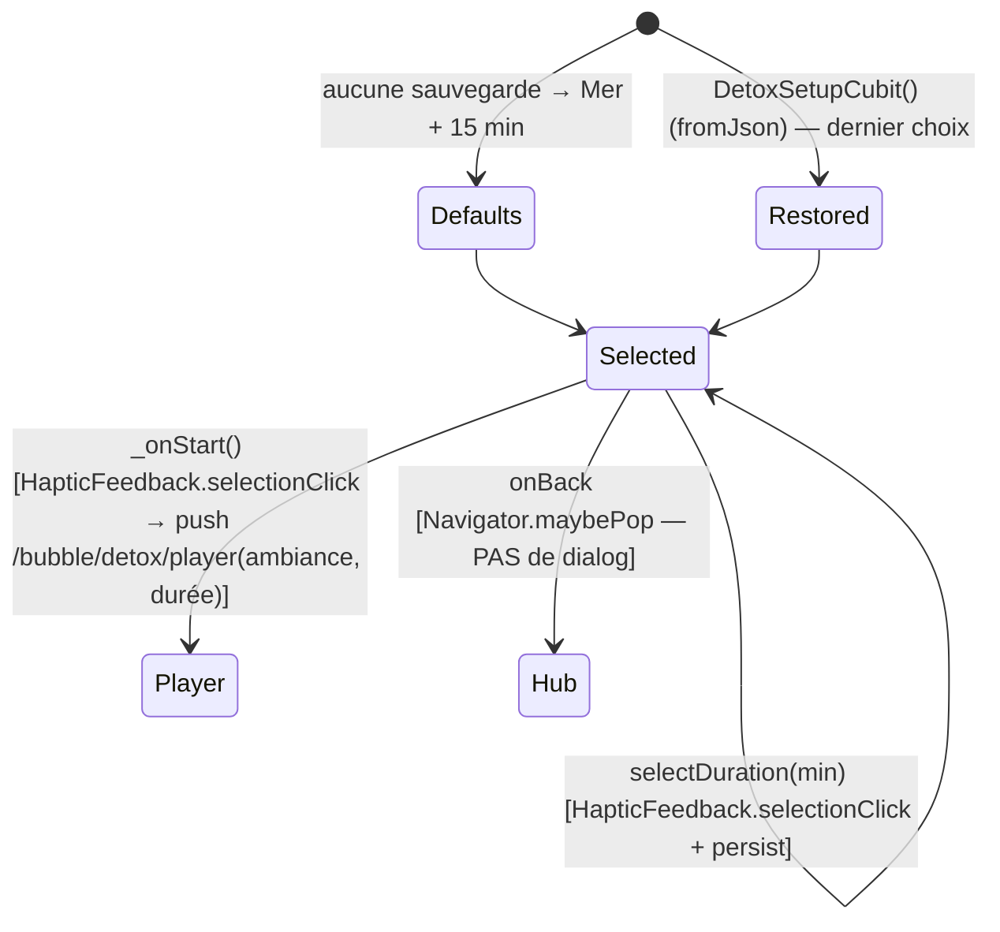

# Plan de page — « Détox » (DetoxSetupPage — étape de CONFIGURATION)

> Plan auto-suffisant pour éditeur IA. Conforme aux règles `aidd_docs/memory/` +
> `aidd_docs/rules/` de DIGIHARMONY : Flutter, monorepo Melos 7, client-only,
> **zéro collecte, zéro réseau, zéro SDK analytics**, vibration via `HapticFeedback`
> uniquement, i18n ARB gen-l10n 8 langues (repli `en`), HydratedBloc pour la sélection
> persistée, assets audio locaux.
>
> Cet écran est la **cible de navigation `detox`** déclarée dans le plan
> `choisis-ta-bulle.md` (`BubbleCategoryId.detox → DetoxSetupPage`). Il réutilise les
> composants partagés `DigiToolbar`, `AppBackground`, `AppTheme` créés par ce plan-là
> et étendus par `respiration.md` (`trailing`, `background`, tokens).
>
> ⚠️ **Périmètre = CONFIGURATION uniquement.** Cet écran prépare la sélection (ambiance +
> durée) puis **navigue** vers un écran **LECTEUR audio dédié** (`DetoxPlayerPage`, route
> `/bubble/detox/player`) qui sera **planifié par un autre agent**. La lecture audio réelle,
> `just_audio_background`, la lecture continue écran verrouillé et l'incrément de l'agrégat
> `WellbeingStats` se font **côté lecteur**, PAS ici (signalés, non implémentés dans ce plan).

---

## 1. Contexte de la page

| Élément | Valeur |
| --- | --- |
| Nom | « Détox » — écran de **configuration de la pause** : choix d'une ambiance sonore + d'une durée avant lancement |
| Widget page | `DetoxSetupPage` (entrée + providers) + `DetoxSetupView` (UI), fichier `lib/detox/view/detox_setup_page.dart` |
| Route logique | `detox`, conceptuellement `/bubble/detox`, **enfant du hub** `/bubble` — écran de config plein écran |
| Parent | Hub « Choisis ta bulle » (`BubblesPage`) → arrivée via tap sur la bulle Détox |
| Accès / rôles / auth | **Aucun** — app sans compte, sans identification, sans permission. Accès libre |
| Données affichées | **4 ambiances** + **3 durées**, listes **statiques en dur** dans `core_package`. Ambiance courante + durée courante = état du `DetoxSetupCubit` (en mémoire, persisté HydratedBloc) |
| Persistance | **HydratedBloc** : mémorise le **dernier choix** (ambiance + durée) entre sessions. **Aucun Drift** ici (l'agrégat `WellbeingStats` est incrémenté côté **lecteur**, fin de pause réelle). Aucune collecte |
| État applicatif | `DetoxSetupCubit` (HydratedBloc) — sélection (ambiance + durée), défauts **Mer + 15 min** |
| États écran | **Nominal uniquement** (écran de sélection). **Pas d'empty, pas d'error** (listes statiques const). Pas de loading (rien à charger) |

**Pourquoi un Cubit ici (contrairement à BubblesPage) :** il y a un **état mutable** (l'ambiance et
la durée sélectionnées changent au tap). La règle `coding-assertions` impose `bloc`/`flutter_bloc`
dès qu'il y a de l'état applicatif. La sélection doit **survivre aux sessions** (mémoriser le dernier
choix) → `HydratedBloc` (DEC-002), cohérent avec `VoiceoverCubit` du plan respiration. **Aucun Drift**
ici : pas de séance terminée sur l'écran de config (DEC-001 réservé à l'agrégat de fin, côté lecteur).

---

## 2. User Stories liées

**Aucune US backlog référencée fournie.** Le plan s'appuie sur les **décisions validées par
l'utilisateur** (reportées en §13) qui font office de critères d'acceptation. À rattacher si une US
existe (mettre à jour le champ `us:` de l'en-tête + du registry).

Critères d'acceptation dérivés des décisions (source des tests Kent) :
- **AC-1** : 4 ambiances affichées en **grille 2×2** dans l'ordre **Eau, Mer, Bruit blanc, Forêt**, chacune sélectionnable.
- **AC-2** : 3 durées affichées côte à côte : **5 / 10 / 15 min**, chacune sélectionnable.
- **AC-3** : **Défauts** à l'ouverture (si aucune sélection mémorisée) = ambiance **Mer** + durée **15 min** (badge « DÉFAUT » sur 15 min).
- **AC-4** : **Une seule** ambiance sélectionnée à la fois ; **une seule** durée à la fois (sélection exclusive, style « sélectionné » = bordure/pastille check pour l'ambiance, fond cyan + texte sombre pour la durée).
- **AC-5** : Tap sur une **ambiance** ou une **durée** → `HapticFeedback.selectionClick()` + mise à jour de l'état + **récap live** rafraîchi.
- **AC-6** : Le **récap** (chip) reflète **en direct** l'ambiance + la durée courantes (« Mer · 15 min »).
- **AC-7** : Le **dernier choix** (ambiance + durée) est **mémorisé entre sessions** (HydratedBloc) ; à la réouverture, l'écran restaure ce choix (sinon défauts AC-3).
- **AC-8** : Bouton « **Commencer ma pause** » → `HapticFeedback.selectionClick()` puis **navigation** vers le **lecteur** (`/bubble/detox/player`) en lui passant **ambiance + durée** sélectionnées (cf. §6 contrat).
- **AC-9** : Chevron retour → **retour direct au hub** (`Navigator.maybePop`). **Pas de dialog de confirmation** (aucune séance en cours sur l'écran de config).
- **AC-10** : Tout texte visible provient de l'**ARB** (gen-l10n), aucune chaîne en dur.
- **AC-11** : Si `reduceMotion` actif → animations en boucle (`card-float`, `orb-drift`, `card-selected` glow, `icon-breathe`) **désactivées/réduites** ; la mécanique de sélection + navigation **reste fonctionnelle**.
- **AC-12** : **Zéro réseau / zéro collecte** : assets audio **locaux** (`assets/audio/detox/`), aucune analytics, aucune permission au-delà de `PACKAGE_USAGE_STATS`. **Aucun Drift** sur cet écran.

---

## 3. Design (capturé) → mapping widgets

Écran mobile fond nuit `#16213C` (même fond que Respiration), **2 halos radiaux décoratifs**
(orb cyan haut-gauche, orb vert bas-droite, animés `orb-drift`). Réutilise la charte du hub.

### Toolbar (haut)
| Élément design | Widget | Comportement |
| --- | --- | --- |
| Bouton retour (chevron-left, 48×48) | `DigiToolbar.onBack` | §6 — retour direct au hub (pas de dialog) |
| Titre centré « Détox » (bold) | `DigiToolbar.title` = `l10n.detoxTitle` | DM Sans bold |
| PAS de bouton à droite (spacer 48 px) | `DigiToolbar` : `showMenu: false`, `trailing: null` | équilibre visuel (spacer déjà géré par le composant) |

### Header (animation `detox-in`)
| Élément design | Widget | Donnée |
| --- | --- | --- |
| Titre « Prépare ta pause » (22 px, cyan `#3FB8E6`) | `Text` | `l10n.detoxSetupHeading` |
| Sous-titre « Choisis une ambiance et une durée » (`#A7B6CE`) | `Text` | `l10n.detoxSetupSubtitle` |

### Section AMBIANCE (label uppercase tracking) — grille 2×2
Label de section `l10n.detoxSectionAmbiance` (uppercase, letter-spacing). 4 cartes (rounded 20,
min-height 108, animées `card-float-1..4`), chacune : icône dans pastille, mini-illustration d'onde,
nom + description.

| Ordre | Ambiance | Icône (design lucide) | Couleur | Nom (ARB) | Description (ARB) | Asset audio |
| --- | --- | --- | --- | --- | --- | --- |
| 1 | Eau | `droplets` | cyan `#3FB8E6` | `detoxAmbianceWaterLabel` | `detoxAmbianceWaterDesc` (« Ruisseau, pluie douce ») | `assets/audio/detox/water.mp3` |
| 2 | **Mer** (sélectionnée par défaut) | `waves` | vert `#2FAE5F` | `detoxAmbianceSeaLabel` | `detoxAmbianceSeaDesc` (« Vagues, brise marine ») | `assets/audio/detox/sea.mp3` |
| 3 | Bruit blanc | `radio` | gris `#A7B6CE` | `detoxAmbianceWhiteNoiseLabel` | `detoxAmbianceWhiteNoiseDesc` (« Silence texturé ») | `assets/audio/detox/white_noise.mp3` |
| 4 | Forêt | `tree-pine` | vert clair `#A8D24E` | `detoxAmbianceForestLabel` | `detoxAmbianceForestDesc` (« Oiseaux, feuillage ») | `assets/audio/detox/forest.mp3` |

État **sélectionné** d'une carte : bordure de la couleur de l'ambiance (Mer = verte), **pastille check**
en coin, animation `card-selected` (glow) + `icon-breathe` sur l'icône. Les autres : surface translucide.

### Section DURÉE (label uppercase, animation `detox-in-3`)
Label `l10n.detoxSectionDuration`. 3 boutons côte à côte (5 / 10 / 15 min).

| Durée | Style non sélectionné | Style sélectionné (15 par défaut) |
| --- | --- | --- |
| 5 min | fond translucide, texte `#F2F6FB` | fond cyan `#3FB8E6`, texte `#16213C`, animation `dur-pop` |
| 10 min | idem | idem |
| **15 min** (défaut) | — | fond cyan `#3FB8E6`, texte `#16213C`, **badge « DÉFAUT »** (`l10n.detoxDurationDefaultBadge`) + `dur-pop` |

> Le **badge « DÉFAUT »** s'affiche **uniquement sur la durée marquée par défaut dans le modèle** (15 min),
> indépendamment de la sélection courante (information « c'est la durée recommandée »). Cf. §5 `DetoxDuration.isDefault`.

### Récap (chip)
| Élément design | Widget | Donnée |
| --- | --- | --- |
| Chip « Mer · 15 min » + icône `volume-2` | `_DetoxRecapChip` | `l10n.detoxRecap(ambiance, duration)` — **live** sur l'état du Cubit |

### Bouton bas — CTA
| Élément design | Widget | Comportement |
| --- | --- | --- |
| Bouton large « Commencer ma pause » (icône `play`, fond cyan `#3FB8E6`, texte `#16213C`) | `_StartButton` | `l10n.detoxStart` ; §6 → navigation vers le lecteur avec la sélection |

### Tokens design (réutiliser `AppTheme`, étendre si besoin)
| Token | Valeur | Source |
| --- | --- | --- |
| `background` (fond nuit) | `#16213C` | `AppTheme.breathingBackground` (déjà ajouté par respiration.md) — **renommer `bubbleBackground`** si le refactor cross-page de les-sens.md est appliqué |
| `primary` (cyan) | `#3FB8E6` | `AppTheme.primary` (existant) |
| vert (Mer) | `#2FAE5F` | **nouveau** token `AppTheme.detoxSea` (ou réutiliser un vert existant si proche) |
| vert clair (Forêt) | `#A8D24E` | `AppTheme.success` (déjà ajouté par respiration.md, `#A8D24E`) |
| `surface` (cartes) | `#283A5E` | **nouveau** token `AppTheme.surface` |
| `foreground` | `#F2F6FB` | `AppTheme.foreground` (existant) |
| `muted` (sous-titres) | `#A7B6CE` | **nouveau** token `AppTheme.muted` |
| Police | `DM Sans` | asset local (déjà posé par le hub) |
| Radius | 12 / 20 | `AppTheme` radius existants |

> Le fond `#16213C` est **identique** à Respiration → réutiliser `AppBackground(background: ...)` sans
> dupliquer. Les **halos** (orb cyan / orb vert) sont décoratifs : si `AppBackground` ne porte que 2 halos
> génériques, étendre légèrement pour positionner orb cyan (haut-gauche) + orb vert (bas-droite) — sinon
> ajouter une couche décorative locale `_DetoxOrbs`. **Choix retenu** : couche locale `_DetoxOrbs` au-dessus
> de `AppBackground` (les halos Détox sont spécifiques et animés `orb-drift`), pour ne pas surcharger le
> composant partagé.

### Icônes (Material par défaut, zéro package d'icônes tiers)
| Design (lucide) | Material proposé |
| --- | --- |
| `droplets` (Eau) | `Icons.water_drop_outlined` (ou `Icons.water_outlined`) |
| `waves` (Mer) | `Icons.waves` |
| `radio` (Bruit blanc) | `Icons.graphic_eq` (ou `Icons.radio`) |
| `tree-pine` (Forêt) | `Icons.park_outlined` (ou `Icons.forest`) |
| `volume-2` (récap) | `Icons.volume_up` |
| `play` (CTA) | `Icons.play_arrow` |
| `chevron-left` | `Icons.chevron_left` (porté par `DigiToolbar`) |

> Les icônes + couleurs sont portées par le **modèle** `DetoxAmbiance` (`IconData`/`Color`) pour rester
> data-driven (même approche que `BubbleCategory`). La mini-illustration d'onde SVG du design est rendue
> par un petit `CustomPainter` local (`_WavePainter`) ou un widget décoratif — **aucun package SVG ajouté**
> (zéro dépendance réseau / tierce).

---

## 4. Arbre de widgets

```
DetoxSetupPage (StatelessWidget)            // lib/detox/view/detox_setup_page.dart
└─ BlocProvider(create: (_) => DetoxSetupCubit())   // HydratedBloc, restaure ou défauts Mer+15
   └─ DetoxSetupView (StatelessWidget)
      └─ Scaffold (extendBodyBehindAppBar: true, backgroundColor: #16213C)
         ├─ appBar: DigiToolbar(
         │     title: l10n.detoxTitle,
         │     showMenu: false,
         │     trailing: null,                       // PAS de bouton à droite (spacer)
         │     onBack: () => Navigator.maybePop(context),   // §6 retour direct, pas de dialog
         │   )
         └─ body: AppBackground(
               background: AppTheme.breathingBackground,    // #16213C (réutilisé)
               child: Stack(
                 ├─ _DetoxOrbs(),                    // 2 halos animés orb-drift (décoratif)
                 └─ SafeArea(
                      child: SingleChildScrollView(
                        child: Column(
                          ├─ _DetoxHeader()                  // detox-in : heading + subtitle
                          │    ├─ Text(l10n.detoxSetupHeading)   // cyan #3FB8E6, 22px bold
                          │    └─ Text(l10n.detoxSetupSubtitle)  // muted #A7B6CE
                          ├─ _SectionLabel(l10n.detoxSectionAmbiance)   // uppercase tracking
                          ├─ BlocSelector<DetoxSetupCubit, DetoxSetupState, DetoxAmbianceId>(
                          │    selector: (s) => s.ambianceId,
                          │    builder: (_, selectedId) => _AmbianceGrid(           // GridView 2×2
                          │       ambiances: DetoxAmbiance.all,
                          │       selectedId: selectedId,
                          │       onSelect: (id) => _onSelectAmbiance(context, id),
                          │    ),
                          │  )   // → 4× _AmbianceCard (card-float-1..4, glow si sélectionné)
                          ├─ _SectionLabel(l10n.detoxSectionDuration)   // detox-in-3
                          ├─ BlocSelector<DetoxSetupCubit, DetoxSetupState, int>(
                          │    selector: (s) => s.durationMinutes,
                          │    builder: (_, selectedMin) => _DurationSelector(        // Row 3 boutons
                          │       durations: DetoxDuration.all,
                          │       selectedMinutes: selectedMin,
                          │       onSelect: (min) => _onSelectDuration(context, min),
                          │    ),
                          │  )   // → 3× _DurationChip (dur-pop si sélectionné, badge DÉFAUT si isDefault)
                          ├─ BlocBuilder<DetoxSetupCubit, DetoxSetupState>(
                          │    builder: (_, s) => _DetoxRecapChip(                    // récap live
                          │       ambianceLabel: s.ambiance.label(l10n),
                          │       durationMinutes: s.durationMinutes, l10n: l10n,
                          │    ),
                          │  )   // « Mer · 15 min » + Icons.volume_up
                          └─ _StartButton(                                           // CTA bas
                               onTap: () => _onStart(context),                       // §6 navigation lecteur
                             )   // « Commencer ma pause » + Icons.play_arrow
                        )
                      )
                    )
               )
             )
```

### Comportements (handlers)
```dart
void _onSelectAmbiance(BuildContext context, DetoxAmbianceId id) {
  HapticFeedback.selectionClick();                     // AC-5
  context.read<DetoxSetupCubit>().selectAmbiance(id);  // met à jour état (+ persiste HydratedBloc)
}

void _onSelectDuration(BuildContext context, int minutes) {
  HapticFeedback.selectionClick();                     // AC-5
  context.read<DetoxSetupCubit>().selectDuration(minutes);
}

Future<void> _onStart(BuildContext context) async {
  await HapticFeedback.selectionClick();               // AC-8 feedback AVANT navigation
  if (!context.mounted) return;
  final s = context.read<DetoxSetupCubit>().state;
  Navigator.of(context).push(DetoxRoutes.player(       // §6 contrat de navigation
    ambianceId: s.ambianceId,
    durationMinutes: s.durationMinutes,
  ));
}
```

---

## 5. Modèle de données — `core_package` (listes statiques en dur)

Données pures, immuables, **sans collecte, sans Drift**. Même philosophie que `BubbleCategory`.
Le **texte** (nom/description) reste i18n côté app (résolu par `id`, §9) — `core_package` ne dépend pas
de l'ARB de l'app.

Fichier : `packages/core_package/lib/src/detox/detox_catalog.dart`
Export : ajouter `export 'src/detox/detox_catalog.dart';` dans `lib/core_package.dart`.

```dart
import 'package:flutter/widgets.dart'; // IconData / Color (widgets, pas material)

/// Identifiant stable d'une ambiance Détox (sert au routing + à la résolution i18n + à l'asset audio).
enum DetoxAmbianceId { water, sea, whiteNoise, forest }

/// Ambiance sonore Détox — donnée statique immuable. Aucune persistance, aucune collecte.
@immutable
class DetoxAmbiance {
  const DetoxAmbiance({
    required this.id,
    required this.icon,
    required this.color,
    required this.audioAsset,
  });

  final DetoxAmbianceId id;
  final IconData icon;
  final Color color;
  final String audioAsset;   // asset local, joué par le LECTEUR (pas ici)

  /// Les 4 ambiances, ordre = ordre de la grille 2×2.
  static const List<DetoxAmbiance> all = <DetoxAmbiance>[
    DetoxAmbiance(id: DetoxAmbianceId.water,      icon: Icons.water_drop_outlined, color: Color(0xFF3FB8E6), audioAsset: 'assets/audio/detox/water.mp3'),
    DetoxAmbiance(id: DetoxAmbianceId.sea,        icon: Icons.waves,               color: Color(0xFF2FAE5F), audioAsset: 'assets/audio/detox/sea.mp3'),
    DetoxAmbiance(id: DetoxAmbianceId.whiteNoise, icon: Icons.graphic_eq,          color: Color(0xFFA7B6CE), audioAsset: 'assets/audio/detox/white_noise.mp3'),
    DetoxAmbiance(id: DetoxAmbianceId.forest,     icon: Icons.park_outlined,       color: Color(0xFFA8D24E), audioAsset: 'assets/audio/detox/forest.mp3'),
  ];

  /// Ambiance par défaut (si aucune sélection mémorisée).
  static const DetoxAmbianceId defaultId = DetoxAmbianceId.sea;

  static DetoxAmbiance byId(DetoxAmbianceId id) =>
      all.firstWhere((a) => a.id == id);
}

/// Durée de pause Détox (minutes). Liste statique 5 / 10 / 15.
@immutable
class DetoxDuration {
  const DetoxDuration({required this.minutes, this.isDefault = false});

  final int minutes;
  final bool isDefault;   // pilote le badge « DÉFAUT » (15 min)

  static const List<DetoxDuration> all = <DetoxDuration>[
    DetoxDuration(minutes: 5),
    DetoxDuration(minutes: 10),
    DetoxDuration(minutes: 15, isDefault: true),
  ];

  /// Durée par défaut (si aucune sélection mémorisée) = 15 min.
  static const int defaultMinutes = 15;

  static const List<int> allowedMinutes = [5, 10, 15];
}
```

> Test Kent (core_package) : `DetoxAmbiance.all.length == 4`, `id` uniques, `defaultId == sea` ;
> `DetoxDuration.all` = [5,10,15], **exactement une** `isDefault` (15), `defaultMinutes == 15`.

---

## 6. État applicatif — `DetoxSetupCubit` (HydratedBloc) + navigation

### État (`DetoxSetupState`, equatable)
```dart
// lib/detox/cubit/detox_setup_state.dart
class DetoxSetupState extends Equatable {
  const DetoxSetupState({
    required this.ambianceId,
    required this.durationMinutes,
  });

  final DetoxAmbianceId ambianceId;
  final int durationMinutes;

  DetoxAmbiance get ambiance => DetoxAmbiance.byId(ambianceId);   // accès dérivé (icône/couleur/asset)

  /// Défauts produit : Mer + 15 min.
  factory DetoxSetupState.initial() => const DetoxSetupState(
        ambianceId: DetoxAmbianceId.sea,
        durationMinutes: 15,
      );

  DetoxSetupState copyWith({DetoxAmbianceId? ambianceId, int? durationMinutes}) =>
      DetoxSetupState(
        ambianceId: ambianceId ?? this.ambianceId,
        durationMinutes: durationMinutes ?? this.durationMinutes,
      );

  @override
  List<Object?> get props => [ambianceId, durationMinutes];
}
```

### Cubit (HydratedBloc — mémorise le dernier choix)
```dart
// lib/detox/cubit/detox_setup_cubit.dart
class DetoxSetupCubit extends HydratedCubit<DetoxSetupState> {
  DetoxSetupCubit() : super(DetoxSetupState.initial());

  void selectAmbiance(DetoxAmbianceId id) =>
      emit(state.copyWith(ambianceId: id));

  void selectDuration(int minutes) {
    if (!DetoxDuration.allowedMinutes.contains(minutes)) return; // garde-fou
    emit(state.copyWith(durationMinutes: minutes));
  }

  // --- Persistance HydratedBloc (sérialisation robuste : repli défauts si valeur inconnue) ---
  @override
  DetoxSetupState? fromJson(Map<String, dynamic> json) {
    final rawId = json['ambianceId'] as String?;
    final id = DetoxAmbianceId.values
        .firstWhere((e) => e.name == rawId, orElse: () => DetoxAmbiance.defaultId);
    final min = json['durationMinutes'] as int?;
    final duration = DetoxDuration.allowedMinutes.contains(min)
        ? min!
        : DetoxDuration.defaultMinutes;
    return DetoxSetupState(ambianceId: id, durationMinutes: duration);
  }

  @override
  Map<String, dynamic> toJson(DetoxSetupState state) => {
        'ambianceId': state.ambianceId.name,
        'durationMinutes': state.durationMinutes,
      };
}
```
- **Persistance** : HydratedBloc sérialise à chaque `emit` (DEC-002) → le **dernier choix survit aux
  sessions** (AC-7). `HydratedBloc.storage` doit être initialisé dans `bootstrap.dart` (déjà le cas si
  `LocaleCubit`/`VoiceoverCubit` existent).
- **Provision** : `BlocProvider` **local à `DetoxSetupPage`** suffit (la sélection n'est consommée que par
  cet écran ; le lecteur la reçoit en **paramètres de navigation**, pas via le provider — découplage propre).
- ⚠️ **Jamais de journal/agrégat dans HydratedBloc** — uniquement ce flag de sélection UI.
- **`reduceMotion`** lu via `MediaQuery.disableAnimations` (pas un état applicatif).

### Diagramme d'états (sélection — `aidd:03:components_behavior`)

> L'état n'a **que** la phase « Selected » (sélection toujours valide : une ambiance + une durée non
> nulles). Pas de transition vers empty/error : les listes sont const.

### Contrat de navigation vers le LECTEUR (planifié ailleurs)
Le CTA navigue vers `DetoxPlayerPage` (route `/bubble/detox/player`) **sans présumer son implémentation
interne**. On expose un **builder de route injecté** côté app (même stratégie que `BubblesRoutes`) :

```dart
// lib/detox/detox_routes.dart  (côté app)
abstract final class DetoxRoutes {
  /// Route vers le LECTEUR audio Détox. Le lecteur est planifié par un autre agent ;
  /// ce builder reste un TODO compilable tant que DetoxPlayerPage n'est pas livré.
  static Route<void> player({
    required DetoxAmbianceId ambianceId,
    required int durationMinutes,
  }) {
    return MaterialPageRoute<void>(
      builder: (_) => DetoxPlayerPage(            // ← classe livrée par le plan « lecteur »
        ambianceId: ambianceId,
        durationMinutes: durationMinutes,
      ),
    );
  }
}
```

**Paramètres passés au lecteur (contrat minimal) :**
| Paramètre | Type | Sens |
| --- | --- | --- |
| `ambianceId` | `DetoxAmbianceId` | ambiance choisie ; le lecteur résout l'`audioAsset` via `DetoxAmbiance.byId(id)` |
| `durationMinutes` | `int` (5 / 10 / 15) | durée de la pause ; le lecteur arme son minuteur |

> Le lecteur (autre plan) est responsable de : lecture `just_audio` **+ `just_audio_background`** (lecture
> continue / écran verrouillé / contrôles lockscreen), boucle de l'ambiance sur la durée, fin de pause →
> **incrément `WellbeingStats` (+1 séance, `exerciseId='detox'`)** via le repository Drift existant
> (cf. respiration.md §10), et son propre dialog de sortie en cours de lecture. **Rien de tout cela n'est
> implémenté sur l'écran de config.**

### Routing d'entrée (depuis le hub)
- Brancher le builder `BubbleCategoryId.detox → MaterialPageRoute(builder: (_) => const DetoxSetupPage())`
  dans `lib/bubbles/bubbles_routes.dart` (TODO laissé par `choisis-ta-bulle.md`).

---

## 7. Audio — préparation seulement (lecture côté lecteur)

> **Cet écran ne lit AUCUN son.** Il prépare uniquement la sélection. Détaillé ici pour que le plan
> « lecteur » s'y raccorde sans ambiguïté.

- **Assets locaux, zéro réseau** : `assets/audio/detox/<ambiance>.mp3`
  (`water.mp3`, `sea.mp3`, `white_noise.mp3`, `forest.mp3`). À fournir par l'équipe contenu.
- Déclarer le dossier dans `pubspec.yaml` (`flutter > assets`) — **fait dès cet écran** pour que le modèle
  `DetoxAmbiance.audioAsset` pointe sur des chemins valides (mais aucun `AudioPlayer` instancié ici).
- **`just_audio_background`** : **Détox est le SEUL écran autorisé** à l'utiliser (lecture en arrière-plan /
  écran verrouillé) — et **uniquement côté LECTEUR**. Les autres exercices (Respiration, Les sens) utilisent
  `just_audio` **simple** au premier plan. Le câblage du service (`JustAudioBackground.init()` dans `main`,
  service AndroidManifest, `UIBackgroundModes audio` iOS) reste **à faire par le plan lecteur** (cf. memory
  « Reste à faire »), **pas ici**.

```yaml
# apps/digiharmony_app/pubspec.yaml → flutter > assets
assets:
  - assets/audio/detox/
```

---

## 8. Agrégat Drift — NON concerné par cet écran (rappel explicite)

- Une pause Détox **réellement terminée** incrémentera l'agrégat partagé **`WellbeingStats`** (+1 séance,
  `exerciseId='detox'`), via `WellbeingStatsRepository.recordCompletedSession('detox')` déjà défini dans
  `respiration.md` §10 (**réutiliser le même repository / la même table, ne pas dupliquer**).
- ⚠️ Cet incrément se fait **côté écran LECTEUR, à la fin de la pause**, **PAS sur cet écran de config**.
  L'écran de config **n'écrit ni ne lit Drift**.

---

## 9. Internationalisation (ARB / gen-l10n)

Système : **gen-l10n / ARB**, dir `lib/l10n/arb`, template `app_en.arb`, 8 langues
`en/fr/el/it/ro/tr/es/mk`, repli `en`. Helper `context.l10n`.

### Clés à créer (préfixe `detox*`)
| Clé ARB | EN | FR | Params |
| --- | --- | --- | --- |
| `detoxTitle` | "Detox" | "Détox" | — |
| `detoxSetupHeading` | "Prepare your break" | "Prépare ta pause" | — |
| `detoxSetupSubtitle` | "Choose an atmosphere and a duration" | "Choisis une ambiance et une durée" | — |
| `detoxSectionAmbiance` | "ATMOSPHERE" | "AMBIANCE" | — (affiché uppercase) |
| `detoxSectionDuration` | "DURATION" | "DURÉE" | — |
| `detoxAmbianceWaterLabel` | "Water" | "Eau" | — |
| `detoxAmbianceWaterDesc` | "Stream, gentle rain" | "Ruisseau, pluie douce" | — |
| `detoxAmbianceSeaLabel` | "Sea" | "Mer" | — |
| `detoxAmbianceSeaDesc` | "Waves, sea breeze" | "Vagues, brise marine" | — |
| `detoxAmbianceWhiteNoiseLabel` | "White noise" | "Bruit blanc" | — |
| `detoxAmbianceWhiteNoiseDesc` | "Textured silence" | "Silence texturé" | — |
| `detoxAmbianceForestLabel` | "Forest" | "Forêt" | — |
| `detoxAmbianceForestDesc` | "Birds, foliage" | "Oiseaux, feuillage" | — |
| `detoxDurationMinutes` | "{count} min" | "{count} min" | `{count}` (int) |
| `detoxDurationDefaultBadge` | "DEFAULT" | "DÉFAUT" | — (affiché uppercase) |
| `detoxRecap` | "{ambiance} · {duration} min" | "{ambiance} · {duration} min" | `{ambiance}` (String), `{duration}` (int) |
| `detoxStart` | "Start my break" | "Commencer ma pause" | — |
| `detoxToolbarBack` | "Back" | "Retour" | — (a11y) |

### Fichiers cibles
- `app_en.arb` : valeurs EN ci-dessus **+ blocs `@detoxXxx`** avec `description` + `placeholders` typés
  (`count`/`duration` = `int`, `ambiance` = `String`) — **obligatoire sur le template**.
- `app_fr.arb` : valeurs FR.
- `app_el.arb`, `app_it.arb`, `app_ro.arb`, `app_tr.arb`, `app_es.arb`, `app_mk.arb` :
  **placeholders = copie EN** (repli), marquer **relecture native ultérieure** (el/ro/tr/mk = locuteur natif).
- Régénérer : `flutter gen-l10n` puis `flutter analyze --fatal-infos`.

### Exemple de placeholders (template)
```json
"detoxDurationMinutes": "{count} min",
"@detoxDurationMinutes": {
  "description": "Duration chip label (5/10/15 minutes)",
  "placeholders": { "count": { "type": "int" } }
},
"detoxRecap": "{ambiance} · {duration} min",
"@detoxRecap": {
  "description": "Live recap chip: selected atmosphere and duration",
  "placeholders": { "ambiance": { "type": "String" }, "duration": { "type": "int" } }
}
```

### Résolution ambiance → clés (côté app)
```dart
// lib/detox/detox_l10n.dart
extension DetoxAmbianceL10n on DetoxAmbiance {
  String label(AppLocalizations l) => switch (id) {
    DetoxAmbianceId.water      => l.detoxAmbianceWaterLabel,
    DetoxAmbianceId.sea        => l.detoxAmbianceSeaLabel,
    DetoxAmbianceId.whiteNoise => l.detoxAmbianceWhiteNoiseLabel,
    DetoxAmbianceId.forest     => l.detoxAmbianceForestLabel,
  };
  String description(AppLocalizations l) => switch (id) {
    DetoxAmbianceId.water      => l.detoxAmbianceWaterDesc,
    DetoxAmbianceId.sea        => l.detoxAmbianceSeaDesc,
    DetoxAmbianceId.whiteNoise => l.detoxAmbianceWhiteNoiseDesc,
    DetoxAmbianceId.forest     => l.detoxAmbianceForestDesc,
  };
}
```

---

## 10. Composants réutilisables (vs registry)

Registry actuel : `DigiToolbar`, `AppBackground`, `BubbleCard` (hub) ; `AppTheme` étendu, `VoiceoverCubit`,
`WellbeingStatsRepository` (respiration / les-sens).

| Composant | Statut | Action |
| --- | --- | --- |
| `DigiToolbar` | **partagé existant** | **Réutiliser** : `title` + `onBack` + `showMenu:false` + `trailing:null` (param `trailing` déjà ajouté par respiration.md). Aucune extension requise |
| `AppBackground` | **partagé existant** | **Réutiliser** : `background: #16213C` (param `background` déjà ajouté par respiration.md) |
| `AppTheme` | **partagé existant** | **Ajouter tokens** : `surface #283A5E`, `muted #A7B6CE`, `detoxSea #2FAE5F` ; réutiliser `success #A8D24E` (Forêt) et `breathingBackground #16213C`. Si le refactor les-sens.md est appliqué : `breathingBackground → bubbleBackground` |
| `DetoxAmbiance` / `DetoxAmbianceId` | **nouveau (core_package)** | liste statique 4 ambiances (icône/couleur/asset), donnée pure |
| `DetoxDuration` | **nouveau (core_package)** | liste statique 3 durées (5/10/15), `isDefault` sur 15 |
| `DetoxSetupCubit` + state | **nouveau (app, HydratedBloc)** | sélection persistée §6 |
| `DetoxRoutes` | **nouveau (app)** | builder de route vers le lecteur (contrat §6) |
| `_DetoxOrbs`, `_DetoxHeader`, `_SectionLabel`, `_AmbianceGrid`, `_AmbianceCard`, `_WavePainter`, `_DurationSelector`, `_DurationChip`, `_DetoxRecapChip`, `_StartButton` | **nouveaux (app, privés à detox)** | spécifiques écran |

> Pas de collision de route (`detox` réservé par le registry pour la config ; `detox/player` = nouvelle route
> du lecteur, planifiée ailleurs). Pas de duplication de Bloc/store. **`WellbeingStatsRepository` réutilisé tel
> quel côté lecteur** (pas recréé ici).

---

## 11. Animations (`flutter_animate`) + accessibilité

`flutter_animate: ^4.5.2` déjà en dépendance. Reproduire les animations CSS du design :

| Animation CSS (design) | Cible Flutter | Effet `flutter_animate` |
| --- | --- | --- |
| `detox-in` / `detox-in-2` / `detox-in-3` | header / section ambiance / section durée | apparitions échelonnées one-shot : `.fadeIn(duration: 400.ms).slideY(begin: .1, end: 0)` avec `delay` croissant (`detox-in-3` = plus tard) |
| `card-float-1..4` | chaque `_AmbianceCard` | flottement en boucle : `.animate(onPlay: (c)=>c.repeat(reverse:true)).moveY(begin:0, end:-6, duration: 2400.ms, curve: Curves.easeInOut)` — **déphasage par index** (1..4) pour effet organique |
| `card-selected` (glow) | carte sélectionnée | glow/halo de la couleur d'ambiance : `.animate(onPlay:(c)=>c.repeat(reverse:true)).tint(...)`/`.boxShadow(...)` doux, **uniquement sur la carte sélectionnée** |
| `icon-breathe` | icône de la carte sélectionnée | `.animate(onPlay:(c)=>c.repeat(reverse:true)).scaleXY(begin:1, end:1.08, duration: 1800.ms)` |
| `dur-pop` | chip durée sélectionné | one-shot au changement de sélection : `.animate().scaleXY(begin:.9, end:1, duration: 180.ms, curve: Curves.easeOutBack)` (rejoué via `key` sur changement) |
| `orb-drift` | `_DetoxOrbs` (2 halos) | dérive lente en boucle : `.animate(onPlay:(c)=>c.repeat(reverse:true)).moveX(...).moveY(...)` (cyan haut-gauche, vert bas-droite) |

### Respect `reduceMotion` (AC-11) — OBLIGATOIRE
```dart
final reduceMotion = MediaQuery.of(context).disableAnimations;
```
- Si `reduceMotion == true` :
  - **`card-float`, `card-selected` glow, `icon-breathe`, `orb-drift`** : `repeat()` **désactivés**
    (cartes/halos statiques, icône fixe).
  - **`detox-in*`** : tolérer un `fadeIn` unique court **ou** affichage direct (pas de slide).
  - **`dur-pop`** : pas d'effet pop → changement instantané.
  - **La sélection (ambiance/durée), le récap live, l'haptique et la navigation restent 100% fonctionnels.**
- Encapsuler les `effects` conditionnels dans chaque widget animé.
- **Test Kent** : avec `MediaQueryData(disableAnimations: true)`, vérifier qu'aucune animation en boucle
  n'est active (pas de `pump` infini), que les cartes/durées restent tappables et que le récap se met à jour.

---

## 12. États de la page

| État | Présent ? | Détail |
| --- | --- | --- |
| **Nominal** (sélection) | ✅ | 4 ambiances + 3 durées, sélection exclusive, récap live, CTA actif |
| Empty | ❌ | listes `const` (toujours 4 ambiances / 3 durées — garanti par tests) |
| Error | ❌ | aucune source faillible (pas de Drift, pas de réseau, pas d'audio ici) |
| Loading | ❌ | aucun I/O au démarrage (HydratedBloc restaure de manière synchrone après init storage) |

Feedback utilisateur : **`HapticFeedback.selectionClick()`** au tap (ambiance / durée / CTA), récap live,
glow de la carte sélectionnée, `dur-pop`. **Aucune popup/dialog** sur cet écran (la confirmation de sortie
éventuelle appartient au **lecteur**, en cours de lecture).

---

## 13. Décisions appliquées (font office de critères d'acceptation)

- Écran = **CONFIGURATION** ; le CTA **navigue** vers le lecteur (`/bubble/detox/player`) avec **ambiance + durée**.
- Données **statiques en dur** dans `core_package` (4 ambiances + 3 durées), **textes en ARB**, **aucun Drift** en lecture ici.
- Sélection locale via **`DetoxSetupCubit`** (HydratedBloc), défauts **Mer + 15 min**, **dernier choix mémorisé** entre sessions.
- **Audio préparé seulement** ; lecture réelle (avec **`just_audio_background`**, lecture continue écran verrouillé) **côté lecteur** ; Détox = **seul** écran autorisé à `just_audio_background`. Assets **locaux**, zéro réseau.
- Agrégat **`WellbeingStats`** (+1) incrémenté **côté lecteur** à la fin d'une pause **réellement terminée** (réutilise le repository de respiration.md), **pas ici**.
- **`HapticFeedback.selectionClick()`** sur sélection ambiance / durée et sur « Commencer ma pause ».
- Retour (chevron-left) = **retour direct au hub**, **sans dialog** (aucune séance en cours sur la config).
- **Réutiliser** `DigiToolbar`, `AppBackground` (fond `#16213C`), `AppTheme`. **Icônes Material uniquement**, **zéro package d'icônes tiers**, **zéro package SVG** (onde via `CustomPainter` local).
- Respect **`reduceMotion`** pour toutes les animations en boucle.
- État **nominal** uniquement (pas d'empty/error).

---

## 14. Contraintes projet (rappel, à respecter à 100 %)

- ✅ **Zéro collecte / zéro réseau** : assets audio **locaux** ; aucune analytics/tracking ; pas de `google_fonts` (réseau) → DM Sans en asset local (déjà posé par le hub) ; pas de package SVG/icônes tiers.
- ✅ **Vibration via `HapticFeedback`** uniquement (`selectionClick` sur sélection + CTA) — pas de permission `VIBRATE`, pas de package vibration.
- ✅ **HydratedBloc** = sélection (ambiance/durée) persistée — **jamais** de journal/agrégat dedans. **Aucun Drift** sur cet écran (réservé au lecteur, fin de pause).
- ✅ **State via `bloc`/`flutter_bloc`** (`DetoxSetupCubit`) — justifié par l'état de sélection mutable.
- ✅ **i18n ARB obligatoire** : aucune chaîne en dur, 8 langues, repli `en`.
- ✅ **Lints** `very_good_analysis` + `bloc_lint` stricts (0 warning/info), `const` partout où possible.
- ✅ **Naming** : fichiers snake_case, widgets PascalCase.
- ✅ **Monorepo** : `DetoxAmbiance`/`DetoxDuration` dans `core_package` ; UI/Cubit/routing dans `apps/digiharmony_app`.
- ✅ **Aucune nouvelle dépendance pub** : réutilise `hydrated_bloc`, `flutter_bloc`, `flutter_animate`, `HapticFeedback`, Material icons (tous déjà au pubspec). `just_audio`/`just_audio_background` ne sont **pas** instanciés ici.
- ✅ **Android release** : `minify`/`shrinkResources` à `false` (déjà en place).

---

## 15. Fichiers à créer / modifier

**core_package**
- `packages/core_package/lib/src/detox/detox_catalog.dart` (`DetoxAmbianceId`, `DetoxAmbiance`, `DetoxDuration` + listes `all`).
- `packages/core_package/lib/core_package.dart` (ajouter l'export).

**app — detox**
- `apps/digiharmony_app/lib/detox/view/detox_setup_page.dart` (`DetoxSetupPage` + `DetoxSetupView` + sous-widgets header/orbs/sections/récap/CTA).
- `apps/digiharmony_app/lib/detox/cubit/detox_setup_cubit.dart` / `detox_setup_state.dart` (HydratedBloc §6).
- `apps/digiharmony_app/lib/detox/widgets/ambiance_card.dart`, `ambiance_grid.dart`, `duration_chip.dart`, `duration_selector.dart`, `detox_recap_chip.dart`, `detox_orbs.dart`, `start_button.dart`, `wave_painter.dart`, `section_label.dart` (privés à detox).
- `apps/digiharmony_app/lib/detox/detox_routes.dart` (contrat de navigation vers le lecteur §6).
- `apps/digiharmony_app/lib/detox/detox_l10n.dart` (extension ambiance → label/description).
- `apps/digiharmony_app/lib/detox/detox.dart` (barrel export).

**app — partagé (réutiliser / étendre tokens)**
- `apps/digiharmony_app/lib/theme/app_theme.dart` (ajouter `surface #283A5E`, `muted #A7B6CE`, `detoxSea #2FAE5F` ; réutiliser `success`, `breathingBackground`).
- `apps/digiharmony_app/lib/bubbles/bubbles_routes.dart` (brancher le builder `detox → const DetoxSetupPage()`).

**app — i18n + assets + bootstrap**
- `apps/digiharmony_app/lib/l10n/arb/app_*.arb` (×8 : clés `detox*`).
- `apps/digiharmony_app/pubspec.yaml` (déclarer `assets/audio/detox/`).
- `apps/digiharmony_app/assets/audio/detox/{water,sea,white_noise,forest}.mp3` (équipe contenu — utilisés par le lecteur).
- `apps/digiharmony_app/lib/bootstrap.dart` (vérifier `HydratedBloc.storage` initialisé — déjà fait si `LocaleCubit`/`VoiceoverCubit` existent).

**Génération**
- `flutter gen-l10n` (ARB).
- `flutter analyze --fatal-infos` + `dart format`.
- (Pas de `build_runner` requis : aucun modèle Drift modifié sur cet écran.)

---

## 16. Hors scope (écran lecteur — autre plan)

À planifier séparément (`DetoxPlayerPage`, route `/bubble/detox/player`) — **ne pas implémenter ici** :
- Lecture `just_audio` **+ `just_audio_background`** (lecture continue, écran verrouillé, contrôles lockscreen) ; câblage `JustAudioBackground.init()` + service AndroidManifest + `UIBackgroundModes audio` iOS.
- Boucle de l'ambiance sur la durée choisie + minuteur de fin.
- Incrément `WellbeingStats` (`exerciseId='detox'`, +1, **1 seule fois**) en **fin de pause terminée** (repository de respiration.md).
- Dialog de sortie « Quitter la pause ? » **pendant la lecture**.
- Réception des paramètres `ambianceId` + `durationMinutes` (contrat §6).

---

## 17. Critères de complétude (Definition of Done)

- [ ] 4 ambiances en grille 2×2 (Eau, Mer, Bruit blanc, Forêt) ; 3 durées (5/10/15) côte à côte.
- [ ] Défauts à l'ouverture (sans sauvegarde) = **Mer + 15 min** ; badge « DÉFAUT » sur 15 min.
- [ ] Sélection **exclusive** ambiance / durée ; style sélectionné (bordure + check pour ambiance, fond cyan + texte sombre pour durée).
- [ ] Tap ambiance / durée → `HapticFeedback.selectionClick()` + récap **live** mis à jour.
- [ ] **Dernier choix mémorisé** entre sessions (HydratedBloc) ; restauré à la réouverture.
- [ ] « Commencer ma pause » → `HapticFeedback.selectionClick()` puis **navigation** vers `/bubble/detox/player` avec **ambiance + durée**.
- [ ] Chevron retour → **retour direct au hub**, **sans dialog**.
- [ ] Tous textes via ARB `detox*`, FR+EN remplis, 6 autres langues = repli EN (TODO relecture native).
- [ ] Animations `detox-in*` / `card-float` / `card-selected` / `icon-breathe` / `dur-pop` / `orb-drift` rendues ; désactivées/réduites si `reduceMotion`.
- [ ] **Aucun Drift, aucun audio joué** sur cet écran ; assets `assets/audio/detox/` déclarés (pour le lecteur).
- [ ] Aucune deps ajoutée, aucun réseau, aucune permission ajoutée, aucun package SVG/icônes tiers.
- [ ] Lints stricts verts, `gen-l10n` OK.
- [ ] Tests générés par Kent (étape 5) verts.
