# Plan de page — « Étirement » (StretchPage)

> Plan auto-suffisant pour éditeur IA. Conforme aux règles `aidd_docs/memory/` +
> `aidd_docs/rules/` de DIGIHARMONY : Flutter, monorepo Melos 7, client-only,
> **zéro collecte, zéro réseau, zéro SDK analytics/tracking**, vibration via
> `HapticFeedback` uniquement, i18n ARB gen-l10n 8 langues (repli `en`), Drift pour
> l'agrégat local, HydratedBloc pour le flag voix off, `just_audio` **simple** pour
> l'audio en asset local (PAS `just_audio_background` — réservé à Détox), DM Sans en
> asset local (pas de `google_fonts` → réseau interdit), icônes **Material** uniquement.
>
> Cet écran est la **4ᵉ et dernière bulle** du hub « Choisis ta bulle » et la **cible de
> navigation `stretch`** déclarée dans `choisis-ta-bulle.md`
> (`BubbleCategoryId.stretch → StretchPage`). Il **réutilise** les composants partagés
> `DigiToolbar` (étendu `trailing` par `respiration.md`), `AppBackground` (étendu
> `background`), `AppTheme`, ainsi que `VoiceoverCubit` et `WellbeingStatsRepository`
> **déjà fondés par `respiration.md`** et réutilisés par `les-sens.md` — **aucun doublon**.
>
> Technique implémentée : **routine d'étirement guidée multi-segments MINUTÉE**, à
> **progression automatique** (ticker), enchaînement segment par segment jusqu'au dernier.

---

## 1. Contexte de la page

| Élément | Valeur |
| --- | --- |
| Nom | « Étirement » — routine guidée **4 segments minutés** qui s'enchaînent automatiquement : Ancrage → Cou & épaules → Mains → Reposer la vue |
| Widget page | `StretchPage` (entrée + providers) + `StretchView` (UI), fichier `lib/stretch/view/stretch_page.dart` |
| Route logique | `stretch`, conceptuellement `/bubble/stretch`, **enfant du hub** `/bubble` — écran autonome plein écran |
| Parent | Hub « Choisis ta bulle » (`BubblesPage`) → arrivée via tap sur la bulle Étirement (`BubbleCategoryId.stretch`) |
| Accès / rôles / auth | **Aucun** — app sans compte, sans identification, sans permission. Accès libre |
| Données affichées | Segment courant (titre + plage horaire + instruction), progression du segment courant + segments terminés/à venir, temps **global** écoulé / restant, état voix off — **toutes dérivées du `StretchBloc`** (en mémoire), contenu **statique** issu de `core_package` |
| Persistance | **Écriture Drift uniquement à la fin** (routine terminée → +1 agrégat `WellbeingStats`, **même agrégat** que Respiration / Les sens / Détox, `exerciseId='stretch'`). Flag voix off persistant via **HydratedBloc** (`VoiceoverCubit` réutilisé). Aucune lecture/écriture pendant la routine |
| État applicatif | `StretchBloc` (machine d'états **ticker multi-segments**) + `VoiceoverCubit` (HydratedBloc, flag on/off **partagé**). Audio piloté par `StretchAudioController` (just_audio **simple**, assets) |
| États écran | (a) **en cours** (running, segment courant + temps global), (b) **en pause** (paused, optionnel — tap sur le guide), (c) **terminé / célébration** (`etir-complete`). **Pas d'empty, pas d'error, pas de loading** (routine figée, contenu en dur, audio en asset local) |

**Pourquoi un Bloc ici :** la règle `coding-assertions` impose `bloc`/`flutter_bloc` *dès
qu'il y a de l'état applicatif mutable*. Ici l'état évolue dans le temps (ticker, segment
courant, temps écoulé/restant, pause/reprise, terminé) → `StretchBloc` obligatoire. Le flag
voix off survit aux sessions → `VoiceoverCubit` (HydratedBloc, DEC-002, **réutilisé**).
L'agrégat de fin est relationnel et requêtable → Drift (DEC-001), jamais HydratedBloc.

> **Différence clé avec « Les sens » (manuel) et parenté avec « Respiration » (ticker)** :
> contrairement à `SensesBloc` (progression **manuelle** via « Suivant », sans timer),
> l'Étirement s'enchaîne **TOUT SEUL** par un **ticker** qui fait avancer la barre du
> segment courant puis passe au segment suivant — machine d'états **proche de
> `BreathingBloc`**. La granularité diffère : `BreathingBloc` séquence des *phases* d'un
> *cycle* (4-2-6), `StretchBloc` séquence des *segments* d'une *routine* (durées propres) en
> exposant **un temps global** (écoulé/restant) et **la progression du segment courant**.

---

## 2. User Stories liées

**Aucune US backlog référencée fournie.** Le plan s'appuie sur les **décisions validées par
l'utilisateur** (reportées en §13/§15) qui font office de critères d'acceptation. À rattacher si
une US existe (mettre à jour le champ `us:` de l'en-tête + du registry).

Critères d'acceptation dérivés des décisions (source des tests Kent) :
- **AC-1** : Routine **4 segments figés ordonnés** : Ancrage → Cou & épaules → Mains → Reposer la vue. Chaque segment a une **durée fixe** (secondes), données **statiques en dur** dans `core_package`. Aucun sélecteur, aucun réordonnancement.
- **AC-2** : **Progression AUTOMATIQUE MINUTÉE** : un **ticker** fait avancer la barre du segment courant ; à expiration de la durée du segment, passage **automatique** au segment suivant, jusqu'au dernier. Aucun bouton « Suivant ».
- **AC-3** : Le **temps global** est affiché en continu : « {t} écoulé » (gauche, muted) et « {t} restant » (droite, vert) — total = **somme des durées des segments**, **piloté par le ticker** (non décoratif).
- **AC-4** : La **liste des 4 segments** reflète l'état : segment **terminé** = barre 100 % cyan `#3FB8E6` ; segment **en cours** = barre à `progress%` vert `#A8D24E`, dot animé, label en gras ; segment **à venir** = barres/dot vides, label atténué. Les **barres sont pilotées par le ticker**, pas décoratives.
- **AC-5** : La **zone instruction** affiche le **titre du segment courant** (vert), sa **plage horaire** (« {start} – {end} » sur le total de la routine) et la **carte instruction détaillée** du segment courant.
- **AC-6** : À chaque **changement de segment** → `HapticFeedback.selectionClick()`. Aucune vibration intempestive **pendant** un segment.
- **AC-7** : Après la **fin du dernier segment** → état **célébration** (`etir-complete`) + **vibration légère de fin** (`HapticFeedback.mediumImpact()`).
- **AC-8** : Une routine **TERMINÉE** incrémente l'**agrégat local Drift** `WellbeingStats` **une seule fois** — **même table/repository/AppDatabase** que Respiration / Les sens / Détox (`recordCompletedSession('stretch')`), gardé par `statsPersisted`. Quitter avant la fin → **0** incrément.
- **AC-9** : **Voix off / musique relaxante** implémentée (assets `just_audio` **simple**, **pas** `just_audio_background`) ; le bouton volume du toolbar bascule on/off ; l'état est **mémorisé entre sessions** (HydratedBloc, **flag partagé** `VoiceoverCubit`).
- **AC-10** : **Sortie en cours** (chevron retour ET back système) → si la routine **est en cours** (running/paused, non terminée), dialog de **confirmation « Quitter la séance ? »** ; sinon retour direct au hub. **Aucune écriture Drift** si sortie anticipée.
- **AC-11** : **« Recommencer »** relance la routine au **segment 1**, temps **remis à zéro**, `statsPersisted=false` — **ne ré-incrémente pas** l'agrégat.
- **AC-12** : **Pause (optionnel)** : le design ne montre pas de bouton pause ; on autorise pause/reprise **au tap sur le cœur visuel (guide)** si cohérent (fige ticker + audio, temps restant du segment préservé). Garder simple.
- **AC-13** : Tout texte visible provient de l'**ARB** (gen-l10n), aucune chaîne en dur ; FR+EN remplis, `el/it/ro/tr/es/mk` = repli EN (relecture native ultérieure pour `el/ro/tr/mk`).
- **AC-14** : Si `reduceMotion` actif → boucles décoratives (guide « breathe », anneau conique rotatif, halo, pulse du dot) **désactivées**, **MAIS** les **barres de segments** et le **compteur écoulé/restant** (information pilotée par le ticker) **restent à jour** (par paliers). La mécanique (ticker, transitions, haptique, audio, persistance) **reste fonctionnelle**.
- **AC-15** : **Zéro réseau / zéro collecte** : audio en asset local, contenu en dur, aucune analytics, aucune permission au-delà de `PACKAGE_USAGE_STATS`, icônes Material, **zéro package tiers** (guide/anneau/barres en `CustomPainter` ou `flutter_animate`, **pas d'asset image**).
- **AC-16** : **Fallback gracieux audio** : si un asset audio est manquant → **dégradation silencieuse** (jamais d'écran d'erreur, la routine continue).

---

## 3. Design (capturé du HTML/CSS fourni) → mapping widgets

Écran mobile fond nuit `#16213C` (même fond que Respiration / Les sens), plein écran,
**2 halos radiaux décoratifs** (vert en haut, cyan en bas-gauche).

### Toolbar (haut)
| Élément design | Widget | Comportement |
| --- | --- | --- |
| Bouton retour (chevron-left, 48×48) | `DigiToolbar.onBack` | §6 — dialog de sortie si routine en cours |
| Titre centré « Étirement » (bold) | `DigiToolbar.title` = `l10n.stretchTitle` | DM Sans bold |
| Bouton volume (volume-2, contrôle voix off) | `DigiToolbar.trailing` = `_VoiceoverButton` | bascule on/off (icône `Icons.volume_up` / `Icons.volume_off`) |

> `DigiToolbar` expose déjà `onBack`, `title`, `showMenu` (hub) **et `trailing`** (extension
> ajoutée par `respiration.md`, réutilisée par `les-sens.md`). **Aucune nouvelle extension
> nécessaire** — on réutilise tel quel.

### Bandeau invite (`etir-invite`)
| Élément design | Widget | Donnée |
| --- | --- | --- |
| « Pose ton téléphone, suis la voix » + icône smartphone | `_PhonePrompt` | `l10n.stretchPhonePrompt`, icône `Icons.phone_android` (ou `Icons.smartphone`) ; apparition `etir-invite` (fade/slide one-shot, §12) |

### Cœur visuel animé (200 px) — guide de mouvement
| Élément design | Widget | Donnée |
| --- | --- | --- |
| Halo vert (`etir-halo`) | `_StretchGuide` (Stack, couche halo) | décoratif, vert `#A8D24E` glow |
| Anneau conique rotatif (`etir-ring`, vert) | `_ConicRing` (`CustomPainter` `SweepGradient` + rotation) | décoratif, boucle `etir-ring` (rotate), **désactivé si reduceMotion** |
| Forme guide SVG abstraite (ellipses + courbes, `etir-guide` « breathe ») | `_GuideShape` (`CustomPainter` ellipses/courbes, anim « breathe ») | **mouvement abstrait**, **pas une figure humaine détaillée** ; boucle « breathe » (scale doux), **désactivée si reduceMotion** |
| (Tap sur le cœur) | `GestureDetector` sur `_StretchGuide` | **pause/reprise** (AC-12, optionnel) |

> **Pas d'asset image, pas de SVG package tiers** : le guide, l'anneau et le halo sont rendus
> en **`CustomPainter`** (ellipses, courbes, `SweepGradient`) et/ou `flutter_animate`. Le guide
> représente le **mouvement en cours**, abstrait — pas de personnage. On NE change PAS la forme
> par segment en V1 (un guide générique animé) ; le **titre + l'instruction du segment** portent
> le sens du mouvement. (Extension possible : un guide par segment, hors scope V1.)

### Instruction du segment courant (`etir-instruction`)
| Élément design | Widget | Donnée |
| --- | --- | --- |
| Titre du segment (20 px, vert `#A8D24E`) | `Text` | `state.segment.label(l10n)` (ex. « Cou & épaules ») |
| Plage horaire du segment « {start} – {end} » | `Text` | `l10n.stretchTimeRange(start, end)` — **bornes globales** du segment (cumul, §5) |
| Carte instruction détaillée (rounded, fond translucide) | `_InstructionCard` | `state.segment.instruction(l10n)` ; apparition `etir-instruction` (fade/slide à chaque changement de segment, §12) |

### Liste des segments (4) — barres de progression PILOTÉES PAR LE TICKER
| Élément design | Widget | Donnée |
| --- | --- | --- |
| Pour chaque segment : `dot` coloré (8 px) + barre + label aligné à droite | `_SegmentList(state)` → `_SegmentRow` ×4 | `state.segments[i].status` ∈ {done, active, upcoming} + `progress` du segment actif |
| Ancrage — **TERMINÉ** : barre 100 % cyan `#3FB8E6` | `_SegmentRow(status: done)` | barre pleine, label normal + check possible |
| Cou & épaules — **EN COURS** : barre `progress%` vert `#A8D24E`, dot animé (`etir-seg-active` pulse), label **gras** | `_SegmentRow(status: active, progress)` | `progress` = temps écoulé du segment / durée du segment (0→1) |
| Mains — **À VENIR** : dot/barres vides, label atténué | `_SegmentRow(status: upcoming)` | barre vide |
| Reposer la vue — **À VENIR** : dot/barres vides, label atténué | `_SegmentRow(status: upcoming)` | barre vide |

> ⚠️ Les **4 segments du HTML** (1 terminé, 1 en cours à 52 %, 2 à venir) sont un **état
> d'exemple**, pas une valeur figée. La liste est **entièrement pilotée par `state`** : statut
> par segment + `progress` continu du segment actif (animé par le ticker).

### Compteur temps (GLOBAL de la routine)
| Élément design | Widget | Donnée |
| --- | --- | --- |
| « {t} écoulé » (gauche, muted `#A7B6CE`) | `Text` | `l10n.stretchElapsed(elapsed)` — temps **global** écoulé |
| « {t} restant » (droite, vert `#A8D24E`, semibold) | `Text` | `l10n.stretchRemaining(remaining)` — temps **global** restant |
| (optionnel) anneau de minuterie `etir-timer-ring` | `_TimerRing` (`CustomPainter`) | sous-jacent au temps global ; **désactivé si reduceMotion** (le texte reste source de vérité) |

### Bas d'écran
| Élément design | Widget | Donnée |
| --- | --- | --- |
| Pastille « Musique relaxante + voix — optionnel » (icône music) | `_AudioHint` | `l10n.stretchAudioHint`, icône `Icons.music_note_outlined`, fond translucide |
| Bouton « Recommencer » (icône rotate-ccw, style cyan translucide outline) | `_RestartButton` | `Icons.restart_alt` (ou `Icons.refresh`), `l10n.stretchRestart` |

### Tokens design (réutiliser `AppTheme`)
| Token | Valeur | Source |
| --- | --- | --- |
| `background` (fond nuit) | `#16213C` | `AppTheme.bubbleBackground` (=`breathingBackground` renommé par `les-sens.md` — réutiliser, **ne pas recréer**) |
| `primary` de cet écran (vert, segment actif) | `#A8D24E` | `AppTheme.success` (=`#A8D24E`, déjà ajouté par `respiration.md`) → **réutiliser** comme accent étirement |
| `accent secondaire` (cyan, segment Ancrage/terminé) | `#3FB8E6` | `AppTheme.primary` (existant) |
| `foreground` | `#F2F6FB` | `AppTheme.foreground` (existant) |
| `muted` (texte atténué, « écoulé ») | `#A7B6CE` | `AppTheme.muted` (existant si défini, sinon ajouter) |
| Police | `DM Sans` | asset local (déclaré par le hub) |
| radius | 12 / full | tokens AppTheme existants |

> **Aucun nouveau token de fond requis** : `#16213C` = `bubbleBackground` partagé. Le **vert
> `#A8D24E`** est déjà `AppTheme.success` (créé par Respiration pour le point cycle/glow) — on le
> **réutilise** comme couleur primaire de cet écran (segment actif / temps restant). Si `muted`
> n'existe pas encore dans `AppTheme`, l'ajouter (`#A7B6CE`).

### Icônes (Material, zéro dépendance ajoutée)
| Design (lucide) | Material |
| --- | --- |
| `smartphone` | `Icons.phone_android` (ou `Icons.smartphone`) |
| `volume-2` | `Icons.volume_up` (ON) / `Icons.volume_off` (OFF) |
| `music` | `Icons.music_note_outlined` |
| `rotate-ccw` | `Icons.restart_alt` (ou `Icons.refresh`) |
| `chevron-left` | `Icons.chevron_left` (déjà porté par `DigiToolbar`) |

---

## 4. Arbre de widgets

```
StretchPage (StatelessWidget)              // lib/stretch/view/stretch_page.dart
└─ MultiBlocProvider
   ├─ BlocProvider(create: StretchBloc(
   │     routine: StretchRoutine.defaultRoutine,             // core_package, 4 segments figés
   │     statsRepository: context.read<WellbeingStatsRepository>(),  // Drift, écriture fin (partagé)
   │     audio: StretchAudioController(),                    // just_audio SIMPLE, assets
   │     voiceover: context.read<VoiceoverCubit>(),          // lit le flag courant (partagé)
   │   )..add(const StretchStarted()))                       // démarrage auto (AC-2)
   └─ StretchView (StatelessWidget)
      └─ PopScope(canPop: false, onPopInvokedWithResult: ...) // §6 back système
         └─ Scaffold (extendBodyBehindAppBar: true, backgroundColor: bubbleBackground #16213C)
            ├─ appBar: DigiToolbar(
            │     title: l10n.stretchTitle,
            │     showMenu: false,
            │     onBack: () => _onBackPressed(context),       // §6 dialog de sortie
            │     trailing: _VoiceoverButton(),                // bascule VoiceoverCubit (partagé)
            │   )
            └─ body: AppBackground(
                  background: AppTheme.bubbleBackground,       // #16213C (partagé)
                  child: SafeArea(
                    child: BlocConsumer<StretchBloc, StretchState>(
                      listenWhen: (p, c) =>
                        p.segmentIndex != c.segmentIndex || p.status != c.status,
                      listener: _onStateSideEffects,           // haptique + audio (§7)
                      builder: (context, state) => switch (state.status) {
                        StretchStatus.running ||
                        StretchStatus.paused    => _RunningLayout(state),
                        StretchStatus.completed => _CelebrationLayout(state),
                      },
                    ),
                  ),
                )

_RunningLayout(state)
└─ Stack (halos décoratifs derrière)
   └─ Column
      ├─ _PhonePrompt()                              // bandeau invite (etir-invite)
      ├─ Spacer
      ├─ GestureDetector(onTap: () => bloc.add(const StretchPauseToggled()))  // AC-12 pause/reprise
      │  └─ _StretchGuide(status: state.status, reduceMotion)   // 200px : halo + anneau conique + guide
      ├─ _SegmentInstruction(                        // etir-instruction
      │     title: state.segment.label(l10n),                 // « Cou & épaules »
      │     timeRange: l10n.stretchTimeRange(state.segmentStart, state.segmentEnd),
      │     instruction: state.segment.instruction(l10n),
      │   )
      ├─ _SegmentList(                               // 4 barres pilotées par le ticker
      │     segments: state.segmentViews,            // [{label,status,progress}] ×4
      │   )
      ├─ _TimerCounter(                              // temps GLOBAL
      │     elapsed: l10n.stretchElapsed(state.elapsedLabel),
      │     remaining: l10n.stretchRemaining(state.remainingLabel),
      │   )
      ├─ Spacer
      ├─ _AudioHint()                                // « Musique relaxante + voix — optionnel »
      └─ _RestartButton(onTap: () => bloc.add(const StretchRestarted()))  // AC-11
   // En pause : voile/label « En pause — tape pour reprendre » (clé stretchResumeHint),
   //            ticker + audio gelés, barres figées.

_CelebrationLayout(state)                            // etir-complete (AC-7)
└─ Column (centré)
   ├─ _CelebrationBurst(reduceMotion)                // glow vert #A8D24E (flutter_animate, one-shot)
   ├─ Text(l10n.stretchCelebrationTitle)             // « Bravo, c'est fait » (titre)
   ├─ Text(l10n.stretchCelebrationBody)              // message apaisant
   ├─ _RestartButton(onTap: () => bloc.add(const StretchRestarted()))  // « Recommencer »
   └─ TextButton(l10n.stretchCelebrationDone, onPressed: () => Navigator.maybePop(context))
```

> `_RunningLayout` couvre **running ET paused** : en pause, le guide se fige (boucles
> stoppées), un label « En pause — tape pour reprendre » s'affiche, ticker + audio gelés, le
> temps restant du segment courant est préservé.

---

## 5. Machine d'états de la routine (ticker multi-segments)

### Modèle (figé — `core_package`)
```dart
// packages/core_package/lib/src/stretch/stretch_routine.dart

/// Identifiants stables des segments (clés i18n dérivées, anim/icone éventuelles).
enum StretchSegmentId { anchor, neckShoulders, hands, restEyes }

@immutable
class StretchSegment extends Equatable {
  const StretchSegment({
    required this.id,
    required this.labelKey,        // clé ARB du titre (résolue côté app, §13)
    required this.instructionKey,  // clé ARB de l'instruction
    required this.duration,        // durée fixe du segment
  });

  final StretchSegmentId id;
  final String labelKey;
  final String instructionKey;
  final Duration duration;

  @override
  List<Object?> get props => [id, labelKey, instructionKey, duration];
}

@immutable
class StretchRoutine extends Equatable {
  const StretchRoutine({required this.segments});

  final List<StretchSegment> segments;

  int get totalSegments => segments.length;

  /// Total de la routine = SOMME des durées des segments (AC-3).
  Duration get totalDuration =>
      segments.fold(Duration.zero, (acc, s) => acc + s.duration);

  /// Début global (cumul) du segment d'index i.
  Duration startOf(int i) =>
      segments.take(i).fold(Duration.zero, (acc, s) => acc + s.duration);

  /// Fin globale (cumul) du segment d'index i.
  Duration endOf(int i) => startOf(i) + segments[i].duration;

  /// Routine FIGÉE en V1 — 4 segments, durées indicatives (à ajuster avec le contenu).
  /// Les libellés/instructions sont des CLÉS i18n (jamais de texte en dur ici).
  static const StretchRoutine defaultRoutine = StretchRoutine(
    segments: [
      StretchSegment(
        id: StretchSegmentId.anchor,
        labelKey: 'stretchSegmentAnchorLabel',
        instructionKey: 'stretchSegmentAnchorInstruction',
        duration: Duration(seconds: 10),
      ),
      StretchSegment(
        id: StretchSegmentId.neckShoulders,
        labelKey: 'stretchSegmentNeckShouldersLabel',
        instructionKey: 'stretchSegmentNeckShouldersInstruction',
        duration: Duration(seconds: 20),   // 0:10 – 0:30 dans le design
      ),
      StretchSegment(
        id: StretchSegmentId.hands,
        labelKey: 'stretchSegmentHandsLabel',
        instructionKey: 'stretchSegmentHandsInstruction',
        duration: Duration(seconds: 15),
      ),
      StretchSegment(
        id: StretchSegmentId.restEyes,
        labelKey: 'stretchSegmentRestEyesLabel',
        instructionKey: 'stretchSegmentRestEyesInstruction',
        duration: Duration(seconds: 15),
      ),
    ],
  );
}
```

> ⚠️ **Durées indicatives** (10/20/15/15 s ⇒ total 60 s) cohérentes avec la plage « 0:10 – 0:30 »
> du design pour le segment 2. À **ajuster avec l'équipe contenu** sans changer l'API. Le design
> affiche « 0:23 écoulé / 0:37 restant » = état d'exemple à mi-segment 2, **non figé**.

### États (`StretchState`, equatable)
```dart
enum StretchStatus { running, paused, completed }
enum StretchSegmentStatus { done, active, upcoming }

class StretchState extends Equatable {
  const StretchState({
    required this.status,
    required this.segmentIndex,         // 0-based : 0..totalSegments-1
    required this.segmentElapsed,       // temps écoulé DANS le segment courant
    required this.routine,
    this.statsPersisted = false,        // garde-fou : agrégat écrit 1 seule fois (AC-8)
  });

  final StretchStatus status;
  final int segmentIndex;
  final Duration segmentElapsed;
  final StretchRoutine routine;
  final bool statsPersisted;

  StretchSegment get segment => routine.segments[segmentIndex];

  /// Progression 0→1 du segment courant (pilote la barre active, AC-4).
  double get segmentProgress => segment.duration.inMilliseconds == 0
      ? 1
      : (segmentElapsed.inMilliseconds / segment.duration.inMilliseconds).clamp(0, 1);

  /// Temps GLOBAL écoulé = cumul des segments précédents + écoulé du segment courant (AC-3).
  Duration get globalElapsed =>
      status == StretchStatus.completed
        ? routine.totalDuration
        : routine.startOf(segmentIndex) + segmentElapsed;

  Duration get globalRemaining => routine.totalDuration - globalElapsed;

  /// Bornes globales du segment courant pour « {start} – {end} » (AC-5).
  Duration get segmentStart => routine.startOf(segmentIndex);
  Duration get segmentEnd   => routine.endOf(segmentIndex);

  /// Vue par segment pour la liste (AC-4) : statut + progress du segment actif.
  List<({String labelKey, StretchSegmentStatus status, double progress})> get segmentViews =>
      [
        for (var i = 0; i < routine.totalSegments; i++)
          (
            labelKey: routine.segments[i].labelKey,
            status: i < segmentIndex
                ? StretchSegmentStatus.done
                : i == segmentIndex && status != StretchStatus.completed
                    ? StretchSegmentStatus.active
                    : i == segmentIndex && status == StretchStatus.completed
                        ? StretchSegmentStatus.done
                        : StretchSegmentStatus.upcoming,
            progress: i < segmentIndex
                ? 1.0
                : i == segmentIndex
                    ? (status == StretchStatus.completed ? 1.0 : segmentProgress)
                    : 0.0,
          ),
      ];

  // Helpers d'affichage m:ss (« 0:23 ») → formatés côté app (Intl/maison), texte via ARB.
  // copyWith + props...
}
```

### Événements (`StretchEvent`)
| Événement | Déclencheur | Effet |
| --- | --- | --- |
| `StretchStarted` | auto à l'ouverture (AC-2) | démarre segment 0, `segmentElapsed=0`, arme le ticker, status=running |
| `StretchTicked` | ticker interne (1 tick = pas de temps, ex. 200 ms ou 1 s) | incrémente `segmentElapsed` ; si ≥ durée du segment → segment suivant (ou completed) |
| `StretchPauseToggled` | tap sur le guide (AC-12) | running→paused (fige ticker + audio) / paused→running (reprend, restant préservé) |
| `StretchRestarted` | bouton « Recommencer » (AC-11) | reset : segment 0 / `segmentElapsed=0` / running, `statsPersisted=false`, ticker rearmé |
| `_StretchCompleted` (interne, via Ticked) | fin du dernier segment | status=completed, écrit Drift 1× (AC-8), vibration de fin (AC-7), stoppe audio |

### Diagramme d'états (attaché — `aidd:03:components_behavior`)

```mermaid
stateDiagram-v2
    [*] --> Running : StretchStarted (segment 0, ticker armé)
    Running --> Running : StretchTicked (avance segmentElapsed ; passage segment suivant si fin de segment)
    Running --> Paused : StretchPauseToggled (tap guide)
    Paused --> Running : StretchPauseToggled (tap guide)
    Running --> Completed : StretchTicked sur fin du DERNIER segment
    Completed --> Running : StretchRestarted (reset segment 0, temps=0)
    Paused --> Running : StretchRestarted
    Completed --> [*] : Navigator.maybePop (Terminé)

    note right of Running
      À chaque CHANGEMENT de segment :
      HapticFeedback.selectionClick()
      + (si voix off ON) audio.playSegment(segment.id)
      Pas de vibration PENDANT un segment.
    end note
    note right of Completed
      HapticFeedback.mediumImpact()
      + WellbeingStatsRepository.recordCompletedSession('stretch') (1× — gardé par statsPersisted)
      + audio.stop()
    end note
```


### Implémentation du ticker (séquencement des segments)
- **Approche recommandée** : un **`Ticker`** (ou `Stream.periodic`) émettant `StretchTicked`
  à intervalle régulier (ex. **200 ms** pour une barre fluide, ou **1 s** si on accepte des
  paliers — voir reduceMotion). À chaque tick, ajouter l'intervalle à `segmentElapsed`.
- **Fin de segment** : si `segmentElapsed >= segment.duration` :
  - reporter le **dépassement** (`overflow = segmentElapsed - duration`) sur le segment suivant
    pour ne pas dériver, OU repartir à `0` (acceptable si tick fin) ;
  - si `segmentIndex < totalSegments-1` → `segmentIndex++`, `segmentElapsed = overflow`,
    déclencher l'**effet de changement de segment** (haptique selectionClick + audio.playSegment) ;
  - sinon → `_StretchCompleted`.
- **Pause** : à `StretchPauseToggled` running→paused, **stopper le ticker** (le `segmentElapsed`
  courant est déjà l'état, rien d'autre à mémoriser puisque l'élapsed est cumulatif intra-segment).
  À la reprise, **réarmer le ticker** depuis `segmentElapsed` courant.
- **`close()` du bloc** : `ticker.dispose()` / annuler le `StreamSubscription` + `audio.dispose()`
  (pas de fuite, pas de son qui continue après pop).
- **Précision du temps global** : `globalElapsed` est **dérivé** (cumul des durées précédentes +
  `segmentElapsed`), donc toujours cohérent avec les barres et le compteur — **une seule source de
  vérité** (`segmentIndex` + `segmentElapsed`).

---

## 6. Navigation / Route + dialog de sortie

| Aspect | Détail |
| --- | --- |
| Route logique | `stretch` (`/bubble/stretch`), enfant du hub. Atteint via `BubblesRoutes` (mapping `BubbleCategoryId.stretch → MaterialPageRoute(builder: (_) => const StretchPage())`) — **brancher le builder TODO laissé par `choisis-ta-bulle.md`** |
| Retour normal | `Navigator.maybePop(context)` vers le hub |
| Sortie en routine (AC-10) | chevron retour ET back système (Android) → si `status ∈ {running, paused}` (routine en cours, non terminée) → **dialog de confirmation**. Si `completed` → pop direct |

### Interception du back système + `_onBackPressed`
```dart
// StretchView racine
PopScope(
  canPop: false,                          // on gère nous-mêmes
  onPopInvokedWithResult: (didPop, _) async {
    if (didPop) return;
    await _onBackPressed(context);
  },
  child: Scaffold(...),
)

Future<void> _onBackPressed(BuildContext context) async {
  final bloc = context.read<StretchBloc>();
  final inSession = bloc.state.status != StretchStatus.completed;
  if (!inSession) {
    Navigator.of(context).maybePop();
    return;
  }
  final leave = await showDialog<bool>(            // dialog « Quitter la séance ? »
    context: context,
    builder: (_) => AlertDialog(
      title: Text(l10n.stretchExitDialogTitle),    // « Quitter la séance ? »
      content: Text(l10n.stretchExitDialogBody),
      actions: [
        TextButton(child: Text(l10n.stretchExitDialogCancel), onPressed: () => Navigator.pop(context, false)),
        TextButton(child: Text(l10n.stretchExitDialogConfirm), onPressed: () => Navigator.pop(context, true)),
      ],
    ),
  );
  if (leave == true && context.mounted) {
    bloc.add(const StretchPaused());              // stoppe ticker+audio si pas déjà
    Navigator.of(context).maybePop();             // PAS d'écriture Drift (routine non terminée, AC-10)
  }
}
```
> ⚠️ Quitter en routine **n'incrémente PAS** l'agrégat Drift (seule une routine **terminée**
> compte, AC-8). Cohérent avec le dialog de Respiration (mêmes clés de structure, préfixe `stretch*`).

---

## 7. Effets de bord (haptique + audio) — `BlocListener`

Centralisés dans `_onStateSideEffects` (listener du `BlocConsumer`), déclenchés sur changement
de `segmentIndex` ou `status` :

| Transition | HapticFeedback | Audio (`just_audio` simple) |
| --- | --- | --- |
| Entrée d'un **nouveau segment** (changement `segmentIndex`) | `HapticFeedback.selectionClick()` (AC-6) | si voix off ON → `audio.playSegment(segment.id)` (asset local) |
| **Pendant** un segment (ticks) | **aucune** vibration (AC-6) | aucun déclenchement |
| `running → paused` | — | `audio.pause()` |
| `paused → running` | — | `audio.resume()` |
| `→ completed` (fin dernier segment, AC-7) | `HapticFeedback.mediumImpact()` | `audio.stop()` + (option) jingle de fin si voix off ON |
| toggle voix off OFF en cours | — | `audio.stop()` immédiat (silence) |

> L'haptique passe **exclusivement** par `HapticFeedback` (règle permissions-zero-collecte : pas
> de permission `VIBRATE`, pas de package vibration). **Pas de vibration intempestive** pendant un
> segment (AC-6) : le tick **n'émet jamais** d'haptique, seul le **changement de segment** le fait.

---

## 8. Intégration audio `just_audio` SIMPLE (assets locaux)

> **`just_audio` SIMPLE uniquement** (PAS `just_audio_background`, **réservé à Détox**) : la
> routine est au **premier plan**, pas de lecture en arrière-plan ni de contrôles lockscreen. **Ne
> pas câbler** le service background pour cette page.

### Assets (packagés, zéro réseau)
```yaml
# apps/digiharmony_app/pubspec.yaml  → flutter > assets
assets:
  - assets/audio/stretch/
```
Fichiers proposés (musique relaxante + voix off de guidage, équipe contenu — multilingue possible plus tard) :
- `assets/audio/stretch/anchor.mp3`
- `assets/audio/stretch/neck_shoulders.mp3`
- `assets/audio/stretch/hands.mp3`
- `assets/audio/stretch/rest_eyes.mp3`
- `assets/audio/stretch/ambient.mp3` (musique relaxante de fond, optionnelle, boucle)
- `assets/audio/stretch/celebration.mp3` (optionnel, fin de routine)

### `StretchAudioController` (wrapper testable)
```dart
// lib/stretch/audio/stretch_audio_controller.dart
class StretchAudioController {
  final AudioPlayer _player = AudioPlayer();   // just_audio SIMPLE

  Future<void> playSegment(StretchSegmentId id) async {
    final asset = switch (id) {
      StretchSegmentId.anchor        => 'assets/audio/stretch/anchor.mp3',
      StretchSegmentId.neckShoulders => 'assets/audio/stretch/neck_shoulders.mp3',
      StretchSegmentId.hands         => 'assets/audio/stretch/hands.mp3',
      StretchSegmentId.restEyes      => 'assets/audio/stretch/rest_eyes.mp3',
    };
    try {
      await _player.setAsset(asset);
      await _player.play();
    } catch (_) {
      // AC-16 : asset manquant → dégradation silencieuse, la routine continue.
    }
  }
  Future<void> playCelebration() => ...;        // try/catch silencieux
  Future<void> pause()  => _player.pause();
  Future<void> resume() => _player.play();
  Future<void> stop()   => _player.stop();
  Future<void> dispose()=> _player.dispose();
}
```
- Le bloc n'appelle l'audio **que si `VoiceoverCubit.state == true`** (voix off ON).
- **Fallback gracieux** (AC-16) : tout chargement d'asset en `try/catch` silencieux → jamais
  d'écran d'erreur.
- **Testabilité** : injecter `StretchAudioController` dans `StretchBloc` → mocker via `mocktail`
  pour vérifier les appels (`playSegment` à chaque changement, `pause/resume/stop`) sans lecteur réel.

---

## 9. Flag voix off — `VoiceoverCubit` (HydratedBloc, PARTAGÉ — NE PAS RECRÉER)

```dart
// Réutilise le VoiceoverCubit fondé par respiration.md (promu sous lib/voiceover/ par les-sens.md).
class VoiceoverCubit extends HydratedCubit<bool> {
  VoiceoverCubit() : super(true);            // défaut : voix off ON
  void toggle() => emit(!state);
  void set(bool v) => emit(v);
  @override bool fromJson(Map<String, dynamic> json) => json['enabled'] as bool? ?? true;
  @override Map<String, dynamic> toJson(bool state) => {'enabled': state};
}
```
- **Réutilisation stricte** : le `VoiceoverCubit` est **déjà créé** (Respiration) et **partagé**
  (Les sens). **Ne pas en recréer un** — le fournir au-dessus de `StretchPage` (idéalement
  globalement, à côté de `LocaleCubit`, comme pour les autres bulles).
- **Bouton volume** (`_VoiceoverButton`) : `context.watch<VoiceoverCubit>()` → icône
  `Icons.volume_up` (ON) / `Icons.volume_off` (OFF), `onPressed: () => context.read<VoiceoverCubit>().toggle()`.
  Passer OFF en pleine routine → `audio.stop()` (effet de bord, §7).
- **Persistance** : HydratedBloc sérialise le flag → état **mémorisé entre sessions** (AC-9, DEC-002).
  `HydratedBloc.storage` déjà initialisé dans `bootstrap.dart` (posé par Respiration).
- ⚠️ **Jamais de journal/agrégat dans HydratedBloc** — uniquement ce flag UI.

---

## 10. Agrégat Drift — `WellbeingStats` (écriture fin de routine, PARTAGÉ — NE PAS RECRÉER)

### Décision : même agrégat que les autres bulles
Une routine **terminée** incrémente le **même** compteur Drift `WellbeingStats` que Respiration /
Les sens / Détox (DEC-001), 100 % sur l'appareil, via le **même `WellbeingStatsRepository`** et la
**même `AppDatabase`** — `exerciseId = 'stretch'`.

```dart
abstract class WellbeingStatsRepository {              // déjà créé par respiration.md
  Future<void> recordCompletedSession(String exerciseId);  // upsert +1, lastCompletedAt = now
  Stream<int> watchCompletedCount(String exerciseId);
}
```
- **Appel unique** dans le bloc à la transition `→ completed`, **gardé par `statsPersisted`** pour
  ne jamais double-compter : `recordCompletedSession('stretch')`.
- **Aucune lecture** Drift pendant la routine (perf + zéro I/O inutile).
- **Aucune écriture** si sortie anticipée (AC-10) ni si « Recommencer » (AC-11) — seule la fin compte.
- **Écriture non bloquante** : `try/catch` autour de l'appel → un échec Drift ne casse pas la
  célébration.
- **Réutilisation stricte** : **ne pas** créer de table ni de repository concurrent. Réutiliser
  l'`AppDatabase` + `DriftWellbeingStatsRepository` existants. La table `WellbeingStats` est déjà
  clé = `exerciseId` (extensible aux bulles), `'stretch'` est une **nouvelle valeur de ligne**, pas
  un nouveau schéma → **aucun codegen** requis (pas de modif de modèle Drift).
- **Test Kent** : fake/mocktail `WellbeingStatsRepository` → `recordCompletedSession('stretch')`
  appelé **exactement 1×** sur routine complète, **0×** si on quitte avant la fin ou si « Recommencer ».

---

## 11. Composants réutilisables (vs registry)

Registry : `DigiToolbar`, `AppBackground`, `BubbleCard` (hub) ; `AppTheme`, `VoiceoverCubit`,
`WellbeingStatsRepository`, `WellbeingStats` Drift (Respiration) ; réutilisés par Les sens.

| Composant | Statut | Action |
| --- | --- | --- |
| `DigiToolbar` (avec `trailing`) | **partagé existant** | **Réutiliser tel quel** (trailing déjà ajouté par Respiration) |
| `AppBackground` (avec `background`) | **partagé existant** | **Réutiliser** : passer `AppTheme.bubbleBackground` (#16213C) |
| `AppTheme` | **partagé existant** | **Réutiliser** tokens `bubbleBackground`, `primary` (#3FB8E6), `success` (#A8D24E), `foreground` ; **ajouter `muted` #A7B6CE** si absent |
| `VoiceoverCubit` (HydratedBloc) | **partagé existant** | **Réutiliser** (flag voix off partagé) — **ne pas recréer** |
| `WellbeingStatsRepository` + `WellbeingStats` (Drift) | **partagé existant** | **Réutiliser** (`exerciseId='stretch'`) — **ne pas recréer** |
| `StretchRoutine` / `StretchSegment` / `StretchSegmentId` | **nouveau (core_package)** | Donnée pure (4 segments figés, durées, clés i18n), sans Flutter UI |
| `StretchBloc` + state + events | **nouveau (app)** | machine d'états **ticker multi-segments** §5 |
| `StretchAudioController` | **nouveau (app)** | wrapper just_audio **simple** §8 |
| `_StretchGuide`, `_ConicRing` (CustomPainter), `_GuideShape` (CustomPainter), `_TimerRing` (CustomPainter) | **nouveaux (app, privés)** | guide animé / anneau conique / anneau minuterie — **pas d'asset image** |
| `_PhonePrompt`, `_SegmentInstruction`, `_InstructionCard`, `_SegmentList`/`_SegmentRow`, `_TimerCounter`, `_AudioHint`, `_RestartButton`, `_VoiceoverButton`, `_CelebrationLayout`, `_CelebrationBurst` | **nouveaux (app, privés à stretch)** | spécifiques écran |

> Pas de collision de route (`stretch` réservé par le registry, mappé dans le hub). Pas de
> duplication de Bloc/cubit/store/table. **Aucune nouvelle dépendance pub.**
>
> 🔁 **Candidat extraction cross-page (suggestion, non bloquant)** : `_VoiceoverButton`,
> `_AudioHint`, `_RestartButton` et le dialog de sortie sont quasi identiques entre Respiration /
> Les sens / Étirement. Après cette 4ᵉ bulle, **toutes les conditions sont réunies** pour
> promouvoir un petit kit partagé `lib/wellbeing_shared/` (VoiceoverButton, AudioHint,
> RestartButton, ExitSessionDialog, CelebrationLayout générique). À planifier en refactor dédié —
> ne pas bloquer cette page.

---

## 12. Animations (`flutter_animate` + `CustomPainter`) + accessibilité

`flutter_animate: ^4.5.2` déjà en dépendance. **Aucun package tiers, aucun asset image.**

| Animation | Cible | Effet |
| --- | --- | --- |
| `etir-invite` | `_PhonePrompt` | fade + slide d'apparition du bandeau (one-shot à l'entrée) |
| `etir-guide` « breathe » | `_GuideShape` (CustomPainter) | scale doux en boucle (mouvement guide abstrait) |
| `etir-halo` | couche halo du guide | pulse/glow doux en boucle, vert `#A8D24E` |
| `etir-ring` | `_ConicRing` (CustomPainter `SweepGradient`) | rotation continue de l'anneau conique |
| `etir-seg-active` | dot du segment en cours | pulse en boucle |
| `etir-instruction` | `_InstructionCard` | fade + slide à **chaque changement de segment** |
| `etir-timer-ring` | `_TimerRing` (optionnel) | anneau de minuterie progressant avec le temps global |
| `etir-complete` | `_CelebrationBurst` | fadeIn + scale + burst vert `#A8D24E` (one-shot, pas de repeat) |
| Barres de segments | `_SegmentRow` (barre active) | largeur animée de 0→1 **pilotée par `segmentProgress`** (information, PAS décoratif) |

### Respect `reduceMotion` (AC-14) — OBLIGATOIRE
```dart
final reduceMotion = MediaQuery.of(context).disableAnimations;
```
- Si `reduceMotion == true` :
  - **boucles décoratives désactivées** : `etir-guide` (breathe), `etir-ring` (rotation conique),
    `etir-halo` (pulse), `etir-seg-active` (pulse du dot) → rendus **statiques**.
  - **MAIS** (information pilotée par le ticker, **toujours à jour**) :
    - **barres de segments** : mises à jour **par paliers** (sauter l'animation de transition de
      largeur ; afficher la valeur courante du `progress`), jamais figées.
    - **compteur écoulé/restant** : **toujours actualisé** (le texte est la source de vérité).
  - **célébration** : pas de burst animé → affichage **statique** du message.
  - **La mécanique reste 100 % fonctionnelle** : ticker, transitions de segment, haptique, audio,
    persistance — rien de tout cela ne dépend de l'animation.
- Encapsuler les `effects` conditionnels dans chaque widget animé ; les `CustomPainter` reçoivent un
  flag `animate` (false ⇒ rendu statique, pas de `repaint` continu).
- **Test Kent** : avec `MediaQueryData(disableAnimations: true)`, vérifier qu'aucune boucle
  décorative n'est active (pas de `pump` infini), que les **barres** et le **compteur** **avancent**
  quand même (via `FakeAsync`/`pump` sur le ticker), et que la routine peut **se terminer**.

---

## 13. Internationalisation (ARB / gen-l10n)

Système : **gen-l10n / ARB**, dir `lib/l10n/arb`, template `app_en.arb`, 8 langues
`en/fr/el/it/ro/tr/es/mk`, repli `en`. Helper `context.l10n` (extension existante).

### Clés à créer (préfixe `stretch*`)
| Clé ARB | EN | FR | Params |
| --- | --- | --- | --- |
| `stretchTitle` | "Stretch" | "Étirement" | — |
| `stretchPhonePrompt` | "Put your phone down, follow the voice" | "Pose ton téléphone, suis la voix" | — |
| `stretchSegmentAnchorLabel` | "Grounding" | "Ancrage" | — |
| `stretchSegmentAnchorInstruction` | "Sit comfortably, plant your feet, take a slow breath." | "Assieds-toi confortablement, ancre tes pieds, respire lentement." | — |
| `stretchSegmentNeckShouldersLabel` | "Neck & shoulders" | "Cou & épaules" | — |
| `stretchSegmentNeckShouldersInstruction` | "Gently tilt your head toward your right shoulder. Hold for 5 seconds. Switch sides." | "Incline doucement la tête vers l'épaule droite. Tiens 5 secondes. Change de côté." | — |
| `stretchSegmentHandsLabel` | "Hands" | "Mains" | — |
| `stretchSegmentHandsInstruction` | "Open and close your hands slowly, then circle your wrists both ways." | "Ouvre et ferme les mains doucement, puis fais tourner tes poignets dans les deux sens." | — |
| `stretchSegmentRestEyesLabel` | "Rest your eyes" | "Reposer la vue" | — |
| `stretchSegmentRestEyesInstruction` | "Look at something far away, then close your eyes and breathe." | "Regarde au loin, puis ferme les yeux et respire." | — |
| `stretchTimeRange` | "{start} – {end}" | "{start} – {end}" | `{start}`,`{end}` (String, ex. "0:10") |
| `stretchElapsed` | "{time} elapsed" | "{time} écoulé" | `{time}` (String, m:ss) |
| `stretchRemaining` | "{time} left" | "{time} restant" | `{time}` (String, m:ss) |
| `stretchSegmentStatusDone` | "Done" | "Terminé" | — (a11y badge segment) |
| `stretchSegmentStatusActive` | "In progress" | "En cours" | — (a11y badge segment) |
| `stretchSegmentStatusUpcoming` | "Upcoming" | "À venir" | — (a11y badge segment) |
| `stretchAudioHint` | "Relaxing music + voice — optional" | "Musique relaxante + voix — optionnel" | — |
| `stretchRestart` | "Restart" | "Recommencer" | — |
| `stretchPauseHint` | "Tap the guide to pause" | "Tape le guide pour mettre en pause" | — |
| `stretchResumeHint` | "Paused — tap to resume" | "En pause — tape pour reprendre" | — |
| `stretchCelebrationTitle` | "Well done!" | "Bravo !" | — |
| `stretchCelebrationBody` | "You completed your stretching routine." | "Tu as terminé ta routine d'étirement." | — |
| `stretchCelebrationDone` | "Done" | "Terminé" | — |
| `stretchExitDialogTitle` | "Leave the session?" | "Quitter la séance ?" | — |
| `stretchExitDialogBody` | "Your progress for this session won't be saved." | "Ta progression de cette séance ne sera pas enregistrée." | — |
| `stretchExitDialogConfirm` | "Leave" | "Quitter" | — |
| `stretchExitDialogCancel` | "Stay" | "Rester" | — |
| `stretchVoiceoverOnLabel` | "Voice guidance on" | "Voix off activée" | — (a11y bouton volume) |
| `stretchVoiceoverOffLabel` | "Voice guidance off" | "Voix off coupée" | — (a11y bouton volume) |
| `stretchToolbarBack` | "Back" | "Retour" | — (a11y) |

### Fichiers cibles
- `app_en.arb` : valeurs EN ci-dessus **+ blocs `@stretchXxx`** avec `description` + `placeholders`
  typés (`start`/`end`/`time` = `String`) — **obligatoire sur le template**.
- `app_fr.arb` : valeurs FR.
- `app_el.arb`, `app_it.arb`, `app_ro.arb`, `app_tr.arb`, `app_es.arb`, `app_mk.arb` :
  **placeholders = copie EN** (repli), marquer **relecture native ultérieure** (el/ro/tr/mk = locuteur natif).
- Régénérer : `flutter gen-l10n` puis `flutter analyze --fatal-infos`.

### Exemple de placeholders (template)
```json
"stretchTimeRange": "{start} – {end}",
"@stretchTimeRange": {
  "description": "Time range of the current segment within the routine total",
  "placeholders": { "start": { "type": "String" }, "end": { "type": "String" } }
},
"stretchElapsed": "{time} elapsed",
"@stretchElapsed": {
  "description": "Global elapsed time of the routine",
  "placeholders": { "time": { "type": "String" } }
}
```

### Résolution segment → clé (côté app)
```dart
// lib/stretch/stretch_l10n.dart
extension StretchSegmentL10n on StretchSegment {
  String label(AppLocalizations l) => switch (id) {
    StretchSegmentId.anchor        => l.stretchSegmentAnchorLabel,
    StretchSegmentId.neckShoulders => l.stretchSegmentNeckShouldersLabel,
    StretchSegmentId.hands         => l.stretchSegmentHandsLabel,
    StretchSegmentId.restEyes      => l.stretchSegmentRestEyesLabel,
  };
  String instruction(AppLocalizations l) => switch (id) {
    StretchSegmentId.anchor        => l.stretchSegmentAnchorInstruction,
    StretchSegmentId.neckShoulders => l.stretchSegmentNeckShouldersInstruction,
    StretchSegmentId.hands         => l.stretchSegmentHandsInstruction,
    StretchSegmentId.restEyes      => l.stretchSegmentRestEyesInstruction,
  };
}
```
> Le modèle `core_package` stocke des **clés** (`labelKey`/`instructionKey`) ; la résolution
> `id → clé ARB` se fait côté app via cette extension (le `core_package` ne dépend pas d'`AppLocalizations`).
> Format `m:ss` (« 0:23 ») : helper d'affichage côté app (maison ou `Intl`), injecté comme `String`
> dans `stretchElapsed`/`stretchRemaining`/`stretchTimeRange`.

---

## 14. États de la page

| État | Présent ? | Détail |
| --- | --- | --- |
| **En cours** (running) | ✅ | guide animé, segment courant (titre+plage+instruction), 4 barres pilotées, compteur global, audio si voix off ON |
| **En pause** (paused, optionnel) | ✅ | ticker + audio gelés, guide figé, barres figées, hint « En pause — tape pour reprendre » |
| **Célébration** (completed) | ✅ | message de félicitation, vibration de fin, agrégat Drift +1 (1×), boutons Recommencer / Terminé |
| Empty | ❌ | routine figée, rien à charger |
| Error | ❌ | audio en asset local (échec → dégradation silencieuse AC-16, jamais d'écran d'erreur) ; écriture Drift en `try/catch` non bloquant |
| Loading | ❌ | aucune attente réseau/I/O au démarrage |

Feedback utilisateur : haptique au changement de segment + fin, audio voix off/musique, dialog de
sortie, célébration, barres + compteur en temps réel.

---

## 15. Contraintes projet (rappel, à respecter à 100 %)

- ✅ **Zéro collecte / zéro réseau** : audio en **asset local** `just_audio`, aucune analytics/tracking ; pas de `google_fonts` (réseau) → DM Sans en asset local (déjà posé par le hub) ; guide/anneau/barres en **`CustomPainter`/`flutter_animate`**, **pas d'asset image, pas de package tiers**.
- ✅ **`just_audio` SIMPLE** ici — **PAS `just_audio_background`** (réservé à Détox), pas de service AndroidManifest/iOS pour cette page.
- ✅ **Vibration via `HapticFeedback`** uniquement (`selectionClick` au changement de segment, `mediumImpact` en fin) — pas de permission `VIBRATE`, pas de package vibration, **aucune vibration pendant un segment**.
- ✅ **Drift** = seule persistance locale (agrégat fin de routine, **réutilisé**), **HydratedBloc** = flag voix off seulement (`VoiceoverCubit` **partagé**), **jamais** de journal/agrégat dans HydratedBloc.
- ✅ **State via `bloc`/`flutter_bloc`** (`StretchBloc`, ticker) — justifié par l'état mutable temporel.
- ✅ **i18n ARB obligatoire** : aucune chaîne en dur, 8 langues, repli `en`.
- ✅ **Lints** `very_good_analysis` + `bloc_lint` stricts (0 warning/info), `const` partout où possible.
- ✅ **Naming** : fichiers snake_case, widgets PascalCase.
- ✅ **Monorepo** : `StretchRoutine`/`StretchSegment`/`StretchSegmentId` dans `core_package` ; UI/Bloc/audio dans `apps/digiharmony_app`. **Aucune dépendance Flutter dans `core_package`** (modèle pur, clés i18n en `String`).
- ✅ **Aucune nouvelle dépendance pub** : réutilise `just_audio`, `drift`, `hydrated_bloc`, `flutter_bloc`, `equatable`, `flutter_animate`, `HapticFeedback`, Material icons (tous déjà au pubspec).
- ✅ **Android release** : `minify`/`shrinkResources` à `false` (déjà en place — protège libs natives Drift).
- ✅ **Pas de codegen Drift** requis (réutilise la table existante, `'stretch'` = nouvelle ligne, pas nouveau schéma) ; `flutter gen-l10n` requis (nouvelles clés ARB).

---

## 16. Fichiers à créer / modifier

**core_package**
- `packages/core_package/lib/src/stretch/stretch_routine.dart` (`StretchSegmentId`, `StretchSegment`, `StretchRoutine.defaultRoutine`).
- `packages/core_package/lib/core_package.dart` (ajouter l'export).

**app — stretch**
- `apps/digiharmony_app/lib/stretch/view/stretch_page.dart` (`StretchPage` + `StretchView` + layouts running/celebration + PopScope + dialog).
- `apps/digiharmony_app/lib/stretch/bloc/stretch_bloc.dart` / `stretch_event.dart` / `stretch_state.dart` (machine d'états ticker §5).
- `apps/digiharmony_app/lib/stretch/audio/stretch_audio_controller.dart` (just_audio simple §8).
- `apps/digiharmony_app/lib/stretch/widgets/stretch_guide.dart` (+ `conic_ring.dart`, `guide_shape.dart`, `timer_ring.dart` en CustomPainter), `phone_prompt.dart`, `segment_instruction.dart`, `segment_list.dart`, `timer_counter.dart`, `audio_hint.dart`, `restart_button.dart`, `voiceover_button.dart`, `celebration_layout.dart`.
- `apps/digiharmony_app/lib/stretch/stretch_l10n.dart` (extension segment → clé).
- `apps/digiharmony_app/lib/stretch/stretch.dart` (barrel export).

**app — partagé (réutiliser, étendre uniquement si nécessaire)**
- `apps/digiharmony_app/lib/theme/app_theme.dart` (ajouter token `muted` #A7B6CE **si absent** ; réutiliser `bubbleBackground`, `primary`, `success`, `foreground`).
- `apps/digiharmony_app/lib/bubbles/bubbles_routes.dart` (brancher le builder `stretch → const StretchPage()`).
- ⚠️ **Ne pas modifier** `digi_toolbar.dart` (trailing déjà présent), `app_background.dart` (background déjà présent), `voiceover_cubit.dart` (réutiliser), `wellbeing_stats_repository.dart` / `app_database.dart` (réutiliser, `exerciseId='stretch'`).

**app — i18n + assets + bootstrap**
- `apps/digiharmony_app/lib/l10n/arb/app_*.arb` (×8 : clés `stretch*`).
- `apps/digiharmony_app/pubspec.yaml` (déclarer `assets/audio/stretch/`).
- `apps/digiharmony_app/assets/audio/stretch/*.mp3` (musique relaxante + voix off + célébration — équipe contenu).
- `apps/digiharmony_app/lib/bootstrap.dart` (vérifier que `VoiceoverCubit` + `WellbeingStatsRepository` sont déjà fournis au-dessus de l'app — posés par Respiration ; rien à ajouter normalement).

**Génération**
- `flutter gen-l10n` (ARB).
- `melos exec -- dart format` + `dart analyze --fatal-infos` (lints stricts).
- (Pas de `build_runner` requis : aucune modif de modèle Drift.)

---

## 17. Critères de complétude (Definition of Done)

- [ ] Routine **4 segments figés** (Ancrage → Cou & épaules → Mains → Reposer la vue), données statiques `core_package` (durées + clés i18n).
- [ ] **Progression automatique minutée** : ticker fait avancer la barre du segment courant puis **passe seul** au segment suivant jusqu'au dernier (aucun bouton « Suivant »).
- [ ] **Temps global** « écoulé » / « restant » affichés et **pilotés par le ticker** (total = somme des durées).
- [ ] **Liste 4 segments** : terminé = barre 100 % cyan ; en cours = `progress%` vert + dot pulsé + label gras ; à venir = vides atténués — **barres pilotées par le ticker**.
- [ ] Zone instruction : **titre du segment** (vert) + **plage horaire** « start – end » + **carte instruction**, qui se mettent à jour à chaque segment.
- [ ] `HapticFeedback.selectionClick()` **à chaque changement de segment** ; `mediumImpact()` en fin ; **aucune vibration pendant** un segment.
- [ ] Fin du dernier segment → **célébration** (`etir-complete`) + agrégat Drift **+1 (1 seule fois)** (`'stretch'`) ; quitter avant la fin → **0** ; « Recommencer » → **0** ré-incrément.
- [ ] **Voix off / musique** : audio asset local (just_audio **simple**) joué si ON ; bouton volume bascule on/off ; **flag persistant** entre sessions (`VoiceoverCubit` **partagé**). Asset manquant → **silencieux**.
- [ ] **Sortie en routine** (chevron / back système) → dialog « Quitter la séance ? » ; retour direct si terminée ; **aucune écriture Drift** si sortie anticipée.
- [ ] **Pause optionnelle** au tap sur le guide (ticker + audio gelés, restant préservé).
- [ ] **« Recommencer »** → reset segment 1 / temps 0 / running, `statsPersisted=false`.
- [ ] Tous textes via ARB `stretch*`, FR+EN remplis, 6 autres langues = repli EN (TODO relecture native).
- [ ] `reduceMotion` → boucles décoratives désactivées, **MAIS barres + compteur restent à jour** ; mécanique intacte.
- [ ] **Aucune deps ajoutée**, aucun réseau, aucune permission ajoutée, **pas de `just_audio_background`**, **pas d'asset image**, aucune lecture Drift pendant la routine, aucun doublon de composant partagé.
- [ ] Lints stricts verts, `gen-l10n` OK.
- [ ] Tests générés par Kent (étape 5) verts.
