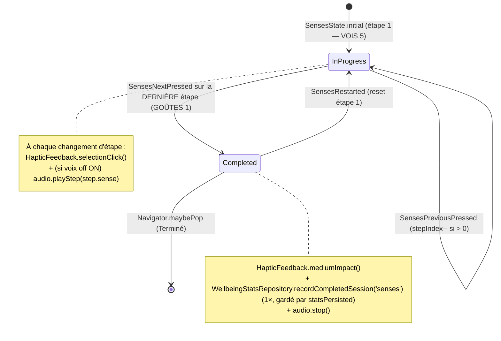

# Plan de page — « Les sens » (SensesPage)

> Plan auto-suffisant pour éditeur IA. Conforme aux règles `aidd_docs/memory/` +
> `aidd_docs/rules/` de DIGIHARMONY : Flutter, monorepo Melos 7, client-only,
> **zéro collecte, zéro réseau, zéro SDK analytics**, vibration via `HapticFeedback`
> uniquement, i18n ARB gen-l10n 8 langues (repli `en`), Drift pour l'agrégat local,
> HydratedBloc pour le flag voix off, `just_audio` pour l'audio en asset local,
> DM Sans en asset local (pas de `google_fonts`), icônes **Material** uniquement.
>
> Cet écran est la **cible de navigation `senses`** déclarée dans le plan
> `choisis-ta-bulle.md` (`BubbleCategoryId.senses → SensesPage`). Il **réutilise** les
> composants partagés `DigiToolbar`, `AppBackground`, `AppTheme` (créés par le hub et
> étendus par `respiration.md`) ainsi que `VoiceoverCubit` et `WellbeingStatsRepository`
> **déjà fondés par `respiration.md`** — aucun doublon.
>
> Technique implémentée : **ancrage sensoriel 5-4-3-2-1 (grounding)**, progression
> **manuelle** étape par étape via le bouton « Suivant ».

---

## 1. Contexte de la page

| Élément | Valeur |
| --- | --- |
| Nom | « Les sens » — ancrage sensoriel **5-4-3-2-1** guidé (grounding), 5 étapes : 5 VOIS → 4 TOUCHES → 3 ENTENDS → 2 SENS (odeurs) → 1 GOÛTES |
| Widget page | `SensesPage` (entrée + providers) + `SensesView` (UI), fichier `lib/senses/view/senses_page.dart` |
| Route logique | `senses`, conceptuellement `/bubble/senses`, **enfant du hub** `/bubble` — écran autonome plein écran |
| Parent | Hub « Choisis ta bulle » (`BubblesPage`) → arrivée via tap sur la bulle Les sens (`BubbleCategoryId.senses`) |
| Accès / rôles / auth | **Aucun** — app sans compte, sans identification, sans permission. Accès libre |
| Données affichées | Sens courant (œil/main/oreille/nez/bouche), compte (5→1), label, instruction, n° d'étape / total, récap des étapes déjà faites, état voix off — **toutes dérivées du `SensesBloc`** (en mémoire), contenu **statique** issu de `core_package` |
| Persistance | **Écriture Drift uniquement à la fin** (exercice terminé → +1 agrégat `WellbeingStats`, **même agrégat** que Respiration). Flag voix off persistant via **HydratedBloc** (`VoiceoverCubit` réutilisé). Aucune lecture/écriture pendant l'exercice |
| État applicatif | `SensesBloc` (machine d'états de progression 5-4-3-2-1) + `VoiceoverCubit` (HydratedBloc, flag on/off **partagé** avec Respiration). Audio piloté par `SensesAudioController` (just_audio, assets) |
| États écran | (a) **en cours** (étape 1→5), (b) **terminé / célébration**. **Pas d'empty, pas d'error, pas de loading** (technique figée, contenu en dur, audio en asset local) |

**Pourquoi un Bloc ici :** la règle `coding-assertions` impose `bloc`/`flutter_bloc` *dès qu'il y
a de l'état applicatif mutable*. Ici l'état évolue (étape courante, progression avant/arrière,
terminé) → `SensesBloc` obligatoire. Le flag voix off survit aux sessions → `VoiceoverCubit`
(HydratedBloc, DEC-002, **réutilisé** de Respiration). L'agrégat de fin est relationnel et
requêtable → Drift (DEC-001), jamais HydratedBloc.

> **Différence clé avec Respiration** : ici **PAS de timer auto**. La progression est
> **MANUELLE** (le design montre un bouton « Suivant » explicite) — l'utilisateur avance à son
> rythme. Aucun ticker, aucune durée de phase. Le `SensesBloc` est piloté **uniquement par les
> événements utilisateur** (Suivant / Précédent / Recommencer), ce qui le rend plus simple et
> 100 % testable sans `FakeAsync`.

---

## 2. User Stories liées

**Aucune US backlog référencée fournie.** Le plan s'appuie sur les **décisions validées par
l'utilisateur** (reportées en §13/§15) qui font office de critères d'acceptation. À rattacher si
une US existe (mettre à jour le champ `us:` de l'en-tête + du registry).

Critères d'acceptation dérivés des décisions (source des tests Kent) :
- **AC-1** : Technique **5-4-3-2-1** figée, **5 étapes ordonnées** : VOIS(5) → TOUCHES(4) → ENTENDS(3) → SENS/odeurs(2) → GOÛTES(1). Aucun sélecteur, aucun réordonnancement.
- **AC-2** : Progression **MANUELLE** via le bouton **« Suivant »** — **aucun timer auto**. L'utilisateur avance étape par étape.
- **AC-3** : L'**indicateur 5 points** reflète l'état : points faits = pleins bleus, point **courant** = barre allongée jaune, à venir = vides bordurés.
- **AC-4** : La **zone centrale** affiche l'icône du sens courant, le grand chiffre du compte, le label et la carte instruction de l'étape courante.
- **AC-5** : Le **récap** liste les étapes **déjà faites** sous forme de chips avec check (✓), couleur par étape.
- **AC-6** : À chaque **« Suivant » / changement d'étape** → `HapticFeedback.selectionClick()`.
- **AC-7** : Après la **dernière étape (1 — GOÛTES)**, le bouton « Suivant » **termine** l'exercice → état **célébration** + **vibration de fin** (`HapticFeedback.mediumImpact()`).
- **AC-8** : Un exercice **TERMINÉ** incrémente l'**agrégat local Drift** `WellbeingStats` **une seule fois** — **même agrégat** que Respiration (`recordCompletedSession('senses')`). Quitter avant la fin → **0** incrément.
- **AC-9** : **Voix off / guide audio** implémentée (assets `just_audio`) ; le bouton volume bascule on/off ; l'état est **mémorisé entre sessions** (HydratedBloc, **flag partagé** avec Respiration).
- **AC-10** : **Sortie en cours** (chevron retour ET back système) → si l'exercice **est commencé** (étape > 1 OU non terminé selon §6), dialog de **confirmation « Quitter la séance ? »** ; sinon retour direct au hub.
- **AC-11** : **« Précédent »** (si présent) revient à l'étape antérieure sans perte ; **« Recommencer »** (dans la célébration) repart à l'étape 1.
- **AC-12** : Tout texte visible provient de l'**ARB** (gen-l10n), aucune chaîne en dur ; FR+EN remplis, `el/it/ro/tr/es/mk` = repli EN (relecture native ultérieure pour `el/ro/tr/mk`).
- **AC-13** : Si `reduceMotion` actif → animations (apparition étape, pop d'icône, anim par sens, glow, halos, célébration) **désactivées/réduites**, mais la mécanique (progression, haptique, audio, récap, persistance) **reste fonctionnelle**.
- **AC-14** : **Zéro réseau / zéro collecte** : audio en asset local, contenu en dur, aucune analytics, aucune permission au-delà de `PACKAGE_USAGE_STATS`, icônes Material, zéro package tiers.

---

## 3. Design (capturé du HTML/CSS fourni) → mapping widgets

Écran mobile fond nuit `#16213C` (même fond que Respiration), plein écran, 2 halos radiaux
décoratifs animés (orb jaune haut-gauche, orb cyan bas-droite, `orb-drift`).

### Toolbar (haut)
| Élément design | Widget | Comportement |
| --- | --- | --- |
| Bouton retour (chevron-left, 48×48) | `DigiToolbar.onBack` | §6 — dialog de sortie si exercice commencé |
| Titre centré « Les sens » (bold) | `DigiToolbar.title` = `l10n.sensesTitle` | DM Sans bold |
| Bouton volume (volume-2, contrôle voix off) | `DigiToolbar.trailing` = `_VoiceoverButton` | bascule on/off (icône `Icons.volume_up` / `Icons.volume_off`) |

> `DigiToolbar` expose déjà `onBack`, `title`, `showMenu` (hub) **et `trailing`** (extension
> ajoutée par `respiration.md`). **Aucune nouvelle extension nécessaire** — on réutilise tel quel.

### Indicateur d'étapes (sous la toolbar)
| Élément design | Widget | Donnée |
| --- | --- | --- |
| 5 points horizontaux : faits = pleins bleus `rgba(143,216,240,.55)`, **courant** = barre allongée jaune `#F0C84A` (28 px large), à venir = vides bordurés | `_StepIndicator(current, total)` | `state.stepIndex` (0-based) / `GroundingExercise.totalSteps` (=5) |

> Le HTML montre l'**étape 3 active** (2 faits, 1 courant, 2 à venir) — c'est l'état d'exemple,
> pas une valeur figée. L'indicateur est piloté par `state.stepIndex`.

### Zone centrale (cœur de l'exercice, `flex:1`, centré)
| Élément design | Widget | Donnée |
| --- | --- | --- |
| Icône du sens courant dans un cercle 80 px (bordure cyan `#3FB8E644`, fond `#3FB8E61A`), animée par sens | `_SenseIcon(sense, reduceMotion)` | `state.step.sense` → `IconData` Material (§3 mapping icônes) |
| Grand chiffre du compte (72 px, jaune `#F0C84A`) | `Text` | `l10n.sensesCountValue(state.step.count)` (ex. « 3 ») |
| Label du sens (22 px bold `#F2F6FB`) | `Text` | `state.step.sense.label(l10n)` (ex. « que tu entends ») |
| Carte instruction (rounded-2xl, fond translucide) | `_InstructionCard` | `state.step.sense.instruction(l10n)` |
| Liste récap des étapes **déjà faites** (chips avec check ✓, couleur par étape) | `_StepRecap(doneSteps)` | étapes d'index `< state.stepIndex`, chacune `l10n.sensesRecapDone(count, label)` + check |

### Bas d'écran
| Élément design | Widget | Donnée |
| --- | --- | --- |
| Pastille « Guide audio — ~3 min — optionnel » (icône music, fond cyan translucide) | `_AudioHint` | `l10n.sensesAudioHint`, icône `Icons.music_note_outlined` |
| Bouton large « Suivant » (`#F0C84A` jaune, texte `#16213C`, icône arrow-right) | `_NextButton` | `l10n.sensesNext`, `Icons.arrow_forward` → avance d'étape / termine si dernière |
| (optionnel) Bouton « Précédent » | `_PreviousButton` | `l10n.sensesPrevious`, `Icons.arrow_back` — visible si `stepIndex > 0` |

> **Décision « Précédent »** : le HTML fourni ne montre **que** « Suivant ». On prévoit le bouton
> « Précédent » **discret** (texte/icône, visible uniquement dès l'étape 2) pour le confort, sans
> casser le design. Clé `sensesPrevious` prévue. Si l'équipe préfère 100 % fidèle au mockup,
> retirer le widget — la machine d'états supporte déjà l'événement `SensesPreviousPressed`.

### Tokens design (réutiliser `AppTheme`, étendre si besoin)
| Token | Valeur | Source |
| --- | --- | --- |
| `background` (fond nuit) | `#16213C` | **réutilise** `AppTheme.breathingBackground` (déjà ajouté par `respiration.md`) — renommer en token neutre `bubbleBackground` recommandé (cf. §11) |
| `primary` (cyan) | `#3FB8E6` | `AppTheme.primary` (existant) |
| `accent` (jaune) | `#F0C84A` | **léger écart** vs `AppTheme.accent` `#F5C842` (Respiration). Voir §11 — soit réutiliser `accent`, soit ajouter `sensesAccent #F0C84A`. Recommandation : ajouter `sensesAccent` pour fidélité exacte au mockup |
| vert (étape) | `#A8D24E` | `AppTheme.success` (token vert ajouté par `respiration.md`) |
| `foreground` | `#F2F6FB` | `AppTheme.foreground` (existant) |
| `muted` | `#A7B6CE` | `AppTheme.muted` (existant hub) ou ajouter si absent |
| Police | `DM Sans` | asset local (déclaré par le hub) |

> **Couleurs par sens (chips récap + icône)** — palette progressive du mockup :
> VOIS `#3FB8E6` (cyan) · TOUCHES `#A8D24E` (vert) · ENTENDS `#3FB8E6` (cyan, oreille active) ·
> SENS/odeurs et GOÛTES : prolonger la palette (ex. violet `#9B7BE8` couleur de la bulle Les sens,
> jaune `#F0C84A`). À porter dans `GroundingStep.accentColor` ou un mapping côté theme.

### Icônes (Material, **zéro dépendance ajoutée**)
| Sens (design lucide) | Material | Étape |
| --- | --- | --- |
| œil (`eye`) | `Icons.visibility_outlined` | VOIS (5) — **cohérent avec l'icône de la bulle hub** |
| main (`hand`) | `Icons.back_hand_outlined` (ou `Icons.pan_tool_outlined`) | TOUCHES (4) |
| oreille (`ear`) | `Icons.hearing_outlined` | ENTENDS (3) |
| nez (`nose`) | `Icons.air` (repli — pas d'icône « nez » Material ; option `Icons.spa_outlined` pour « odeur ») | SENS/odeurs (2) |
| bouche (`mouth`) | `Icons.restaurant_outlined` (ou `Icons.lunch_dining_outlined`) | GOÛTES (1) |
| `volume-2` | `Icons.volume_up` (on) / `Icons.volume_off` (off) | toolbar |
| `music` | `Icons.music_note_outlined` | pastille audio |
| `arrow-right` | `Icons.arrow_forward` | Suivant |
| `arrow-left` (option) | `Icons.arrow_back` | Précédent |
| `chevron-left` | `Icons.chevron_left` (porté par `DigiToolbar`) | retour |

> ⚠️ Material n'a **pas** d'icône « nez ». Choix retenu : **`Icons.air`** (souffle/odeur) pour
> l'étape SENS, à confirmer visuellement ; alternative `Icons.spa_outlined`. Aucune icône custom,
> aucun package tiers (contrainte dure).

---

## 4. Arbre de widgets

```
SensesPage (StatelessWidget)               // lib/senses/view/senses_page.dart
└─ BlocProvider(create: SensesBloc(
│     exercise: GroundingExercise.fiveFourThreeTwoOne,   // core_package, contenu figé en dur
│     statsRepository: context.read<WellbeingStatsRepository>(),  // Drift, écriture fin (réutilisé)
│     audio: SensesAudioController(),                    // just_audio, assets
│     voiceover: context.read<VoiceoverCubit>(),         // flag partagé (lecture)
│   ))                                                    // PAS de start auto : 1re étape par défaut
   └─ SensesView (StatelessWidget)
      └─ PopScope(canPop: false, onPopInvokedWithResult: _onBackPressed)   // §6 back système
         └─ Scaffold (extendBodyBehindAppBar: true, backgroundColor: #16213C)
            ├─ appBar: DigiToolbar(
            │     title: l10n.sensesTitle,
            │     showMenu: false,
            │     onBack: () => _onBackPressed(context, didPop: false),     // §6 dialog de sortie
            │     trailing: _VoiceoverButton(),                            // bascule VoiceoverCubit
            │   )
            └─ body: AppBackground(
                  background: AppTheme.bubbleBackground,    // #16213C (cf. §11 renommage)
                  child: Stack(
                    children: [
                      _DecorativeOrbs(),                    // 2 halos radiaux (orb-drift) — décoratif
                      SafeArea(
                        child: BlocConsumer<SensesBloc, SensesState>(
                          listenWhen: (p, c) => p.stepIndex != c.stepIndex || p.status != c.status,
                          listener: _onStateSideEffects,     // haptique + audio (§7)
                          builder: (context, state) => switch (state.status) {
                            SensesStatus.inProgress => _InProgressLayout(state),
                            SensesStatus.completed  => _CelebrationLayout(state),
                          },
                        ),
                      ),
                    ],
                  ),
                )

_InProgressLayout(state)
└─ Column
   ├─ _StepIndicator(current: state.stepIndex, total: exercise.totalSteps)  // 5 points (AC-3)
   ├─ Spacer
   ├─ _SenseIcon(sense: state.step.sense, reduceMotion: reduceMotion)       // cercle 80px animé (AC-4)
   ├─ Text(l10n.sensesCountValue(state.step.count))                         // grand chiffre 72px jaune
   ├─ Text(state.step.sense.label(l10n))                                    // « que tu entends »
   ├─ _InstructionCard(text: state.step.sense.instruction(l10n))           // carte instruction
   ├─ _StepRecap(doneSteps: state.doneSteps)                                // chips ✓ étapes faites (AC-5)
   ├─ Spacer
   ├─ _AudioHint()                                                          // « Guide audio — ~3 min — optionnel »
   └─ Row
      ├─ if (state.stepIndex > 0) _PreviousButton(
      │     onTap: () => bloc.add(const SensesPreviousPressed()))           // AC-11 (optionnel)
      └─ _NextButton(
            label: state.isLastStep ? l10n.sensesCelebrationDone : l10n.sensesNext,
            onTap: () => bloc.add(const SensesNextPressed()))               // avance / termine (AC-2/AC-7)

_CelebrationLayout(state)                    // fin d'exercice (AC-7)
└─ Column (centré)
   ├─ _CelebrationBurst()                     // glow vert #A8D24E / violet (flutter_animate, one-shot)
   ├─ Text(l10n.sensesCelebrationTitle)       // « Bravo, te voilà ancré·e »
   ├─ Text(l10n.sensesCelebrationBody)        // message apaisant
   ├─ _NextButton(label: l10n.sensesCelebrationDone,
   │     onTap: () => Navigator.maybePop(context))                          // retour au hub
   └─ TextButton(l10n.sensesNext /* « Recommencer » via clé dédiée */,
         onPressed: () => bloc.add(const SensesRestarted()))                // AC-11 reset étape 1
```

> Note : dans la célébration, le bouton principal « Terminé » retourne au hub
> (`Navigator.maybePop`) ; un bouton secondaire « Recommencer » relance à l'étape 1. (Si une clé
> dédiée « Recommencer » est souhaitée, ajouter `sensesRestart` — sinon réutiliser un libellé
> existant. Le plan prévoit `sensesPrevious`/`sensesNext` ; ajouter `sensesRestart` recommandé.)

---

## 5. Machine d'états de l'exercice (progression 5-4-3-2-1 — MANUELLE)

### Contenu figé (donnée pure — `core_package`, AUCUNE chaîne en dur ici : seul le TEXTE passe par l'ARB)

```dart
// packages/core_package/lib/src/senses/grounding_exercise.dart
enum GroundingSense { see, touch, hear, smell, taste }

@immutable
class GroundingStep {
  const GroundingStep({
    required this.sense,
    required this.count,
  });

  final GroundingSense sense;   // see / touch / hear / smell / taste
  final int count;              // 5 / 4 / 3 / 2 / 1
}

@immutable
class GroundingExercise {
  const GroundingExercise({required this.steps});

  final List<GroundingStep> steps;

  int get totalSteps => steps.length;   // 5

  /// Technique 5-4-3-2-1 — FIGÉE en V1 (ordre et comptes immuables).
  /// Le contenu TEXTUEL (label + instruction) n'est PAS stocké ici : il est
  /// résolu via l'ARB côté app (extension GroundingSense → clés), pour i18n.
  static const GroundingExercise fiveFourThreeTwoOne = GroundingExercise(
    steps: [
      GroundingStep(sense: GroundingSense.see,   count: 5),
      GroundingStep(sense: GroundingSense.touch, count: 4),
      GroundingStep(sense: GroundingSense.hear,  count: 3),
      GroundingStep(sense: GroundingSense.smell, count: 2),
      GroundingStep(sense: GroundingSense.taste, count: 1),
    ],
  );
}
```

> **Pourquoi pas le texte dans `core_package` ?** Le contenu sensoriel (sens + compte + ordre) est
> une **donnée métier statique** → `core_package`. Mais le **texte** (label « que tu entends »,
> instruction « Ferme les yeux… ») doit être **traduisible** → il vit dans l'**ARB** et est résolu
> par une extension `GroundingSense → clé` côté app (§13). Ainsi `core_package` reste sans
> dépendance UI/i18n, et les 8 langues sont couvertes. (Couleur d'accent par sens : optionnellement
> portée dans un mapping theme côté app plutôt que dans `core_package`.)

### États (`SensesState`, equatable)
```dart
enum SensesStatus { inProgress, completed }

class SensesState extends Equatable {
  const SensesState({
    required this.status,
    required this.exercise,
    required this.stepIndex,         // 0-based : 0..totalSteps-1
    this.statsPersisted = false,     // garde-fou : agrégat écrit 1 seule fois (AC-8)
  });

  final SensesStatus status;
  final GroundingExercise exercise;
  final int stepIndex;
  final bool statsPersisted;

  GroundingStep get step => exercise.steps[stepIndex];
  bool get isLastStep => stepIndex == exercise.totalSteps - 1;
  List<GroundingStep> get doneSteps => exercise.steps.sublist(0, stepIndex); // étapes faites (récap)

  factory SensesState.initial(GroundingExercise exercise) => SensesState(
    status: SensesStatus.inProgress, exercise: exercise, stepIndex: 0,
  );
  // copyWith + props : [status, stepIndex, statsPersisted] (exercise const, stable)
}
```

### Événements (`SensesEvent`)
| Événement | Déclencheur | Effet |
| --- | --- | --- |
| `SensesNextPressed` | bouton « Suivant » (AC-2) | si `!isLastStep` → `stepIndex++` (reste `inProgress`) ; si `isLastStep` → `status = completed`, écrit Drift 1× (AC-8), vibration de fin (AC-7), stoppe audio |
| `SensesPreviousPressed` | bouton « Précédent » (AC-11, optionnel) | si `stepIndex > 0` → `stepIndex--` ; sinon no-op |
| `SensesRestarted` | « Recommencer » (célébration, AC-11) | reset : `stepIndex = 0`, `status = inProgress`, `statsPersisted = false` |

> **Aucun événement temporel** (pas de `Ticked`). Le bloc ne possède **aucun timer** : il réagit
> uniquement aux gestes utilisateur. C'est la différence structurelle majeure avec `BreathingBloc`.

### Diagramme d'états (à attacher au plan — `aidd:03:components_behavior`)


### Implémentation (handler `SensesNextPressed`)
```dart
void _onNext(SensesNextPressed e, Emitter<SensesState> emit) {
  final s = state;
  if (!s.isLastStep) {
    emit(s.copyWith(stepIndex: s.stepIndex + 1));           // avance, reste inProgress
    return;
  }
  if (s.statsPersisted) return;                              // garde-fou anti double-compte
  emit(s.copyWith(status: SensesStatus.completed, statsPersisted: true));
  // effets de bord (Drift +1, audio.stop, mediumImpact) : voir §7 — soit dans le listener UI,
  // soit ici via le repository injecté. Recommandation : Drift dans le bloc (await repository),
  // haptique/audio dans le BlocListener UI (couche présentation).
}
```
- **`close()` du bloc** : `audio.dispose()` (pas de son résiduel après pop). Aucun timer à annuler.
- **Écriture Drift** : appel **unique** à la transition `→ completed`, **gardé par `statsPersisted`**
  pour ne jamais double-compter. `recordCompletedSession('senses')`.

---

## 6. Navigation / Route + dialog de sortie

| Aspect | Détail |
| --- | --- |
| Route logique | `senses` (`/bubble/senses`), enfant du hub. Atteint via `BubblesRoutes` (mapping `BubbleCategoryId.senses → MaterialPageRoute(builder: (_) => const SensesPage())`) — **brancher le builder TODO laissé par `choisis-ta-bulle.md`** (le registry liste `senses → SensesPage`) |
| Retour normal | `Navigator.maybePop(context)` vers le hub |
| « Commencé » (AC-10) | l'exercice est considéré **commencé** dès que `stepIndex > 0` **OU** `status == inProgress && stepIndex >= 0` avec progression amorcée. **Choix retenu (cohérent avec Respiration)** : tant que `status != completed`, on est « en séance » → dialog. Si l'on veut autoriser un retour direct à l'étape 1 intacte, conditionner par `stepIndex > 0`. **Défaut : dialog si `status != completed` ET `stepIndex > 0`** ; retour direct à l'étape 1 sans dialog (rien fait). À confirmer — voir note |
| Sortie en cours (AC-10) | chevron retour ET back système (Android) → si « commencé » → **dialog de confirmation** « Quitter la séance ? ». Si `completed` ou étape 1 intacte → pop direct. **Quitter ne persiste PAS** l'agrégat Drift (AC-8) |

> **Note décision sortie** : Respiration ouvre le dialog dès `status != completed`. Comme « Les
> sens » démarre directement sur l'étape 1 (pas de compte à rebours), demander confirmation alors
> que l'utilisateur n'a encore rien fait serait friction inutile. **Défaut retenu** : dialog
> **uniquement si `stepIndex > 0`** (au moins une étape franchie) ; sinon retour direct. Aligner
> avec l'équipe si l'on veut le comportement strictement identique à Respiration.

### Interception du back système
```dart
PopScope(
  canPop: false,                          // on gère nous-mêmes
  onPopInvokedWithResult: (didPop, _) async {
    if (didPop) return;
    await _onBackPressed(context, didPop: true);
  },
  child: Scaffold(...),
)
```

### `_onBackPressed`
```dart
Future<void> _onBackPressed(BuildContext context, {required bool didPop}) async {
  final bloc = context.read<SensesBloc>();
  final started = bloc.state.status != SensesStatus.completed && bloc.state.stepIndex > 0;
  if (!started) {
    Navigator.of(context).maybePop();
    return;
  }
  final leave = await showDialog<bool>(            // dialog « Quitter la séance ? »
    context: context,
    builder: (_) => AlertDialog(
      title: Text(l10n.sensesExitDialogTitle),     // « Quitter la séance ? »
      content: Text(l10n.sensesExitDialogBody),
      actions: [
        TextButton(child: Text(l10n.sensesExitDialogCancel), onPressed: () => Navigator.pop(context, false)),
        TextButton(child: Text(l10n.sensesExitDialogConfirm), onPressed: () => Navigator.pop(context, true)),
      ],
    ),
  );
  if (leave == true && context.mounted) {
    Navigator.of(context).maybePop();              // PAS d'écriture Drift (exercice non terminé, AC-8)
  }
}
```
> ⚠️ Quitter en cours **n'incrémente PAS** l'agrégat Drift (seul un exercice **terminé** compte, AC-8).

---

## 7. Effets de bord (haptique + audio) — `BlocListener`

Centralisés dans `_onStateSideEffects` (listener du `BlocConsumer`), déclenchés sur changement de
`stepIndex` ou `status` :

| Transition | HapticFeedback | Audio (`just_audio`) |
| --- | --- | --- |
| Changement d'**étape** (Suivant / Précédent, AC-6) | `HapticFeedback.selectionClick()` | si voix off ON → `audio.playStep(state.step.sense)` (asset local) |
| `→ completed` (fin étape 1 GOÛTES, AC-7) | `HapticFeedback.mediumImpact()` | `audio.stop()` + (option) jingle de fin si voix off ON |
| toggle voix off **OFF** en cours | — | `audio.stop()` immédiat (silence) |
| toggle voix off **ON** en cours | — | (option) rejoue l'audio de l'étape courante |

> L'haptique passe **exclusivement** par `HapticFeedback` (règle permissions-zero-collecte : pas de
> permission `VIBRATE`, pas de package vibration). `selectionClick()` au changement d'étape (geste
> léger, cohérent UX), `mediumImpact()` en fin.

---

## 8. Intégration audio `just_audio` (assets locaux) — guide « ~3 min »

### Assets (packagés, zéro réseau)
```yaml
# apps/digiharmony_app/pubspec.yaml  → flutter > assets
assets:
  - assets/audio/senses/
```
Fichiers proposés (guide audio / voix off — à fournir par l'équipe contenu, multilingue possible plus tard) :
- `assets/audio/senses/see.mp3`   (5 — VOIS)
- `assets/audio/senses/touch.mp3` (4 — TOUCHES)
- `assets/audio/senses/hear.mp3`  (3 — ENTENDS)
- `assets/audio/senses/smell.mp3` (2 — SENS / odeurs)
- `assets/audio/senses/taste.mp3` (1 — GOÛTES)
- `assets/audio/senses/celebration.mp3` (optionnel, fin)

> La pastille « Guide audio — ~3 min — optionnel » est **informative** : elle indique la durée
> approximative du guidage complet, pas un timer. La progression reste **manuelle** (AC-2).
> **Multilingue audio (V1)** : un seul jeu de fichiers (neutre / langue de référence). Extensible
> par `assets/audio/senses/<lang>/...` plus tard (hors scope V1). `SensesAudioController` accepte un
> préfixe de chemin pour rester extensible.

### `SensesAudioController` (wrapper testable)
```dart
// lib/senses/audio/senses_audio_controller.dart
class SensesAudioController {
  final AudioPlayer _player = AudioPlayer();   // just_audio

  Future<void> playStep(GroundingSense sense) async {
    final asset = switch (sense) {
      GroundingSense.see   => 'assets/audio/senses/see.mp3',
      GroundingSense.touch => 'assets/audio/senses/touch.mp3',
      GroundingSense.hear  => 'assets/audio/senses/hear.mp3',
      GroundingSense.smell => 'assets/audio/senses/smell.mp3',
      GroundingSense.taste => 'assets/audio/senses/taste.mp3',
    };
    await _player.setAsset(asset);
    await _player.play();
  }
  Future<void> playCelebration() async { /* celebration.mp3 */ }
  Future<void> stop()    => _player.stop();
  Future<void> dispose() => _player.dispose();
}
```
- **Pas de `just_audio_background`** ici (exercice au premier plan, pas de lecture en arrière-plan —
  réservé à Detox). Ne pas câbler le service background pour cette page.
- Le listener n'appelle l'audio **que si `VoiceoverCubit.state == true`** (voix off ON).
- **Testabilité** : injecter/mocker `SensesAudioController` (via `mocktail`) pour vérifier les appels
  sans lecteur réel.

---

## 9. Flag voix off — `VoiceoverCubit` (HydratedBloc) — **RÉUTILISÉ de Respiration**

**Ne PAS recréer** un cubit voix off. `respiration.md` a déjà fondé `VoiceoverCubit`
(HydratedBloc, `lib/breathing/cubit/voiceover_cubit.dart`). Deux options de cohérence :

| Option | Détail | Recommandation |
| --- | --- | --- |
| **A — Flag global partagé** | Un seul `VoiceoverCubit` provisionné **au-dessus de l'app** (à côté de `LocaleCubit`), partagé par Respiration ET Les sens. Le réglage voix off est **commun** à toutes les bulles | ✅ **Retenu** — cohérent « un seul réglage voix off », moins de stockage, UX prévisible |
| B — Flag par exercice | Une clé HydratedBloc distincte par écran | ❌ Surdimensionné, divergence de réglages |

> **Action de refactor légère** : si `VoiceoverCubit` vit aujourd'hui sous `lib/breathing/`, le
> **promouvoir** vers `lib/voiceover/cubit/voiceover_cubit.dart` (partagé) et l'exporter, pour qu'il
> ne soit plus « propriété » de Respiration. Mettre à jour les imports de Respiration. Sinon, le
> laisser et l'importer depuis `senses`. **Recommandation : promouvoir** (composant partagé propre).
> Provision dans `bootstrap.dart` au-dessus de `MaterialApp`.

- **Bouton volume** (`_VoiceoverButton`) : `context.watch<VoiceoverCubit>()` → icône `Icons.volume_up`
  (ON) / `Icons.volume_off` (OFF), `onPressed: () => context.read<VoiceoverCubit>().toggle()`. Labels
  a11y `sensesVoiceoverOnLabel` / `sensesVoiceoverOffLabel`.
- Passage **OFF** en cours → `audio.stop()` (effet de bord §7).
- ⚠️ **Jamais de journal/agrégat dans HydratedBloc** — uniquement ce flag UI.

---

## 10. Agrégat Drift — `WellbeingStats` (écriture fin) — **MÊME agrégat que Respiration**

### Décision : agrégat local partagé, jamais de collecte
Un exercice **terminé** incrémente le **même** compteur de séances bien-être que Respiration, stocké
en **Drift** (DEC-001), 100 % sur l'appareil. **Réutiliser** la table `WellbeingStats` et le
repository `WellbeingStatsRepository` **fondés par `respiration.md`** — **ne PAS créer de seconde
table ni de seconde DB**.

> ⚠️ **Cohérence cross-page** : `respiration.md` pose la **fondation Drift** (`AppDatabase`,
> table `WellbeingStats(exerciseId, completedCount, lastCompletedAt)`, `WellbeingStatsRepository`).
> Ce plan **consomme** cette fondation avec `exerciseId = 'senses'`. Si Respiration n'est pas encore
> implémentée au moment du dev de cette page, **créer la fondation depuis le plan le plus avancé**,
> puis l'autre réutilise — **une seule `AppDatabase`** dans l'app.

### Réutilisation (rappel de l'interface posée par Respiration)
```dart
abstract class WellbeingStatsRepository {
  Future<void> recordCompletedSession(String exerciseId);  // upsert +1, lastCompletedAt = now
  Stream<int> watchCompletedCount(String exerciseId);      // réactif (futur écran stats)
}
```
- **Appel unique** dans le bloc à la transition `→ completed`, **gardé par `statsPersisted`** :
  `recordCompletedSession('senses')`.
- **Aucune lecture** pendant l'exercice.
- L'agrégat distingue les exercices par `exerciseId` (`'breathing'`, `'senses'`, …) → la même table
  totalise toutes les bulles sans collision.
- **Test Kent** : fake/mocktail `WellbeingStatsRepository` → vérifier `recordCompletedSession('senses')`
  appelé **exactement 1×** sur exercice complet, **0×** si on quitte avant la fin.

---

## 11. Composants réutilisables (vs registry)

Registry actuel : `DigiToolbar`, `AppBackground`, `BubbleCard` (hub) ; `DigiToolbar(trailing)`,
`AppBackground(background)`, `AppTheme` tokens, `VoiceoverCubit`, `WellbeingStats(+repo)`,
`BreathingAudioController`, `BreathingBloc` (Respiration).

| Composant | Statut | Action |
| --- | --- | --- |
| `DigiToolbar` (avec `trailing`) | **partagé existant** | **Réutiliser tel quel** (trailing déjà ajouté par Respiration) |
| `AppBackground` (avec `background`) | **partagé existant** | **Réutiliser** : passer `#16213C` |
| `AppTheme` | **partagé existant** | **Réutiliser** `primary`/`foreground`/`success`/`muted`. ⚠️ Voir notes ci-dessous (token fond + accent jaune) |
| `VoiceoverCubit` (HydratedBloc) | **partagé existant (Respiration)** | **Réutiliser** (flag global partagé, §9). Recommandation : **promouvoir** sous `lib/voiceover/` |
| `WellbeingStats` + `WellbeingStatsRepository` (Drift) | **partagé existant (Respiration)** | **Réutiliser** avec `exerciseId='senses'`, **ne PAS dupliquer** |
| `GroundingExercise` / `GroundingStep` / `GroundingSense` | **nouveau (core_package)** | Donnée pure 5-4-3-2-1, sans Flutter UI |
| `SensesBloc` + state + events | **nouveau (app)** | machine d'états §5 (manuelle, sans timer) |
| `SensesAudioController` | **nouveau (app)** | wrapper just_audio §8 |
| `_StepIndicator`, `_SenseIcon`, `_InstructionCard`, `_StepRecap`, `_AudioHint`, `_NextButton`, `_PreviousButton`, `_CelebrationLayout`, `_CelebrationBurst`, `_DecorativeOrbs`, `_VoiceoverButton` | **nouveaux (app, privés à senses)** | spécifiques écran |

### ⚠️ Cohérence tokens à arbitrer (cross-page)
1. **Token fond `#16213C`** : `respiration.md` l'a nommé `AppTheme.breathingBackground`. Comme **Les
   sens partage exactement ce fond** (et probablement Étirement/Détox), **renommer** en token neutre
   **`AppTheme.bubbleBackground`** (alias rétro-compatible possible). Évite un token « breathing »
   utilisé par « senses ». **Action** : renommer + mettre à jour Respiration + registry.
2. **Accent jaune** : Respiration `#F5C842` (`AppTheme.accent`) vs mockup Les sens `#F0C84A`. Écart
   minime. **Choix** : ajouter `AppTheme.sensesAccent = #F0C84A` pour fidélité exacte, **ou** unifier
   sur `accent`. **Recommandation : ajouter `sensesAccent`** (fidélité mockup), à trancher avec l'équipe.
3. **`_VoiceoverButton`** : Respiration a un `_VoiceoverButton` privé. **Candidat à extraction
   partagée** (`lib/voiceover/widgets/voiceover_button.dart`) puisqu'identique (bascule le même
   `VoiceoverCubit`). **Recommandation : extraire** → réutilisé par les 4 bulles.

> Pas de collision de route (`senses` déjà réservé par le registry). Pas de duplication de Bloc/store
> à condition de **réutiliser** `VoiceoverCubit` + `WellbeingStats(+repo)`.

---

## 12. Animations (`flutter_animate`) + accessibilité

`flutter_animate` déjà en dépendance. Reproduire les animations CSS du mockup :

| Animation CSS (mockup) | Cible Flutter | Effet |
| --- | --- | --- |
| `sens-step-reveal` | `_InProgressLayout` (à chaque changement d'étape) | `fadeIn` + léger `slideY` à l'entrée de l'étape (`key: ValueKey(stepIndex)` pour rejouer) |
| `sens-icon-pop` | `_SenseIcon` | `scale` pop one-shot quand l'icône change |
| `sens-ear`/`sens-eye`/`sens-hand`/`sens-nose` | `_SenseIcon` | anim douce spécifique par sens (pulse/tilt léger, en boucle discrète) |
| `sens-inner` (glow) | cercle 80 px | glow/pulse doux derrière l'icône |
| `sens-dot-fill` | `_StepIndicator` | remplissage animé du point quand une étape est franchie |
| `sens-light-spread` | transition d'étape | léger halo de transition (one-shot) |
| `sens-msg` | `_InstructionCard` | `fadeIn` de la carte instruction |
| `sens-orb-drift` | `_DecorativeOrbs` (halos jaune/cyan) | dérive lente en boucle (`onPlay: repeat`, `moveX/moveY`) |
| célébration | `_CelebrationBurst` | `fadeIn` + `scale` + burst vert `#A8D24E` / violet (one-shot) |

### Respect `reduceMotion` (AC-13) — OBLIGATOIRE
```dart
final reduceMotion = MediaQuery.of(context).disableAnimations;
```
- Si `reduceMotion == true` :
  - **apparition étape / icon-pop / light-spread / célébration** : pas d'animation → affichage
    instantané (le contenu apparaît directement).
  - **anim par sens / glow / orb-drift** : `repeat()` **désactivés** (icône et halos statiques).
  - **dot-fill** : changement d'état instantané du point courant.
  - **La mécanique reste 100 % fonctionnelle** : progression Suivant/Précédent, haptique, audio,
    récap, persistance — rien n'en dépend.
- Encapsuler les `effects` conditionnels dans chaque widget animé.
- **Test Kent** : avec `MediaQueryData(disableAnimations: true)`, vérifier qu'aucune animation en
  boucle n'est active (pas de `pump` infini) et que la progression d'étape fonctionne quand même.

---

## 13. Internationalisation (ARB / gen-l10n)

Système : **gen-l10n / ARB**, dir `lib/l10n/arb`, template `app_en.arb`, 8 langues
`en/fr/el/it/ro/tr/es/mk`, repli `en`. Helper `context.l10n` (extension existante).

### Clés à créer (préfixe `senses*`)
| Clé ARB | EN | FR | Params |
| --- | --- | --- | --- |
| `sensesTitle` | "The senses" | "Les sens" | — |
| `sensesStepProgress` | "Step {current} of {total}" | "Étape {current} sur {total}" | `{current}`,`{total}` (int) — a11y indicateur |
| `sensesCountValue` | "{count}" | "{count}" | `{count}` (int) — grand chiffre |
| `sensesStepSeeLabel` | "things you see" | "que tu vois" | — |
| `sensesStepSeeInstruction` | "Look around and name five things you can see." | "Regarde autour de toi et nomme cinq choses que tu vois." | — |
| `sensesStepTouchLabel` | "you can touch" | "que tu peux toucher" | — |
| `sensesStepTouchInstruction` | "Notice four things you can feel against your skin." | "Remarque quatre choses que tu peux sentir contre ta peau." | — |
| `sensesStepHearLabel` | "you hear" | "que tu entends" | — |
| `sensesStepHearInstruction` | "Close your eyes. Listen to nearby sounds, then distant ones." | "Ferme les yeux. Écoute les sons proches, puis les lointains." | — |
| `sensesStepSmellLabel` | "you can smell" | "que tu sens" | — |
| `sensesStepSmellInstruction` | "Identify two scents around you, even faint ones." | "Identifie deux odeurs autour de toi, même légères." | — |
| `sensesStepTasteLabel` | "you can taste" | "que tu goûtes" | — |
| `sensesStepTasteInstruction` | "Focus on one taste in your mouth right now." | "Concentre-toi sur un goût présent dans ta bouche." | — |
| `sensesRecapDone` | "{count} {label}" | "{count} {label}" | `{count}` (int), `{label}` (String) — chip récap |
| `sensesAudioHint` | "Audio guide — ~3 min — optional" | "Guide audio — ~3 min — optionnel" | — |
| `sensesNext` | "Next" | "Suivant" | — |
| `sensesPrevious` | "Previous" | "Précédent" | — (optionnel) |
| `sensesRestart` | "Start over" | "Recommencer" | — (célébration) |
| `sensesVoiceoverOnLabel` | "Voice guidance on" | "Voix off activée" | — (a11y bouton volume) |
| `sensesVoiceoverOffLabel` | "Voice guidance off" | "Voix off coupée" | — (a11y bouton volume) |
| `sensesCelebrationTitle` | "Well grounded!" | "Te voilà ancré·e !" | — |
| `sensesCelebrationBody` | "You completed the 5-4-3-2-1 grounding exercise." | "Tu as terminé l'ancrage 5-4-3-2-1." | — |
| `sensesCelebrationDone` | "Done" | "Terminé" | — |
| `sensesExitDialogTitle` | "Leave the session?" | "Quitter la séance ?" | — |
| `sensesExitDialogBody` | "Your progress for this session won't be saved." | "Ta progression de cette séance ne sera pas enregistrée." | — |
| `sensesExitDialogConfirm` | "Leave" | "Quitter" | — |
| `sensesExitDialogCancel` | "Stay" | "Rester" | — |
| `sensesToolbarBack` | "Back" | "Retour" | — (a11y) |

### Fichiers cibles
- `app_en.arb` : valeurs EN ci-dessus **+ blocs `@sensesXxx`** avec `description` + `placeholders`
  typés (`current`/`total`/`count` = `int`, `label` = `String`) — **obligatoire sur le template**.
- `app_fr.arb` : valeurs FR.
- `app_el.arb`, `app_it.arb`, `app_ro.arb`, `app_tr.arb`, `app_es.arb`, `app_mk.arb` :
  **placeholders = copie EN** (repli), marquer **relecture native ultérieure** (el/ro/tr/mk = locuteur natif).
- Régénérer : `flutter gen-l10n` puis `flutter analyze --fatal-infos`.

### Exemple de placeholders (template)
```json
"sensesStepProgress": "Step {current} of {total}",
"@sensesStepProgress": {
  "description": "Accessibility label for the 5-step indicator",
  "placeholders": { "current": { "type": "int" }, "total": { "type": "int" } }
},
"sensesRecapDone": "{count} {label}",
"@sensesRecapDone": {
  "description": "Recap chip for an already completed step (count + sense label)",
  "placeholders": { "count": { "type": "int" }, "label": { "type": "String" } }
}
```

### Résolution sens → clés (côté app)
```dart
// lib/senses/senses_l10n.dart
extension GroundingSenseL10n on GroundingSense {
  String label(AppLocalizations l) => switch (this) {
    GroundingSense.see   => l.sensesStepSeeLabel,
    GroundingSense.touch => l.sensesStepTouchLabel,
    GroundingSense.hear  => l.sensesStepHearLabel,
    GroundingSense.smell => l.sensesStepSmellLabel,
    GroundingSense.taste => l.sensesStepTasteLabel,
  };

  String instruction(AppLocalizations l) => switch (this) {
    GroundingSense.see   => l.sensesStepSeeInstruction,
    GroundingSense.touch => l.sensesStepTouchInstruction,
    GroundingSense.hear  => l.sensesStepHearInstruction,
    GroundingSense.smell => l.sensesStepSmellInstruction,
    GroundingSense.taste => l.sensesStepTasteInstruction,
  };

  IconData get icon => switch (this) {
    GroundingSense.see   => Icons.visibility_outlined,
    GroundingSense.touch => Icons.back_hand_outlined,
    GroundingSense.hear  => Icons.hearing_outlined,
    GroundingSense.smell => Icons.air,
    GroundingSense.taste => Icons.restaurant_outlined,
  };
}
```

---

## 14. États de la page

| État | Présent ? | Détail |
| --- | --- | --- |
| **En cours** (inProgress) | ✅ | indicateur 5 points, icône + chiffre + label + instruction de l'étape, récap des étapes faites, pastille audio, bouton Suivant (+ Précédent dès étape 2) |
| **Célébration** (completed) | ✅ | message de félicitation, vibration de fin, agrégat Drift +1 (`'senses'`), boutons Terminé / Recommencer |
| Empty | ❌ | technique figée, contenu en dur, rien à charger |
| Error | ❌ | audio en asset local (échec audio → dégradation silencieuse, jamais d'écran d'erreur) ; écriture Drift en `try/catch` non bloquant (ne casse pas la célébration) |
| Loading | ❌ | aucune attente réseau/I/O au démarrage (pas de lecture Drift) |

Feedback utilisateur : haptique à chaque étape + fin, audio voix off (si ON), récap visuel,
dialog de sortie, célébration.

---

## 15. Décisions de conception (validées / défauts appliqués)

| # | Décision | Statut |
| --- | --- | --- |
| D-1 | Progression **MANUELLE** via « Suivant » (pas de timer auto) | ✅ Défaut appliqué (conforme au design qui montre un bouton explicite) |
| D-2 | Contenu 5 étapes = **données statiques en dur** dans `core_package` (`GroundingExercise`), **texte via ARB** | ✅ Appliqué |
| D-3 | Voix off / guide audio = **just_audio assets locaux**, flag on/off **mémorisé HydratedBloc** (cubit **partagé** avec Respiration) | ✅ Appliqué |
| D-4 | Fin d'exercice = **écran de félicitation** + **+1 agrégat Drift** (même `WellbeingStats` que Respiration, `exerciseId='senses'`) | ✅ Appliqué |
| D-5 | Sortie en cours = **dialog « Quitter la séance ? »** si commencé, sinon retour direct | ✅ Appliqué (commencé = `stepIndex > 0 && !completed`) |
| D-6 | `HapticFeedback.selectionClick()` à chaque Suivant/changement d'étape ; `mediumImpact()` en fin | ✅ Appliqué |
| D-7 | Route `senses` (`/bubble/senses`), enfant du hub, écran autonome | ✅ Appliqué (cible registry `senses → SensesPage`) |
| D-8 | États : en cours / célébration. Pas d'empty/error/loading. `reduceMotion` respecté | ✅ Appliqué |
| D-9 | Bouton **« Précédent »** ajouté (confort), visible dès l'étape 2 | ⚠️ Hors mockup strict — à confirmer (retirable sans casser la machine d'états) |
| D-10 | Icône « nez » → `Icons.air` (Material n'a pas d'icône nez) | ⚠️ À valider visuellement |
| D-11 | Token fond renommé `bubbleBackground` (vs `breathingBackground`) + accent `sensesAccent #F0C84A` | ⚠️ Refactor cross-page recommandé — à trancher avec l'équipe |

---

## 16. Contraintes projet (rappel, à respecter à 100 %)

- ✅ **Zéro collecte / zéro réseau** : audio en **asset local** `just_audio` ; contenu en dur ; aucune analytics/tracking ; pas de `google_fonts` → DM Sans en asset local (posé par le hub).
- ✅ **Vibration via `HapticFeedback`** uniquement (`selectionClick` par étape, `mediumImpact` en fin) — pas de permission `VIBRATE`, pas de package vibration.
- ✅ **Drift** = seule persistance locale (agrégat fin, **table partagée** `WellbeingStats`), **HydratedBloc** = flag voix off seulement (**partagé**), **jamais** de journal/agrégat dans HydratedBloc.
- ✅ **State via `bloc`/`flutter_bloc`** (`SensesBloc`) — justifié par l'état mutable (progression).
- ✅ **i18n ARB obligatoire** : aucune chaîne en dur, 8 langues, repli `en`.
- ✅ **Icônes Material uniquement**, **zéro package tiers** (contrainte dure du brief).
- ✅ **Lints** `very_good_analysis` + `bloc_lint` stricts (0 warning/info), `const` partout où possible.
- ✅ **Naming** : fichiers snake_case, widgets PascalCase.
- ✅ **Monorepo** : `GroundingExercise`/`GroundingStep`/`GroundingSense` dans `core_package` ; UI/Bloc/audio dans `apps/digiharmony_app`. Drift/Voiceover **réutilisés** (pas recréés).
- ✅ **Aucune nouvelle dépendance pub** : réutilise `just_audio`, `drift`, `hydrated_bloc`, `flutter_bloc`, `flutter_animate`, `HapticFeedback`, Material icons.
- ✅ **Android release** : `minify`/`shrinkResources` à `false` (déjà en place — protège libs natives Drift).
- ✅ Après modif modèle Drift (si fondation créée ici) : `dart run build_runner build --delete-conflicting-outputs`.

---

## 17. Fichiers à créer / modifier

**core_package**
- `packages/core_package/lib/src/senses/grounding_exercise.dart` (`GroundingSense`, `GroundingStep`, `GroundingExercise.fiveFourThreeTwoOne`).
- `packages/core_package/lib/core_package.dart` (ajouter l'export).

**app — senses**
- `apps/digiharmony_app/lib/senses/view/senses_page.dart` (`SensesPage` + `SensesView` + layouts inProgress/celebration + PopScope + dialog).
- `apps/digiharmony_app/lib/senses/bloc/senses_bloc.dart` / `senses_event.dart` / `senses_state.dart` (machine d'états §5, **sans timer**).
- `apps/digiharmony_app/lib/senses/audio/senses_audio_controller.dart` (just_audio §8).
- `apps/digiharmony_app/lib/senses/widgets/step_indicator.dart`, `sense_icon.dart`, `instruction_card.dart`, `step_recap.dart`, `audio_hint.dart`, `next_button.dart`, `previous_button.dart` (option), `celebration_layout.dart`, `decorative_orbs.dart`.
- `apps/digiharmony_app/lib/senses/senses_l10n.dart` (extension sens → label/instruction/icon).
- `apps/digiharmony_app/lib/senses/senses.dart` (barrel export).

**app — partagé (RÉUTILISER, refactor léger recommandé)**
- `apps/digiharmony_app/lib/widgets/digi_toolbar.dart` (réutiliser `trailing` — **rien à changer**).
- `apps/digiharmony_app/lib/widgets/app_background.dart` (réutiliser `background` — **rien à changer**).
- `apps/digiharmony_app/lib/theme/app_theme.dart` (renommer `breathingBackground → bubbleBackground` + ajouter `sensesAccent #F0C84A` — cf. §11, D-11).
- `apps/digiharmony_app/lib/voiceover/cubit/voiceover_cubit.dart` (**promotion** de `VoiceoverCubit` en composant partagé — déplacer depuis `breathing/`, mettre à jour imports) + `apps/digiharmony_app/lib/voiceover/widgets/voiceover_button.dart` (extraction partagée — optionnel, cf. §11).
- `apps/digiharmony_app/lib/database/wellbeing_stats_repository.dart` (**réutiliser** — `recordCompletedSession('senses')`, rien à recréer).
- `apps/digiharmony_app/lib/bubbles/bubbles_routes.dart` (brancher le builder `senses → const SensesPage()`).

**app — i18n + assets + bootstrap**
- `apps/digiharmony_app/lib/l10n/arb/app_*.arb` (×8 : clés `senses*`).
- `apps/digiharmony_app/pubspec.yaml` (déclarer `assets/audio/senses/`).
- `apps/digiharmony_app/assets/audio/senses/*.mp3` (guide audio par sens + célébration — équipe contenu).
- `apps/digiharmony_app/lib/bootstrap.dart` (vérifier `VoiceoverCubit` + `WellbeingStatsRepository` provisionnés au-dessus de l'app ; **réutilisés**, pas recréés).

**Génération**
- `dart run build_runner build --delete-conflicting-outputs` (si fondation Drift créée ici).
- `flutter gen-l10n` (ARB).
- `flutter analyze --fatal-infos` + `dart format`.

---

## 18. Critères de complétude (Definition of Done)

- [ ] 5 étapes **5-4-3-2-1** figées et ordonnées (VOIS→TOUCHES→ENTENDS→SENS→GOÛTES), contenu en dur (`core_package`), texte via ARB.
- [ ] Progression **MANUELLE** via « Suivant » — **aucun timer**. « Précédent » (si retenu) revient sans perte.
- [ ] Indicateur 5 points correct (faits pleins bleus, courant barre jaune allongée, à venir vides).
- [ ] Zone centrale : icône du sens (cercle 80 px), grand chiffre jaune, label, carte instruction — tous pilotés par l'étape courante.
- [ ] Récap des étapes faites (chips ✓, couleur par sens).
- [ ] `HapticFeedback.selectionClick()` à chaque changement d'étape ; `mediumImpact()` en fin.
- [ ] Après l'étape 1 (GOÛTES), « Suivant » → **célébration** + agrégat Drift **+1 (1 seule fois, `'senses'`)** ; quitter avant la fin → **0** incrément.
- [ ] **Voix off** : audio asset local joué si ON ; bouton volume bascule on/off ; **flag persistant partagé** entre sessions ET avec Respiration (HydratedBloc).
- [ ] **Sortie en cours** (chevron / back système) → dialog « Quitter la séance ? » si `stepIndex > 0` ; retour direct sinon / si terminé.
- [ ] **« Recommencer »** (célébration) → reset étape 1, `statsPersisted=false`.
- [ ] Tous textes via ARB `senses*`, FR+EN remplis, 6 autres langues = repli EN (TODO relecture native el/ro/tr/mk).
- [ ] `reduceMotion` → animations désactivées/réduites, mécanique intacte.
- [ ] **Réutilisation** : `DigiToolbar`/`AppBackground`/`AppTheme`/`VoiceoverCubit`/`WellbeingStats(+repo)` réutilisés, **aucun doublon**.
- [ ] Icônes Material uniquement, aucune deps ajoutée, aucun réseau, aucune permission ajoutée, aucune lecture Drift pendant l'exercice.
- [ ] Lints stricts verts, `gen-l10n` OK, `build_runner` OK (si Drift touché).
- [ ] Tests générés par Kent (étape 5) verts.
