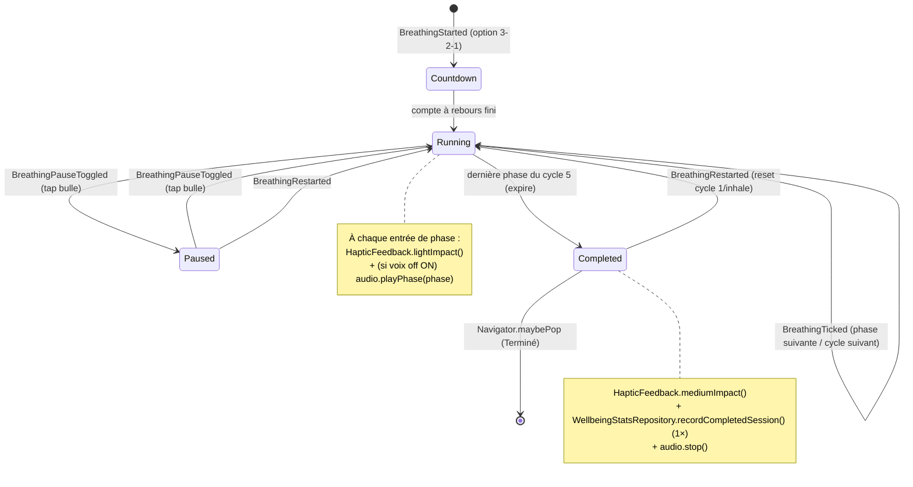

# Plan de page — « Respiration » (BreathingPage)

> Plan auto-suffisant pour éditeur IA. Conforme aux règles `aidd_docs/memory/` +
> `aidd_docs/rules/` de DIGIHARMONY : Flutter, monorepo Melos 7, client-only,
> **zéro collecte, zéro réseau, zéro SDK analytics**, vibration via `HapticFeedback`
> uniquement, i18n ARB gen-l10n 8 langues (repli `en`), Drift pour l'agrégat local,
> HydratedBloc pour le flag voix off, `just_audio` pour l'audio en asset local.
>
> Cet écran est la **cible de navigation `breathing`** déclarée dans le plan
> `choisis-ta-bulle.md` (`BubbleCategoryId.respiration → BreathingPage`). Il réutilise
> les composants partagés `DigiToolbar`, `AppBackground`, `AppTheme` créés par ce plan-là.

---

## 1. Contexte de la page

| Élément | Valeur |
| --- | --- |
| Nom | « Respiration » — exercice de cohérence cardiaque guidé, cadence figée 4-2-6 × 5 cycles |
| Widget page | `BreathingPage` (entrée + providers) + `BreathingView` (UI), fichier `lib/breathing/view/breathing_page.dart` |
| Route logique | `breathing`, conceptuellement `/bubble/breathing`, **enfant du hub** `/bubble` — écran autonome plein écran |
| Parent | Hub « Choisis ta bulle » (`BubblesPage`) → arrivée via tap sur la bulle Respiration |
| Accès / rôles / auth | **Aucun** — app sans compte, sans identification, sans permission. Accès libre |
| Données affichées | Phase courante (inspire/hold/expire), durée de la phase, n° de cycle / total, état voix off — **toutes dérivées de l'état du `BreathingBloc`** (en mémoire) |
| Persistance | **Écriture Drift uniquement à la fin** (séance terminée → +1 agrégat `WellbeingStats`). Flag voix off persistant via **HydratedBloc**. Aucune lecture/écriture pendant la séance |
| État applicatif | `BreathingBloc` (machine d'états timer/phases/cycles) + `VoiceoverCubit` (HydratedBloc, flag on/off). Audio piloté par `BreathingAudioController` (just_audio, assets) |
| États écran | (a) **en cours** (running ↔ paused au tap bulle), (b) **terminé / célébration**. **Pas d'empty, pas d'error** (technique figée, audio en asset local) |

**Pourquoi un Bloc ici (contrairement à BubblesPage) :** la règle `coding-assertions` impose
`bloc`/`flutter_bloc` *dès qu'il y a de l'état applicatif mutable*. Ici l'état évolue dans le temps
(timer, phases, cycles, pause/reprise) → `BreathingBloc` obligatoire. Le flag voix off survit aux
sessions → `VoiceoverCubit` (HydratedBloc, DEC-002). L'agrégat de fin de séance est relationnel et
requêtable → Drift (DEC-001), jamais HydratedBloc.

---

## 2. User Stories liées

**Aucune US backlog référencée fournie.** Le plan s'appuie sur les **décisions validées par
l'utilisateur** (reportées en §13) qui font office de critères d'acceptation. À rattacher si une US
existe (mettre à jour le champ `us:` de l'en-tête + du registry).

Critères d'acceptation dérivés des décisions (source des tests Kent) :
- **AC-1** : Cadence figée **4-2-6** (inspire 4 s / hold 2 s / expire 6 s), **5 cycles**, aucun sélecteur de technique.
- **AC-2** : Démarrage **auto à l'arrivée** (court compte à rebours 3-2-1 toléré avant le cycle 1, cf. §5 — garder simple).
- **AC-3** : **Tap sur la bulle** met en pause / reprend la séance.
- **AC-4** : À chaque **changement de phase** → `HapticFeedback.lightImpact()` (vibration légère).
- **AC-5** : Après le **5e cycle** → état **célébration** (`breath-celebration`) + **vibration de fin** (`HapticFeedback.mediumImpact()`).
- **AC-6** : Une séance **TERMINÉE** incrémente l'**agrégat local Drift** (`WellbeingStats`) **une seule fois** (pas si on quitte avant la fin).
- **AC-7** : **Voix off** implémentée (assets `just_audio`) ; bouton volume bascule on/off ; l'état est **mémorisé entre sessions** (HydratedBloc).
- **AC-8** : **Sortie en pleine séance** (chevron retour) → si une séance **est en cours**, dialog de **confirmation « Quitter la séance ? »** ; sinon retour direct au hub.
- **AC-9** : **« Recommencer »** relance à **cycle 1 / phase inspire** (reset complet).
- **AC-10** : Tout texte visible provient de l'**ARB** (gen-l10n), aucune chaîne en dur.
- **AC-11** : Si `reduceMotion` actif → animations (scale bulle, shimmer, célébration) **désactivées/réduites**, mais la mécanique (timer/phases/cycles, haptique, audio) **reste fonctionnelle**.
- **AC-12** : **Zéro réseau / zéro collecte** : audio en asset local, aucune analytics, aucune permission au-delà de `PACKAGE_USAGE_STATS`.

---

## 3. Design (capturé) → mapping widgets

Écran mobile fond nuit `#16213C`, plein écran. Réutilise la charte du hub.

### Toolbar (haut)
| Élément design | Widget | Comportement |
| --- | --- | --- |
| Bouton retour (chevron-left, 48×48) | `DigiToolbar.onBack` | §6 — dialog de sortie si séance en cours |
| Titre centré « Respiration » | `DigiToolbar.title` = `l10n.breathingTitle` | DM Sans bold |
| Bouton volume (volume-2, 48×48) | `DigiToolbar.trailing` = `_VoiceoverButton` | bascule on/off voix off (icône `Icons.volume_up` / `Icons.volume_off`) |

> ⚠️ `DigiToolbar` créé par `choisis-ta-bulle.md` expose `onBack`, `title`, `showMenu`. **Extension
> requise** : ajouter un paramètre `Widget? trailing` (pour le bouton volume) **sans casser** les
> usages existants (`trailing` nullable, défaut `null`). Cf. §10 (composants partagés).

### Zone centrale (cœur de l'exercice)
| Élément design | Widget | Donnée |
| --- | --- | --- |
| Bulle animée (220 px) scale selon phase (halos, anneau shimmer rotatif, glow) | `_BreathingBubble` (animée `flutter_animate`) | `state.phase` pilote l'échelle cible |
| Label de phase « Inspire… / Retiens… / Expire… » | `Text` | `state.phase` → clé ARB (§9) |
| Sous-label durée « 4 / 2 / 6 secondes » | `Text` | `l10n.breathingSecondsValue(state.phaseDurationSeconds)` |
| Indicateur cycles : 5 points (rempli=fait, courant agrandi) | `_CycleDots(current, total)` | `state.cycleIndex` / `BreathingSession.totalCycles` |
| Texte « Cycle 2 sur 5 » | `Text` | `l10n.breathingCycleProgress(state.cycleNumber, total)` |

### Bas d'écran
| Élément design | Widget | Donnée |
| --- | --- | --- |
| Pastille info « Voix off disponible — optionnel » (icône music) | `_VoiceoverHint` | `l10n.breathingVoiceoverHint`, icône `Icons.music_note_outlined` |
| Bouton large « Recommencer » (icône rotate-ccw) | `_RestartButton` | `Icons.refresh` (rotate-ccw → Material), `l10n.breathingRestart` |

### Tokens design (réutiliser `AppTheme`, étendre si besoin)
| Token | Valeur | Source |
| --- | --- | --- |
| `background` (fond nuit) | `#16213C` | **nouveau** vs `#1F2C49` du hub → ajouter `AppTheme.breathingBackground` (ou variante) |
| `primary` (cyan) | `#3FB8E6` | `AppTheme.primary` (existant) |
| `accent` (jaune) | `#F5C842` | `AppTheme.accent` (existant) |
| vert | `#A8D24E` | **nouveau** token (point cycle rempli / glow validation) |
| `foreground` | `#F2F6FB` | `AppTheme.foreground` (existant) |
| Police | `DM Sans` | asset local (déclaré par le hub) |

> Le fond `#16213C` diffère du hub (`#1F2C49`). **Décision** : `AppBackground` accepte une
> `Color? background` (défaut = bleu nuit hub) → la page Respiration passe `#16213C`. Aucune
> duplication de widget de fond.

### Icônes (Material, zéro dépendance ajoutée)
| Design (lucide) | Material |
| --- | --- |
| `volume-2` | `Icons.volume_up` (on) / `Icons.volume_off` (off) |
| `music` | `Icons.music_note_outlined` |
| `rotate-ccw` | `Icons.refresh` |
| `chevron-left` | `Icons.chevron_left` (déjà porté par `DigiToolbar`) |

---

## 4. Arbre de widgets

```
BreathingPage (StatelessWidget)            // lib/breathing/view/breathing_page.dart
└─ MultiBlocProvider
   ├─ BlocProvider(create: BreathingBloc(
   │     session: BreathingSession.fourTwoSix,        // core_package, cadence figée
   │     statsRepository: context.read<WellbeingStatsRepository>(),  // Drift, écriture fin
   │     audio: BreathingAudioController(),           // just_audio, assets
   │     voiceover: context.read<VoiceoverCubit>(),   // lit le flag courant
   │   )..add(const BreathingStarted()))              // démarrage auto (AC-2)
   └─ BreathingView (StatelessWidget)
      └─ Scaffold (extendBodyBehindAppBar: true, backgroundColor: #16213C)
         ├─ appBar: DigiToolbar(
         │     title: l10n.breathingTitle,
         │     showMenu: false,
         │     onBack: () => _onBackPressed(context),          // §6 dialog de sortie
         │     trailing: _VoiceoverButton(),                   // bascule VoiceoverCubit
         │   )
         └─ body: AppBackground(
               background: AppTheme.breathingBackground,       // #16213C
               child: SafeArea(
                 child: BlocConsumer<BreathingBloc, BreathingState>(
                   listenWhen: (p, c) => p.phase != c.phase || p.status != c.status,
                   listener: _onStateSideEffects,              // haptique + audio (§7)
                   builder: (context, state) => switch (state.status) {
                     BreathingStatus.running ||
                     BreathingStatus.paused   => _RunningLayout(state),
                     BreathingStatus.completed => _CelebrationLayout(state),
                   },
                 ),
               ),
             )

_RunningLayout(state)
└─ Column
   ├─ Spacer
   ├─ GestureDetector(onTap: () => bloc.add(BreathingPauseToggled()))   // AC-3 tap = pause/reprise
   │  └─ _BreathingBubble(phase: state.phase, status: state.status)     // 220px, scale animé
   │     └─ Stack: halos · _ShimmerRing (rotatif) · glow · cercle
   ├─ Text(state.phase.label(l10n))            // Inspire… / Retiens… / Expire…
   ├─ Text(l10n.breathingSecondsValue(state.phaseDurationSeconds))      // « 4 secondes »
   ├─ _CycleDots(current: state.cycleIndex, total: session.totalCycles) // 5 points
   ├─ Text(l10n.breathingCycleProgress(state.cycleNumber, total))       // « Cycle 2 sur 5 »
   ├─ Spacer
   ├─ _VoiceoverHint()                          // pastille « Voix off disponible — optionnel »
   └─ _RestartButton(onTap: () => bloc.add(BreathingRestarted()))       // AC-9
   // Overlay optionnel : _Countdown(3-2-1) tant que status==running && countdown en cours (§5)

_CelebrationLayout(state)                       // breath-celebration (AC-5)
└─ Column (centré)
   ├─ _CelebrationBurst()                       // confetti/glow vert #A8D24E (flutter_animate)
   ├─ Text(l10n.breathingCelebrationTitle)      // « Bravo, c'est fait » (titre)
   ├─ Text(l10n.breathingCelebrationBody)       // message apaisant
   ├─ _RestartButton(onTap: () => bloc.add(BreathingRestarted()))  // « Recommencer »
   └─ TextButton(l10n.breathingCelebrationDone, onPressed: () => Navigator.maybePop(context))
```

> `_RunningLayout` couvre **running ET paused** : en pause, la bulle se fige (animation stoppée),
> un voile/label « En pause » peut s'afficher (clé `breathingResumeHint`), le timer est gelé.

---

## 5. Machine d'états de l'exercice (timer / phases / cycles)

### Constantes (figées — `core_package`)
```dart
// packages/core_package/lib/src/breathing/breathing_session.dart
enum BreathPhase { inhale, hold, exhale }

@immutable
class BreathingSession {
  const BreathingSession({
    required this.inhale, required this.hold, required this.exhale,
    required this.totalCycles,
  });

  final Duration inhale;   // 4 s
  final Duration hold;     // 2 s
  final Duration exhale;   // 6 s
  final int totalCycles;   // 5

  /// Cadence 4-2-6 × 5 — FIGÉE en V1 (aucun sélecteur).
  static const BreathingSession fourTwoSix = BreathingSession(
    inhale: Duration(seconds: 4),
    hold: Duration(seconds: 2),
    exhale: Duration(seconds: 6),
    totalCycles: 5,
  );

  Duration durationOf(BreathPhase p) => switch (p) {
    BreathPhase.inhale => inhale,
    BreathPhase.hold   => hold,
    BreathPhase.exhale => exhale,
  };

  /// Ordre des phases dans un cycle.
  static const List<BreathPhase> phaseOrder = [
    BreathPhase.inhale, BreathPhase.hold, BreathPhase.exhale,
  ];
}
```

### États (`BreathingState`, equatable)
```dart
enum BreathingStatus { running, paused, completed }

class BreathingState extends Equatable {
  const BreathingState({
    required this.status,
    required this.phase,
    required this.cycleIndex,        // 0-based : 0..totalCycles-1
    required this.phaseDurationSeconds,
    this.statsPersisted = false,     // garde-fou : agrégat écrit 1 seule fois (AC-6)
  });

  final BreathingStatus status;
  final BreathPhase phase;
  final int cycleIndex;
  final int phaseDurationSeconds;
  final bool statsPersisted;

  int get cycleNumber => cycleIndex + 1;       // 1-based pour l'affichage « Cycle 2 sur 5 »
  // copyWith + props...
}
```

### Événements (`BreathingEvent`)
| Événement | Déclencheur | Effet |
| --- | --- | --- |
| `BreathingStarted` | auto à l'ouverture (AC-2) | (option) lance compte à rebours 3-2-1 puis démarre cycle 1 / inhale, arme le ticker |
| `BreathingTicked` | ticker interne (1 tick = fin de phase) | avance à la phase suivante (ou cycle suivant, ou completed) |
| `BreathingPauseToggled` | tap sur la bulle (AC-3) | running→paused (fige ticker + audio) / paused→running (reprend) |
| `BreathingRestarted` | bouton « Recommencer » (AC-9) | reset : cycle 1 / inhale / running, `statsPersisted=false`, ticker rearmé |
| `_BreathingCompleted` (interne, via Ticked) | après expire du 5e cycle | status=completed, écrit Drift 1× (AC-6), vibration de fin (AC-5), stoppe audio |

### Diagramme d'états (à attacher au plan — `aidd:03:components_behavior`)


### Implémentation du ticker (séquencement des phases)
- Utiliser un **`Ticker`/`Stream.periodic`** ou des `Timer` chaînés. **Approche recommandée** :
  émettre `BreathingTicked` à l'expiration de la **durée de la phase courante** (pas un tick/seconde),
  donc reprogrammer un timer de `session.durationOf(phase)` à chaque transition.
- **Pause** : annuler le timer courant et mémoriser le **temps restant** ; à la reprise, reprogrammer
  sur le restant (sinon la phase repart de zéro). Stocker `remaining` dans le bloc (champ privé, pas
  forcément dans `BreathingState`).
- **Transition phase** : `inhale → hold → exhale`. Après `exhale` :
  - si `cycleIndex < totalCycles-1` → `cycleIndex++`, repart à `inhale`.
  - sinon → `_BreathingCompleted`.
- **`close()` du bloc** : annuler tous les timers + `audio.dispose()` (pas de fuite, pas de son qui
  continue après pop).

### Compte à rebours d'entrée (option « garder simple »)
- Choix retenu : **court compte à rebours 3-2-1** avant le cycle 1 (overlay `_Countdown`), pour éviter
  un démarrage brutal. Implémentation minimale : 3 ticks de 1 s puis `inhale`. **Si jugé superflu**,
  le supprimer ne change rien aux AC (démarrage auto direct sur `inhale`). Pas d'écran « prêt » séparé.

---

## 6. Navigation / Route + dialog de sortie

| Aspect | Détail |
| --- | --- |
| Route logique | `breathing` (`/bubble/breathing`), enfant du hub. Atteint via `BubblesRoutes` (mapping `BubbleCategoryId.respiration → MaterialPageRoute(builder: (_) => const BreathingPage())`) — **brancher le builder TODO laissé par `choisis-ta-bulle.md`** |
| Retour normal | `Navigator.maybePop(context)` vers le hub |
| Sortie en séance (AC-8) | chevron retour ET back système (Android) → si `status ∈ {running, paused}` (séance en cours, non terminée) → **dialog de confirmation**. Si `completed` → pop direct |

### Interception du back système
```dart
// BreathingView racine
PopScope(
  canPop: false,                          // on gère nous-mêmes
  onPopInvokedWithResult: (didPop, _) async {
    if (didPop) return;
    await _onBackPressed(context);
  },
  child: Scaffold(...),
)
```

### `_onBackPressed`
```dart
Future<void> _onBackPressed(BuildContext context) async {
  final bloc = context.read<BreathingBloc>();
  final inSession = bloc.state.status != BreathingStatus.completed;
  if (!inSession) {
    Navigator.of(context).maybePop();
    return;
  }
  final leave = await showDialog<bool>(            // dialog « Quitter la séance ? »
    context: context,
    builder: (_) => AlertDialog(
      title: Text(l10n.breathingExitDialogTitle),  // « Quitter la séance ? »
      content: Text(l10n.breathingExitDialogBody),
      actions: [
        TextButton(child: Text(l10n.breathingExitDialogCancel), onPressed: () => Navigator.pop(context, false)),
        TextButton(child: Text(l10n.breathingExitDialogConfirm), onPressed: () => Navigator.pop(context, true)),
      ],
    ),
  );
  if (leave == true && context.mounted) {
    bloc.add(const BreathingPaused());            // stoppe ticker+audio si pas déjà
    Navigator.of(context).maybePop();             // PAS d'écriture Drift (séance non terminée, AC-6)
  }
}
```
> ⚠️ Quitter en séance **n'incrémente PAS** l'agrégat Drift (seule une séance **terminée** compte, AC-6).

---

## 7. Effets de bord (haptique + audio) — `BlocListener`

Centralisés dans `_onStateSideEffects` (listener du `BlocConsumer`), déclenchés sur changement de
`phase` ou `status` :

| Transition | HapticFeedback | Audio (`just_audio`) |
| --- | --- | --- |
| Entrée d'une nouvelle **phase** (inhale/hold/exhale) | `HapticFeedback.lightImpact()` (AC-4) | si voix off ON → `audio.playPhase(phase)` (asset local) |
| `running → paused` | — | `audio.pause()` |
| `paused → running` | — | `audio.resume()` (ou rejoue la phase courante) |
| `→ completed` (fin 5e cycle, AC-5) | `HapticFeedback.mediumImpact()` | `audio.stop()` + (option) jingle de fin `breath_celebration.mp3` si voix off ON |
| toggle voix off OFF en cours | — | `audio.stop()` immédiat (silence) |

> L'haptique passe **exclusivement** par `HapticFeedback` (règle permissions-zero-collecte : pas de
> permission `VIBRATE`, pas de package vibration).

---

## 8. Intégration audio `just_audio` (assets locaux)

### Assets (packagés, zéro réseau)
```yaml
# apps/digiharmony_app/pubspec.yaml  → flutter > assets
assets:
  - assets/audio/breathing/
```
Fichiers proposés (voix off / guidage, à fournir par l'équipe contenu — multilingue possible plus tard) :
- `assets/audio/breathing/inhale.mp3`
- `assets/audio/breathing/hold.mp3`
- `assets/audio/breathing/exhale.mp3`
- `assets/audio/breathing/celebration.mp3` (optionnel, fin de séance)

> **Multilingue audio (V1)** : un seul jeu de fichiers (neutre / langue de référence). Si un guidage
> par langue est requis plus tard, indexer par `Localizations.localeOf(context)` →
> `assets/audio/breathing/<lang>/inhale.mp3`. Hors scope V1, mais l'API `BreathingAudioController`
> doit accepter un préfixe de chemin pour rester extensible.

### `BreathingAudioController` (wrapper testable)
```dart
// lib/breathing/audio/breathing_audio_controller.dart
class BreathingAudioController {
  final AudioPlayer _player = AudioPlayer();   // just_audio

  Future<void> playPhase(BreathPhase phase) async {
    final asset = switch (phase) {
      BreathPhase.inhale => 'assets/audio/breathing/inhale.mp3',
      BreathPhase.hold   => 'assets/audio/breathing/hold.mp3',
      BreathPhase.exhale => 'assets/audio/breathing/exhale.mp3',
    };
    await _player.setAsset(asset);
    await _player.play();
  }
  Future<void> playCelebration() => ...;
  Future<void> pause()  => _player.pause();
  Future<void> resume() => _player.play();
  Future<void> stop()   => _player.stop();
  Future<void> dispose()=> _player.dispose();
}
```
- **Pas besoin de `just_audio_background`** ici (exercice au premier plan, pas de lecture en
  arrière-plan ni de contrôles lockscreen — réservé à Detox). Ne pas câbler le service background pour
  cette page.
- Le bloc n'appelle l'audio **que si `VoiceoverCubit.state == true`** (voix off ON).
- **Testabilité** : injecter `BreathingAudioController` dans `BreathingBloc` → mocker via `mocktail`
  pour vérifier les appels sans lecteur réel.

---

## 9. Flag voix off — `VoiceoverCubit` (HydratedBloc)

```dart
// lib/breathing/cubit/voiceover_cubit.dart
class VoiceoverCubit extends HydratedCubit<bool> {
  VoiceoverCubit() : super(true);            // défaut : voix off ON (au choix produit)

  void toggle() => emit(!state);
  void set(bool v) => emit(v);

  @override
  bool fromJson(Map<String, dynamic> json) => json['enabled'] as bool? ?? true;
  @override
  Map<String, dynamic> toJson(bool state) => {'enabled': state};
}
```
- **Provision** : fournir `VoiceoverCubit` **au-dessus** de `BreathingPage` (ou globalement, à côté de
  `LocaleCubit`). Le `BreathingBloc` lit son état pour décider de jouer l'audio.
- **Bouton volume** (`_VoiceoverButton`) : `context.watch<VoiceoverCubit>()` → icône
  `Icons.volume_up` (ON) / `Icons.volume_off` (OFF), `onPressed: () => context.read<VoiceoverCubit>().toggle()`.
  Quand on passe OFF en pleine séance → `audio.stop()` (effet de bord, §7).
- **Persistance** : HydratedBloc sérialise automatiquement (DEC-002) → l'état survit aux sessions (AC-7).
  `HydratedBloc.storage` doit être initialisé dans `bootstrap.dart` (à vérifier : si `LocaleCubit`
  existe déjà, le storage est déjà initialisé).
- ⚠️ **Jamais de journal/agrégat dans HydratedBloc** — uniquement ce flag UI.

---

## 10. Agrégat Drift — `WellbeingStats` (écriture fin de séance)

### Décision : agrégat local, jamais de collecte
Une séance **terminée** incrémente un compteur de séances bien-être faites, stocké en **Drift**
(DEC-001), 100 % sur l'appareil. **Cohérence architecture** : ne pas dupliquer ailleurs ; si une table
d'agrégats existe déjà (ou est planifiée pour le journal/stats), **réutiliser/étendre** plutôt que créer
une table concurrente.

> ⚠️ **À vérifier au moment de l'implémentation** : la base Drift n'existe pas encore dans `lib/`
> (aucun fichier Drift détecté). **Premier consommateur Drift du projet** → ce plan pose la fondation
> minimale. Si un autre agent crée la DB en parallèle (journal d'humeur), **fusionner** dans la même
> `AppDatabase` au lieu d'en créer une seconde (une seule DB locale par l'app).

### Table proposée
```dart
// lib/database/tables/wellbeing_stats.dart  (ou core_package selon où vit la DB)
class WellbeingStats extends Table {
  // Agrégat par type d'exercice (extensible aux autres bulles).
  TextColumn get exerciseId => text()();            // ex. 'breathing'
  IntColumn  get completedCount => integer().withDefault(const Constant(0))();
  DateTimeColumn get lastCompletedAt => dateTime().nullable()();

  @override
  Set<Column> get primaryKey => {exerciseId};
}
```

### Repository (interface injectable, testable)
```dart
// lib/database/wellbeing_stats_repository.dart
abstract class WellbeingStatsRepository {
  Future<void> recordCompletedSession(String exerciseId);  // upsert +1, set lastCompletedAt = now
  Stream<int> watchCompletedCount(String exerciseId);      // réactif (pour un futur écran stats)
}

class DriftWellbeingStatsRepository implements WellbeingStatsRepository { ... }
```
- **Appel unique** dans le bloc à la transition `→ completed`, **gardé par `statsPersisted`** pour ne
  jamais double-compter (ex. si un re-build relance un événement). `recordCompletedSession('breathing')`.
- **Aucune lecture** pendant la séance (perf + zéro I/O inutile).
- **Codegen** : après création des tables → `dart run build_runner build --delete-conflicting-outputs`
  (règle coding-assertions).
- **Test Kent** : injecter un **fake/mocktail `WellbeingStatsRepository`** → vérifier
  `recordCompletedSession('breathing')` appelé **exactement 1×** sur séance complète, **0×** si on
  quitte avant la fin.

---

## 11. Composants réutilisables (vs registry)

Registry actuel : `DigiToolbar`, `AppBackground`, `BubbleCard` (créés par `choisis-ta-bulle.md`).

| Composant | Statut | Action |
| --- | --- | --- |
| `DigiToolbar` | **partagé existant** | **Étendre** : ajouter `Widget? trailing` (bouton volume), sans casser les usages hub |
| `AppBackground` | **partagé existant** | **Étendre** : ajouter `Color? background` (défaut hub `#1F2C49`) → Respiration passe `#16213C` |
| `AppTheme` | **partagé existant** | **Ajouter tokens** : `breathingBackground #16213C`, `success/validation #A8D24E` |
| `BreathingSession` | **nouveau (core_package)** | Donnée pure cadence 4-2-6 × 5, sans Flutter UI |
| `BreathPhase` | **nouveau (core_package)** | enum inhale/hold/exhale |
| `BreathingBloc` + state + events | **nouveau (app)** | machine d'états §5 |
| `VoiceoverCubit` | **nouveau (app, HydratedBloc)** | flag voix off persistant §9 |
| `BreathingAudioController` | **nouveau (app)** | wrapper just_audio §8 |
| `WellbeingStats` + repository | **nouveau (app/db)** | agrégat Drift §10 — **fonde la DB locale** |
| `_BreathingBubble`, `_CycleDots`, `_VoiceoverButton`, `_VoiceoverHint`, `_RestartButton`, `_Countdown`, `_CelebrationLayout` | **nouveaux (app, privés à breathing)** | spécifiques écran |

> Pas de collision de route (`breathing` déjà réservé par le registry). Pas de duplication de Bloc/store.

---

## 12. Animations (`flutter_animate`) + accessibilité

`flutter_animate: ^4.5.2` déjà en dépendance.

| Animation | Cible | Effet |
| --- | --- | --- |
| **Scale bulle** | `_BreathingBubble` | échelle cible pilotée par la phase : inhale → grossit (`scale` vers ~1.0 sur 4 s, `Curves.easeInOut`), hold → maintien, exhale → rétrécit sur 6 s. **Durée de l'anim = durée de la phase** (synchro timer/visuel) |
| **Shimmer ring** | anneau autour | `.animate(onPlay: (c)=>c.repeat()).rotate(duration: 6.s)` + `.shimmer()` |
| **Glow / halos** | derrière la bulle | pulse doux synchronisé phase |
| **Cycle dot courant** | `_CycleDots` | point courant agrandi + léger `scale`/`fade` à chaque cycle |
| **Célébration** | `_CelebrationBurst` | `fadeIn` + `scale` + burst vert `#A8D24E` (one-shot, pas de repeat) |

### Respect `reduceMotion` (AC-11) — OBLIGATOIRE
```dart
final reduceMotion = MediaQuery.of(context).disableAnimations;
```
- Si `reduceMotion == true` :
  - **bulle** : pas d'animation de scale fluide → afficher une taille fixe (ou un changement
    instantané à chaque phase) ; **le label de phase + le timer restent la source de vérité**.
  - **shimmer/rotate/glow** : `repeat()` **désactivés** (anneau statique).
  - **célébration** : pas de burst animé → affichage statique du message.
  - **La mécanique reste 100 % fonctionnelle** : timer, transitions de phase, haptique, audio,
    cycle dots, persistance — rien de tout cela ne dépend de l'animation.
- Encapsuler les `effects` conditionnels dans chaque widget animé.
- **Test Kent** : avec `MediaQueryData(disableAnimations: true)`, vérifier qu'aucune animation en
  boucle n'est active (pas de `pump` infini), que les transitions de phase avancent quand même (via
  `FakeAsync`/`pump`), et que la séance peut se terminer.

---

## 13. Internationalisation (ARB / gen-l10n)

Système : **gen-l10n / ARB**, dir `lib/l10n/arb`, template `app_en.arb`, 8 langues
`en/fr/el/it/ro/tr/es/mk`, repli `en`. Helper `context.l10n` (extension existante).

### Clés à créer (préfixe `breathing*`)
| Clé ARB | EN | FR | Params |
| --- | --- | --- | --- |
| `breathingTitle` | "Breathing" | "Respiration" | — |
| `breathingPhaseInhale` | "Breathe in…" | "Inspire…" | — |
| `breathingPhaseHold` | "Hold…" | "Retiens…" | — |
| `breathingPhaseExhale` | "Breathe out…" | "Expire…" | — |
| `breathingSecondsValue` | "{count} seconds" | "{count} secondes" | `{count}` (int) |
| `breathingCycleProgress` | "Cycle {current} of {total}" | "Cycle {current} sur {total}" | `{current}`,`{total}` (int) |
| `breathingVoiceoverHint` | "Voice guidance available — optional" | "Voix off disponible — optionnel" | — |
| `breathingRestart` | "Restart" | "Recommencer" | — |
| `breathingVoiceoverOnLabel` | "Voice guidance on" | "Voix off activée" | — (a11y bouton volume) |
| `breathingVoiceoverOffLabel` | "Voice guidance off" | "Voix off coupée" | — (a11y bouton volume) |
| `breathingPauseHint` | "Tap the bubble to pause" | "Tape la bulle pour mettre en pause" | — |
| `breathingResumeHint` | "Paused — tap to resume" | "En pause — tape pour reprendre" | — |
| `breathingCelebrationTitle` | "Well done!" | "Bravo !" | — |
| `breathingCelebrationBody` | "You completed your breathing session." | "Tu as terminé ta séance de respiration." | — |
| `breathingCelebrationDone` | "Done" | "Terminé" | — |
| `breathingExitDialogTitle` | "Leave the session?" | "Quitter la séance ?" | — |
| `breathingExitDialogBody` | "Your progress for this session won't be saved." | "Ta progression de cette séance ne sera pas enregistrée." | — |
| `breathingExitDialogConfirm` | "Leave" | "Quitter" | — |
| `breathingExitDialogCancel` | "Stay" | "Rester" | — |
| `breathingToolbarBack` | "Back" | "Retour" | — (a11y) |

### Fichiers cibles
- `app_en.arb` : valeurs EN ci-dessus **+ blocs `@breathingXxx`** avec `description` + `placeholders`
  typés (`count`/`current`/`total` = `int`) — **obligatoire sur le template**.
- `app_fr.arb` : valeurs FR.
- `app_el.arb`, `app_it.arb`, `app_ro.arb`, `app_tr.arb`, `app_es.arb`, `app_mk.arb` :
  **placeholders = copie EN** (repli), marquer **relecture native ultérieure** (el/ro/tr/mk = locuteur natif).
- Régénérer : `flutter gen-l10n` puis `flutter analyze --fatal-infos`.

### Exemple de placeholders (template)
```json
"breathingSecondsValue": "{count} seconds",
"@breathingSecondsValue": {
  "description": "Duration label under the breathing bubble",
  "placeholders": { "count": { "type": "int" } }
},
"breathingCycleProgress": "Cycle {current} of {total}",
"@breathingCycleProgress": {
  "description": "Cycle progress indicator",
  "placeholders": { "current": { "type": "int" }, "total": { "type": "int" } }
}
```

### Résolution phase → clé (côté app)
```dart
// lib/breathing/breathing_l10n.dart
extension BreathPhaseL10n on BreathPhase {
  String label(AppLocalizations l) => switch (this) {
    BreathPhase.inhale => l.breathingPhaseInhale,
    BreathPhase.hold   => l.breathingPhaseHold,
    BreathPhase.exhale => l.breathingPhaseExhale,
  };
}
```

---

## 14. États de la page

| État | Présent ? | Détail |
| --- | --- | --- |
| **En cours** (running) | ✅ | bulle animée, phase + durée + cycles, audio si voix off ON |
| **En pause** (paused) | ✅ | timer + audio gelés, bulle figée, hint « En pause — tape pour reprendre » |
| **Célébration** (completed) | ✅ | message de félicitation, vibration de fin, agrégat Drift +1, boutons Recommencer / Terminé |
| **Compte à rebours** (option) | ✅(option) | overlay 3-2-1 avant cycle 1 |
| Empty | ❌ | technique figée, rien à charger |
| Error | ❌ | audio en asset local (échec audio → dégradation silencieuse, jamais d'écran d'erreur) ; écriture Drift en `try/catch` non bloquant (ne casse pas la célébration) |
| Loading | ❌ | aucune attente réseau/I/O au démarrage |

Feedback utilisateur : haptique à chaque phase + fin, audio voix off, dialog de sortie, célébration.

---

## 15. Contraintes projet (rappel, à respecter à 100 %)

- ✅ **Zéro collecte / zéro réseau** : audio en **asset local** `just_audio` ; aucune analytics/tracking ; pas de `google_fonts` (réseau) → DM Sans en asset local (déjà posé par le hub).
- ✅ **Vibration via `HapticFeedback`** uniquement (light à chaque phase, medium en fin) — pas de permission `VIBRATE`, pas de package vibration.
- ✅ **Drift** = seule persistance locale (agrégat fin de séance), **HydratedBloc** = flag voix off seulement, **jamais** de journal/agrégat dans HydratedBloc.
- ✅ **State via `bloc`/`flutter_bloc`** (`BreathingBloc`) — justifié par l'état mutable temporel.
- ✅ **i18n ARB obligatoire** : aucune chaîne en dur, 8 langues, repli `en`.
- ✅ **Lints** `very_good_analysis` + `bloc_lint` stricts (0 warning/info), `const` partout où possible.
- ✅ **Naming** : fichiers snake_case, widgets PascalCase.
- ✅ **Monorepo** : `BreathingSession`/`BreathPhase` dans `core_package` ; UI/Bloc/audio/DB dans `apps/digiharmony_app`.
- ✅ **Aucune nouvelle dépendance pub** : réutilise `just_audio`, `drift`, `hydrated_bloc`, `flutter_bloc`, `flutter_animate`, `HapticFeedback`, Material icons (tous déjà au pubspec).
- ✅ **Android release** : `minify`/`shrinkResources` à `false` (déjà en place — protège libs natives Drift).
- ✅ Après création tables Drift : `dart run build_runner build --delete-conflicting-outputs`.

---

## 16. Fichiers à créer / modifier

**core_package**
- `packages/core_package/lib/src/breathing/breathing_session.dart` (`BreathPhase`, `BreathingSession.fourTwoSix`).
- `packages/core_package/lib/core_package.dart` (ajouter l'export).

**app — breathing**
- `apps/digiharmony_app/lib/breathing/view/breathing_page.dart` (`BreathingPage` + `BreathingView` + layouts running/celebration + PopScope + dialog).
- `apps/digiharmony_app/lib/breathing/bloc/breathing_bloc.dart` / `breathing_event.dart` / `breathing_state.dart` (machine d'états §5).
- `apps/digiharmony_app/lib/breathing/cubit/voiceover_cubit.dart` (HydratedBloc §9).
- `apps/digiharmony_app/lib/breathing/audio/breathing_audio_controller.dart` (just_audio §8).
- `apps/digiharmony_app/lib/breathing/widgets/breathing_bubble.dart`, `cycle_dots.dart`, `voiceover_button.dart`, `voiceover_hint.dart`, `restart_button.dart`, `celebration_layout.dart`, `countdown.dart` (option).
- `apps/digiharmony_app/lib/breathing/breathing_l10n.dart` (extension phase → clé).
- `apps/digiharmony_app/lib/breathing/breathing.dart` (barrel export).

**app — base de données (fondation Drift, 1er consommateur)**
- `apps/digiharmony_app/lib/database/app_database.dart` (`AppDatabase` Drift — **réutiliser si déjà créée par un autre agent**).
- `apps/digiharmony_app/lib/database/tables/wellbeing_stats.dart` (table `WellbeingStats`).
- `apps/digiharmony_app/lib/database/wellbeing_stats_repository.dart` (interface + impl Drift).

**app — partagé (étendre)**
- `apps/digiharmony_app/lib/widgets/digi_toolbar.dart` (ajouter `trailing`).
- `apps/digiharmony_app/lib/widgets/app_background.dart` (ajouter `background`).
- `apps/digiharmony_app/lib/theme/app_theme.dart` (tokens `breathingBackground`, `success`).
- `apps/digiharmony_app/lib/bubbles/bubbles_routes.dart` (brancher le builder `respiration → const BreathingPage()`).

**app — i18n + assets + bootstrap**
- `apps/digiharmony_app/lib/l10n/arb/app_*.arb` (×8 : clés `breathing*`).
- `apps/digiharmony_app/pubspec.yaml` (déclarer `assets/audio/breathing/`).
- `apps/digiharmony_app/assets/audio/breathing/*.mp3` (fichiers voix off + célébration — équipe contenu).
- `apps/digiharmony_app/lib/bootstrap.dart` (vérifier `HydratedBloc.storage` initialisé ; provision `VoiceoverCubit` + `WellbeingStatsRepository` au-dessus de l'app).

**Génération**
- `dart run build_runner build --delete-conflicting-outputs` (Drift).
- `flutter gen-l10n` (ARB).
- `flutter analyze --fatal-infos` + `dart format`.

---

## 17. Critères de complétude (Definition of Done)

- [ ] Démarrage auto à l'ouverture (option compte à rebours 3-2-1), cadence **4-2-6 × 5** figée.
- [ ] Bulle change d'échelle selon la phase, synchronisée au timer ; label phase + durée + cycles corrects.
- [ ] Indicateur 5 points (rempli = fait, courant agrandi) + « Cycle N sur 5 ».
- [ ] **Tap bulle** = pause/reprise (timer + audio gelés, restant préservé).
- [ ] `HapticFeedback.lightImpact()` à chaque changement de phase ; `mediumImpact()` en fin.
- [ ] Après 5e cycle → **célébration** + agrégat Drift **+1 (1 seule fois)** ; quitter avant la fin → **0** incrément.
- [ ] **Voix off** : audio asset local joué si ON ; bouton volume bascule on/off ; **flag persistant** entre sessions (HydratedBloc).
- [ ] **Sortie en séance** (chevron / back système) → dialog « Quitter la séance ? » ; retour direct si terminée.
- [ ] **« Recommencer »** → reset cycle 1 / inhale / running, `statsPersisted=false`.
- [ ] Tous textes via ARB `breathing*`, FR+EN remplis, 6 autres langues = repli EN (TODO relecture native).
- [ ] `reduceMotion` → animations désactivées/réduites, mécanique intacte.
- [ ] Aucune deps ajoutée, aucun réseau, aucune permission ajoutée, aucune lecture Drift pendant la séance.
- [ ] Lints stricts verts, `gen-l10n` OK, `build_runner` OK.
- [ ] Tests générés par Kent (étape 5) verts.
