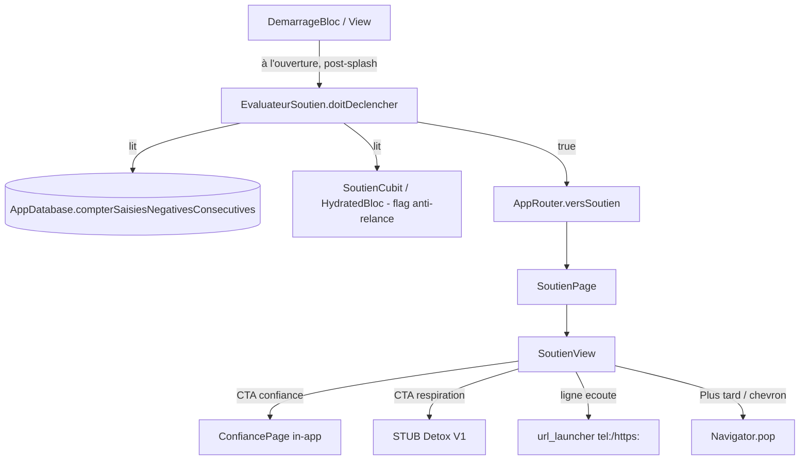

# Page Plan — Écran de soutien (« Super conseil » / `SoutienPage`)

> ⚠️ Écran sensible (public **mineur**, Erasmus+). **Tous les textes affichés et tous les
> numéros/URL de ligne d'écoute sont des PLACEHOLDERS À VALIDER HUMAINEMENT par les
> partenaires du projet.** Ne rien figer comme « définitif ». Aucun 3114 ni numéro universel
> hardcodé. Voir §8 (i18n) et §6 (table de ressources).

## 0. Garde-fous (DEC-003 + contraintes projet) — FONT LOI

- **Sans backend, sans Firebase, zéro collecte.** Aucun SDK réseau/analytics/tracking/Crashlytics.
  La seule « sortie » est l'ouverture d'une app tierce (téléphone/navigateur) via `url_launcher`
  (déjà au pubspec) : **rien n'est envoyé, rien n'est journalisé**.
- **Drift = journal réactif** (lecture du compteur dérivé) ; **HydratedBloc = état léger**
  (flag anti-relance uniquement). Le compteur **n'est JAMAIS dupliqué** dans HydratedBloc (DEC-001/002).
- **Ton bienveillant, jamais alarmant, jamais culpabilisant** : halo doux chaud/cyan NON alarmant,
  pas de rouge d'alerte, pas de streak/badge/score/FOMO, **aucune relance** (DEC-003).
  L'écran promet explicitement « Aucune relance — à ton rythme ».
- **Montré UNE FOIS par épisode** (anti-relance, DEC-SO-004). Jamais re-poussé tant que le compteur
  n'est pas redescendu sous 7 puis remonté à 7.
- **Tous les hex du mockup → tokens `theme.dart`** (`AppColors`/`AppSpacing`/`AppRadii`).
  **Aucun hex en dur.** Fond `#16213C` → `AppColors.backgroundDeep`. Accent cyan → `AppColors.primary`.
- **Couche de données en FRANÇAIS** (architecture.md) ; suffixes Flutter conservés.
- **`minify`/`shrinkResources = false`** : ne rien faire qui suppose le contraire.
- **a11y** : reduced motion (halo OFF si `MediaQuery.disableAnimations`), tap ≥ 48×48,
  `HapticFeedback` discret.
- **CTA « Respiration guidée » = STUB V1** (Détox non implémenté) → navigation câblée plus tard.

---

## 1. Contexte de la page

| Élément | Valeur |
|---|---|
| **But** | Offrir un moment de soutien bienveillant lorsque l'utilisateur traverse une série de jours difficiles. Proposer 1 à 3 petits pas (parler à quelqu'un, respirer, ligne d'écoute), sans pression. |
| **Public** | **Mineurs**, contexte Erasmus+. Ton et contenus validés par les partenaires. |
| **Accès** | Aucune auth (app sans compte). **Pas d'entrée manuelle dans la navigation principale** : l'écran est **déclenché automatiquement** (§5). |
| **Déclenchement** | Évalué **à l'ouverture de l'app** (après le splash/`Demarrage`, au moment du routage vers l'Accueil). Règle = **7 dernières SAISIES négatives consécutives**, jours sans saisie ignorés (§5). |
| **Anti-relance** | Montré **une fois par épisode** (DEC-SO-004). Flag persistant dans `SoutienCubit` (HydratedBloc). |
| **Route** | Pas de GoRouter (cohérent `AppRouter`, DEC-FND-07). Nouvelle méthode `AppRouter.versSoutien(context)` en **`push`** (empilé au-dessus de l'Accueil : on veut « Plus tard » = `pop` simple). |
| **Sortie** | Chevron toolbar → `Navigator.pop`. « Plus tard » → `Navigator.pop`. Les deux respectent l'anti-relance (le flag est posé **à l'affichage**, pas à la sortie — §5.4). |

---

## 2. Arborescence des fichiers à créer / modifier

```
apps/digiharmony_app/lib/soutien/
├── soutien_page.dart                       # SoutienPage (fournit SoutienCubit + Scaffold/toolbar)
├── soutien_view.dart                       # SoutienView (UI : halo, header, CTA, ligne d'écoute, footer)
├── soutien_cubit.dart                      # SoutienCubit (HydratedCubit<SoutienEtatRelance>) — flag anti-relance
├── soutien_etat.dart                       # SoutienEtatRelance (état léger persistant)
├── modeles/
│   └── ressource_ligne_ecoute.dart         # RessourceLigneEcoute + table statique par locale
├── declenchement/
│   └── evaluateur_soutien.dart             # logique pure : doitDeclencher(compteur, etat)
└── widgets/
    ├── halo_soutien.dart                   # halo doux chaud/cyan, OFF si reduced motion
    ├── bouton_action_soutien.dart          # CTA primaire / secondaire (icône + label)
    └── bloc_ligne_ecoute.dart              # bloc conditionnel « Ligne d'écoute » (phone/url)

# Sous-écran in-app (CTA « Parler à quelqu'un de confiance »)
apps/digiharmony_app/lib/soutien/confiance/
└── confiance_page.dart                     # ConfiancePage (pistes bienveillantes locales, texte à valider)

# Fichiers MODIFIÉS
apps/digiharmony_app/lib/data/local/app_database.dart   # + méthode dérivée compterSaisiesNegativesConsecutives()
apps/digiharmony_app/lib/app/routing/app_router.dart    # + versSoutien(context) (push)
apps/digiharmony_app/lib/app/view/app.dart              # + BlocProvider<SoutienCubit> (état léger global)
apps/digiharmony_app/lib/demarrage/...                  # point de déclenchement post-splash (§5.4, dépendance d'intégration Splash)
apps/digiharmony_app/lib/l10n/arb/app_fr.arb            # clés soutien* (réelles fr, À VALIDER)
apps/digiharmony_app/lib/l10n/arb/app_en.arb            # clés soutien* (réelles en + métadonnées @, À VALIDER)
apps/digiharmony_app/lib/l10n/arb/app_{el,it,ro,tr,es,mk}.arb  # repli en (TODO traduction)
```

> Après modif Drift : `dart run build_runner build --delete-conflicting-outputs` (depuis `apps/digiharmony_app/`).
> Puis `flutter gen-l10n`.

---

## 3. Architecture & séparation des responsabilités



- **Compteur** : dérivé de Drift à la demande (lecture ponctuelle, pas un `watch()` permanent — on évalue
  une fois à l'ouverture). DEC-001 respecté : jamais stocké ailleurs.
- **Flag anti-relance** : seul état persistant porté par `SoutienCubit` (HydratedBloc). DEC-003 respecté.
- **Décision de déclencher** : helper **pur et testable** `EvaluateurSoutien.doitDeclencher(...)`, sans I/O.

---

## 4. Modèle métier — table statique des lignes d'écoute (par locale)

`lib/soutien/modeles/ressource_ligne_ecoute.dart`

```dart
/// Type d'ouverture de la ressource d'écoute.
enum TypeRessourceEcoute { telephone, lien }

/// Ressource d'écoute associée à une locale (donnée statique embarquée).
///
/// ⚠️ PLACEHOLDERS — numéros/URL à remplir par les partenaires du projet.
class RessourceLigneEcoute {
  const RessourceLigneEcoute({
    required this.nom,
    required this.cible,        // numéro brut (tel) ou URL (https)
    required this.type,
    required this.disponibilite, // clé i18n OU libellé à valider (ex. « 24h/24, 7j/7 »)
  });
  final String nom;
  final String cible;
  final TypeRessourceEcoute type;
  final String disponibilite;
}
```

### 4.1 Table statique locale → ressource (TODO partenaires)

Map `const`, clé = `Locale.languageCode`. **Bloc affiché UNIQUEMENT si la locale courante a une entrée.**
Sinon le bloc « Ligne d'écoute » est **entièrement masqué** (pas de bloc vide, pas de fallback hasardeux).

| locale | nom (placeholder) | cible (placeholder) | type | dispo |
|---|---|---|---|---|
| `fr` | `// TODO partenaire` | `// TODO numéro FR` | `telephone` | `// TODO` |
| `en` | `// TODO partenaire` | `// TODO` | `telephone`/`lien` | `// TODO` |
| `el` `it` `ro` `tr` `es` `mk` | (absentes V1 → bloc masqué jusqu'à fourniture) | — | — | — |

> **Aucun numéro réel n'est inventé.** La map de départ peut être **vide** (`const {}`) avec un commentaire
> `// TODO: les partenaires fournissent les ressources par pays`. Tant qu'une locale n'a pas de ressource
> validée, son bloc reste masqué. Cela respecte « pas de 3114 universel » et « zéro collecte ».

### 4.2 Ouverture de la ressource

- `telephone` → `Uri(scheme: 'tel', path: cible)` via `launchUrl(...)`.
- `lien` → `Uri.parse(cible)` (https) via `launchUrl(..., mode: LaunchMode.externalApplication)`.
- Échec d'ouverture (`canLaunchUrl` false / exception) → SnackBar bienveillant non alarmant
  (clé i18n générique d'erreur si elle existe, sinon message inline neutre). **Pas de crash, pas de log distant.**

---

## 5. Mécanique de déclenchement

### 5.1 Définition de la série (FONT FOI)

- **Négatives** = `sad`, `angry`, `nervous`, `tired` (valence `< 0`, cohérent §3 du plan Noter-humeur).
- **Série** = les **7 dernières SAISIES** (entrées du journal, triées par `creeLe`/`jour` DESC) sont **toutes** négatives.
- **Jours SANS saisie = IGNORÉS** : ils ne cassent pas la série. On compte des **saisies**, pas des jours
  calendaires. Une saisie positive **casse** la série (compteur repart de 0 à la prochaine évaluation).
- Seuil de déclenchement : **compteur ≥ 7**.

### 5.2 Méthode data layer (Drift, en FRANÇAIS)

Ajouter à `AppDatabase` :

```dart
/// Compte les saisies négatives consécutives EN PARTANT DE LA PLUS RÉCENTE.
///
/// Lit le journal trié par date décroissante et additionne tant que la valence
/// est < 0 ; s'arrête à la première saisie positive/neutre. Les jours sans
/// saisie n'apparaissent pas dans le journal → naturellement ignorés.
/// Dérivé de Drift (DEC-001), jamais dupliqué dans HydratedBloc.
Future<int> compterSaisiesNegativesConsecutives();

/// Sucre : déclenchement potentiel (compteur >= seuil). Le seuil (7) est une
/// constante centralisée. N'inclut PAS l'anti-relance (porté par SoutienCubit).
Future<bool> aDeclencherSoutien();
```

Implémentation : `SELECT valence FROM entrees_humeur ORDER BY cree_le DESC` (ou `jour DESC`),
parcours jusqu'au premier `valence >= 0`. Retour = nombre de négatives consécutives en tête.

### 5.3 Anti-relance — `SoutienCubit` (HydratedBloc)

`lib/soutien/soutien_etat.dart` + `lib/soutien/soutien_cubit.dart` :

```dart
/// État léger persistant de l'anti-relance (DEC-003).
///
/// `dejaMontrePourEpisodeEnCours` : true tant que le compteur n'est pas
/// redescendu sous 7. Empêche de re-montrer le même épisode.
class SoutienEtatRelance {
  const SoutienEtatRelance({this.dejaMontrePourEpisodeEnCours = false});
  final bool dejaMontrePourEpisodeEnCours;
}

class SoutienCubit extends HydratedCubit<SoutienEtatRelance> {
  SoutienCubit() : super(const SoutienEtatRelance());

  @override
  String get id => 'soutien';

  /// Marque l'épisode courant comme déjà montré (appelé À L'AFFICHAGE).
  void marquerMontre() =>
      emit(const SoutienEtatRelance(dejaMontrePourEpisodeEnCours: true));

  /// Réarme l'anti-relance quand le compteur est repassé sous le seuil.
  void reinitialiser() =>
      emit(const SoutienEtatRelance(dejaMontrePourEpisodeEnCours: false));

  // fromJson / toJson : sérialise le seul booléen.
}
```

> **Pas de Drift ici** : c'est un flag léger (DEC-002). Le compteur, lui, reste dérivé de Drift.

### 5.4 Point d'intégration (au démarrage)

- **Quand** : à l'ouverture, **après le splash `Demarrage`**, au moment où l'app route vers l'Accueil
  (cohérent avec splash-screen.md §6 : `SplashPretPourHome`). On évalue **après** avoir routé vers l'Accueil
  (l'Accueil reste le fond) puis on `push` `SoutienPage` par-dessus si nécessaire.
- **Logique d'évaluation** (helper pur `EvaluateurSoutien.doitDeclencher`) :

```dart
class EvaluateurSoutien {
  static const int seuil = 7;

  /// Décision pure : pas d'I/O. Le compteur et l'état sont fournis par l'appelant.
  /// Retourne aussi l'action de réarmement éventuelle pour SoutienCubit.
  static bool doitDeclencher({
    required int compteurNegativesConsecutives,
    required bool dejaMontrePourEpisodeEnCours,
  }) {
    final atteintSeuil = compteurNegativesConsecutives >= seuil;
    if (!atteintSeuil) return false;          // (réarmement géré séparément)
    return !dejaMontrePourEpisodeEnCours;     // une fois par épisode
  }
}
```

- **Séquence côté appelant (Demarrage/Accueil)** :
  1. `compteur = await db.compterSaisiesNegativesConsecutives()`.
  2. Si `compteur < 7` **et** `dejaMontre == true` → `soutienCubit.reinitialiser()` (réarme l'épisode suivant).
  3. Si `EvaluateurSoutien.doitDeclencher(compteur, dejaMontre)` → `soutienCubit.marquerMontre()` **puis**
     `AppRouter.versSoutien(context)`.
  4. Sinon → ne rien faire (l'Accueil reste affiché).
- **Marquage à l'affichage** (pas à la sortie) : ainsi « Plus tard », chevron, et fermeture par CTA
  comptent tous comme « montré une fois ». DEC-SO-004.
- **Dépendance d'intégration** : le hook se branche sur la branche Splash (`Demarrage`) / Accueil.
  Si cette branche part avant, prévoir un patch d'intégration append-only (voir §11).

> ⚠️ **Aucune relance** (DEC-003) : pas de notification, pas de re-poussée, pas de minuterie de rappel.
> Le déclenchement est strictement « à l'ouverture si série ≥ 7 et pas déjà montré ».

---

## 6. UI (`SoutienView`)

### 6.1 Structure

```
Scaffold (backgroundColor: AppColors.backgroundDeep)
 ├─ AppBar (toolbar douce, DEC-003)
 │   ├─ leading : IconButton chevron-left → Navigator.pop  (zone ≥ 48×48)
 │   ├─ title  : logo DigiHarmony (logo_digiharmony_square.png, hauteur réduite) centré
 │   └─ actions: SizedBox d'équilibre (« espace » du mockup — pas de menu agressif ici)
 └─ Stack
     ├─ HaloSoutien        (halo doux chaud/cyan NON alarmant, derrière le contenu ; OFF si reduced motion)
     └─ SafeArea > SingleChildScrollView > Padding(AppSpacing.lg) > Column (center)
         ├─ Icône ronde douce 🤍 (~80 px, Container circle, teinte AppColors.primary atténuée)
         ├─ SizedBox(AppSpacing.lg)
         ├─ Text(soutienTitre)      titleLarge, AppColors.text, centré
         ├─ SizedBox(AppSpacing.sm)
         ├─ Text(soutienAccroche)   titleMedium, AppColors.primary (cyan), centré
         ├─ SizedBox(AppSpacing.md)
         ├─ Text(soutienParagraphe) bodyLarge, AppColors.textMuted, centré
         ├─ SizedBox(AppSpacing.xl)
         ├─ BoutonActionSoutien(primaire)   : icône heart-handshake + soutienCtaConfiance
         ├─ SizedBox(AppSpacing.md)
         ├─ BoutonActionSoutien(secondaire) : icône wind + soutienCtaRespiration (STUB V1)
         ├─ SizedBox(AppSpacing.lg)
         ├─ BlocLigneEcoute   (CONDITIONNEL : visible seulement si ressource pour la locale)
         ├─ Spacer / SizedBox(AppSpacing.xl)
         ├─ TextButton(soutienPlusTard)  → Navigator.pop
         └─ Text(soutienAucuneRelance)   bodySmall, AppColors.textMuted, centré
```

### 6.2 `HaloSoutien`

- Halo doux **chaud/cyan, NON alarmant** (pas de rouge). Réutiliser l'esprit de `halo_respirant.dart`
  (Accueil) : dégradé radial `AppColors.primary.withValues(alpha: 0.18)` → transparent.
  **Aucun hex en dur.**
- **Reduced motion** : si `MediaQuery.of(context).disableAnimations` → **halo statique** (pas de boucle
  d'animation), voire simple dégradé fixe. a11y obligatoire.

### 6.3 `BoutonActionSoutien`

- Bouton large (icône à gauche + label), rayon `AppRadii.button`.
- **Primaire** (« Parler à quelqu'un de confiance ») : style rempli `AppColors.primary` → `push ConfiancePage`.
- **Secondaire** (« Faire une respiration guidée ») : style outline/ghost → **STUB V1** :
  `ouvrirPlaceholder(context, ...)` ou SnackBar « Bientôt disponible » (cohérent avec le reste de l'app),
  câblage Détox plus tard (DEC-SO-005).
- Icônes : faute d'iconset custom, utiliser des icônes Material proches (`Icons.volunteer_activism`
  pour heart-handshake, `Icons.air` pour wind) — **drift documenté**, pas de hex.
- Zone tactile ≥ 48×48, `HapticFeedback.lightImpact()` au tap (côté View).

### 6.4 `BlocLigneEcoute` (conditionnel)

- **Rendu uniquement** si `tableRessources[locale.languageCode] != null`.
- Carte douce (`AppRadii.card`, fond `AppColors.surface`) : icône `Icons.phone`, `soutienLignePrefix` +
  `nom`, `soutienLigneDispoPrefix` + `disponibilite`, action → ouverture `tel:`/`https:` (§4.2).
- Présentée comme **option externe** (« tu sortiras de l'app »), non comme un service intégré → cohérent zéro-collecte.

### 6.5 `ConfiancePage` (CTA primaire, in-app)

- Écran local (même toolbar douce) listant des **pistes bienveillantes** : parler à un parent, un prof,
  un·e ami·e de confiance, un adulte référent. **Textes placeholders À VALIDER** (`soutienConfianceTitre`,
  `soutienConfianceParagraphe`). Pas de collecte, pas de formulaire, pas de réseau. Retour = `pop`.

### 6.6 Couleurs / espacements / rayons

- Fond : `AppColors.backgroundDeep` (= `#16213C` du mockup). Accent : `AppColors.primary`.
- Texte : `AppColors.text` / atténué `AppColors.textMuted`. Surface carte : `AppColors.surface`.
- Espacements `AppSpacing`, rayons `AppRadii`. **Zéro hex en dur** (tout drift du mockup mappé aux tokens).

---

## 7. États de l'écran

| État | Rendu |
|---|---|
| Nominal | Halo + header + 2 CTA + (bloc ligne d'écoute si locale couverte) + « Plus tard » + « Aucune relance ». |
| Locale sans ressource | Identique mais **bloc « Ligne d'écoute » masqué** (pas de bloc vide). |
| Reduced motion | Halo statique (pas de boucle). Le reste inchangé. |
| Respiration tapée | STUB : SnackBar/placeholder « Bientôt disponible ». Pas de navigation réelle V1. |
| Confiance tapée | Push `ConfiancePage` (pistes locales). |
| Ligne d'écoute tapée | `launchUrl` ; si échec → SnackBar neutre, pas de crash. |
| « Plus tard » / chevron | `Navigator.pop` → retour Accueil. Anti-relance déjà posé à l'affichage. |

Pas d'état « vide » (écran transitoire déclenché). Pas d'état « erreur » bloquant (l'écran ne charge rien
de distant ; la lecture du compteur a déjà eu lieu en amont).

---

## 8. i18n

> **Tous les textes ci-dessous sont des PLACEHOLDERS À VALIDER par les partenaires** (public mineur).
> `fr`+`en` réels (provisoires), **repli `en`** pour `el/it/ro/tr/es/mk`. Marquer `// TODO validation`.

| Clé | fr (provisoire, à valider) | en (provisoire, à valider) |
|---|---|---|
| `soutienTitre` | « Ces derniers jours ont l'air difficiles. » | "The last few days seem hard." |
| `soutienAccroche` | « Tu n'es pas seul·e. » | "You're not alone." |
| `soutienParagraphe` | « Ce que tu ressens est réel, et il est normal de traverser des moments difficiles. Prendre soin de soi commence par un tout petit pas. » | "What you feel is real, and it's okay to go through hard times. Taking care of yourself starts with one small step." |
| `soutienCtaConfiance` | « Parler à quelqu'un de confiance » | "Talk to someone you trust" |
| `soutienCtaRespiration` | « Faire une respiration guidée » | "Try a guided breathing" |
| `soutienLignePrefix` | « Ligne d'écoute : » | "Helpline: " |
| `soutienLigneDispoPrefix` | « Disponible : » | "Available: " |
| `soutienPlusTard` | « Plus tard » | "Later" |
| `soutienAucuneRelance` | « Aucune relance — à ton rythme » | "No reminders — at your own pace" |
| `soutienConfianceTitre` | « Parler à quelqu'un de confiance » | "Talk to someone you trust" |
| `soutienConfianceParagraphe` | « Tu peux en parler à un parent, un·e prof, un·e ami·e ou un adulte en qui tu as confiance. Tu n'as pas à tout porter seul·e. » | "You can talk to a parent, a teacher, a friend or a trusted adult. You don't have to carry it all alone." |

- Les `disponibilite` / `nom` des lignes d'écoute peuvent être des libellés directs (fournis par
  partenaires) plutôt que des clés i18n, selon ce que les partenaires livrent. À trancher au remplissage.
- Après ajout : `flutter gen-l10n`.

---

## 9. Navigation

`app_router.dart` à ajouter :

```dart
/// Ouvre l'écran de soutien (empilé au-dessus de l'Accueil, « Plus tard » = pop).
static Future<void> versSoutien(BuildContext context) {
  return Navigator.of(context).push(
    MaterialPageRoute<void>(
      builder: (_) => const SoutienPage(),
    ),
  );
}
```

- **Entrée** : `AppRouter.versSoutien` en `push` (pas `pushReplacement` : on revient à l'Accueil par `pop`).
- **Sortie** : chevron / « Plus tard » → `Navigator.pop`. Pas de GoRouter (DEC-FND-07).
- **`SoutienPage`** : fournit `SoutienCubit` (déjà global via `app.dart`, donc accès par `context.read`) et
  les dépendances (locale via `LocaleCubit`, `AppDatabase` via `RepositoryProvider` si besoin de relecture).

---

## 10. Plan de tests prévisionnel (pour Kent — Step 5)

> Réutiliser les packages déjà présents (`flutter_test`, `bloc_test` si dispo, `drift` `NativeDatabase.memory()`
> via `AppDatabase.forTesting`, `hydrated_bloc` test storage). **Ne pas ajouter de dépendance de test.**
> Lancer le codegen Drift avant les tests si le schéma a changé.

### Data layer (`AppDatabase`)
- `compterSaisiesNegativesConsecutives` : 0 si journal vide.
- 7 saisies négatives consécutives en tête → retourne ≥ 7.
- Une saisie **positive** en tête casse la série → retourne 0.
- Série négative interrompue par une positive plus ancienne → ne compte que la tête (s'arrête à la positive).
- **Jours sans saisie ignorés** : 7 saisies négatives réparties sur des jours non consécutifs (avec des
  jours vides entre) → toujours ≥ 7 (on compte des saisies, pas des jours calendaires).
- `aDeclencherSoutien` true ssi compteur ≥ 7.

### Logique pure (`EvaluateurSoutien.doitDeclencher`)
- compteur < 7 → false (quel que soit le flag).
- compteur ≥ 7 et `dejaMontre == false` → true.
- compteur ≥ 7 et `dejaMontre == true` → false (une fois par épisode).

### Anti-relance (`SoutienCubit`, HydratedBloc)
- État initial `dejaMontrePourEpisodeEnCours == false`.
- `marquerMontre()` → true ; persistance (`toJson`/`fromJson` round-trip).
- `reinitialiser()` → false.
- Scénario épisode complet : montré une fois (true) → re-évaluation à 7 ne re-montre pas → compteur
  retombe < 7 → `reinitialiser()` → remonte à 7 → re-montre (true). **Pas de double affichage dans un épisode.**

### Table ressources (`RessourceLigneEcoute`)
- Locale couverte → ressource non nulle, type correct.
- Locale non couverte → null (le bloc UI doit être masqué).
- Aucune cible réelle hardcodée hors map partenaires (test garde-fou : pas de « 3114 » dans le code).

### Widget (`SoutienView`)
- Rend : icône, `soutienTitre`, `soutienAccroche`, `soutienParagraphe`, 2 CTA, « Plus tard », « Aucune relance ».
- **Bloc ligne d'écoute masqué** quand la locale n'a pas de ressource ; **présent** quand elle en a une.
- Fond = `AppColors.backgroundDeep`, accroche teinte `AppColors.primary` (pas de hex en dur — vérifier les tokens).
- « Plus tard » → `Navigator.pop` appelé.
- CTA confiance → push `ConfiancePage`.
- CTA respiration (STUB) → pas de navigation réelle (SnackBar/placeholder).
- **Reduced motion** : `MediaQuery.disableAnimations = true` → halo statique (pas d'animation continue).
- `HapticFeedback` discret déclenché au tap (mock du channel `HapticFeedback`).
- Zone tactile ≥ 48×48 sur chevron et CTA (a11y).

### Hors périmètre (NE PAS tester ici)
- Détox / respiration réelle (STUB V1).
- Ouverture effective d'une vraie ligne d'écoute (numéros = placeholders partenaires).

---

## 11. Décisions (DEC-SO) + risques

| ID | Décision |
|---|---|
| DEC-SO-001 | Déclenchement = 7 dernières **saisies** négatives consécutives ; jours sans saisie ignorés. Compteur dérivé de Drift (`compterSaisiesNegativesConsecutives`), jamais dupliqué (DEC-001). |
| DEC-SO-002 | Négatives = `sad/angry/nervous/tired` (valence `< 0`), cohérent Noter-humeur §3. |
| DEC-SO-003 | Évaluation **à l'ouverture**, après le splash `Demarrage`, au routage vers l'Accueil ; `push` par-dessus l'Accueil. Aucune entrée manuelle dans la nav. |
| DEC-SO-004 | **Anti-relance** : montré **une fois par épisode** ; flag `dejaMontrePourEpisodeEnCours` dans `SoutienCubit` (HydratedBloc, pas Drift). Marqué **à l'affichage**. Réarmé quand le compteur repasse sous 7. |
| DEC-SO-005 | CTA « Respiration guidée » = **STUB V1** (Détox non implémenté), câblage ultérieur. |
| DEC-SO-006 | CTA « Parler à quelqu'un de confiance » = écran **in-app local** (`ConfiancePage`), pistes bienveillantes, **textes à valider**. |
| DEC-SO-007 | Ligne d'écoute = **table statique par locale** ; bloc affiché **seulement** si la locale a une ressource. **Aucun numéro universel hardcodé** ; numéros = placeholders TODO partenaires. Ouverture via `url_launcher` (`tel:`/`https:`). Sortie vers app tierce = zéro-collecte respecté. |
| DEC-SO-008 | « Plus tard » / chevron = `Navigator.pop` simple ; respecte l'anti-relance (flag déjà posé à l'affichage). |
| DEC-SO-009 | **Tous les hex du mockup → tokens `theme.dart`** ; aucun hex en dur. Halo doux NON alarmant (pas de rouge). |
| DEC-SO-010 | a11y : reduced motion (halo OFF), tap ≥ 48×48, `HapticFeedback` discret. |
| DEC-SO-011 | **Tous les textes affichés et toutes les ressources d'écoute = placeholders À VALIDER HUMAINEMENT** (public mineur, Erasmus+). Ne rien figer. |
| DEC-SO-012 | Garde-fous DEC-003 : aucun streak/badge/score/FOMO, **aucune relance** (pas de notification ni rappel), jamais culpabiliser. |

### Risques / coordination
- **Dépendance Noter-humeur (#6)** : la valence et l'écriture du journal viennent de cette US.
  Sans entrées de journal, le compteur reste 0 → écran jamais déclenché (comportement correct).
- **Point d'intégration au démarrage** : se branche sur `Demarrage`/Accueil (Splash #1 + Accueil #2).
  Append-only pour éviter une collision Git si la branche Soutien part avant.
- **`app.dart`** : ajout d'un `BlocProvider<SoutienCubit>` (état léger global) — modif minimale, append-only.
- **Cohérence valence** : single source de vérité = `valencePour`/`MoodColors.byKey` (Noter-humeur) ; ne pas
  redéfinir la liste des émotions négatives ici, la consommer.
- **Validation humaine bloquante** : aucun déploiement de contenu sensible sans relecture des partenaires
  (textes + numéros). Les placeholders sont explicitement marqués.
